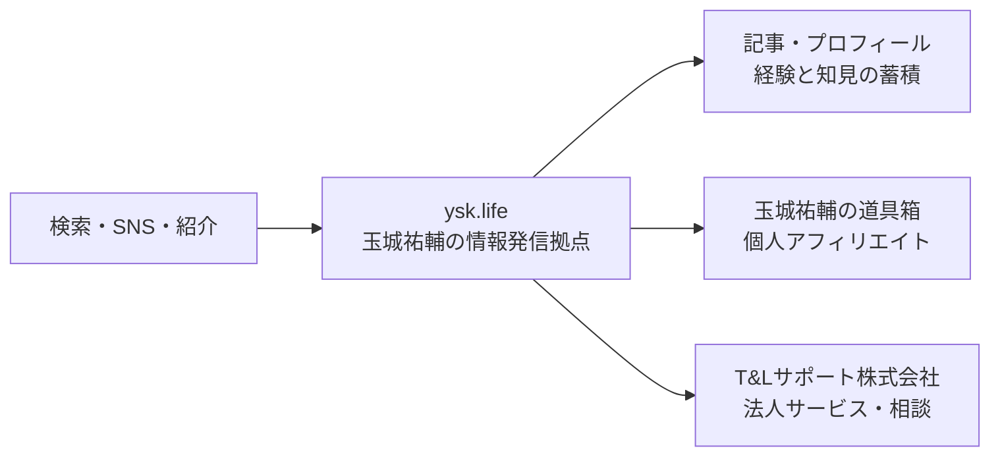

# ysk.life AIブログ基盤 方針整理・現況確認 作業ログ

> [!summary]
> `ysk.life` を玉城祐輔個人の情報発信拠点にし、個人アフィリエイト導線「玉城祐輔の道具箱」と、T&Lサポート株式会社への相談導線を併設する方針を整理した。実装基盤は Astro + GitHub + Cloudflare Pages を第一候補とする。本ログ作成時点では、DNS・Cloudflare・GitHub・公開サイトには変更を加えていない。

## 1. 今回決めたこと

- 独自ドメインは、お名前.comで契約中の `ysk.life` を利用する。
- `ysk.life` は「玉城祐輔としての知見・実践・道具」を蓄積する個人メディアとする。
- 収益導線として「玉城祐輔の道具箱」を設ける。これは玉城祐輔個人のアフィリエイト導線であり、T&Lサポート株式会社の売上導線とは区別する。
- 法人サービスへの相談が自然な記事では、T&Lサポート株式会社公式サイト `https://taxlegal.jp/` へ誘導する。
- CMSはWordPressを採用せず、AstroのMarkdown/MDX記事をGitで管理する。
- 公開基盤はCloudflare Pagesを第一候補とする。大規模なDBや常時稼働サーバーは使わない。
- ドメインの取得・更新は引き続きお名前.comで行う。DNSをCloudflareへ移す場合も、ドメイン移管は必須ではない。
- 記事執筆、挿絵生成、画像挿入、内部リンク、メタ情報、サイトデザイン、ビルド確認はAIが扱いやすい構成にする。
- 公開は、プレビュー確認後に玉城祐輔が承認し、本番へ反映する運用を基本とする。

## 2. サイトの役割分担

| 場所 | 主な役割 | 収益・問い合わせの扱い |
|---|---|---|
| `ysk.life` | 玉城祐輔個人の発信、記事、プロフィール、導線の起点 | 記事ごとに道具箱またはT&Lへ自然に接続 |
| 玉城祐輔の道具箱 | 実際に使う機材・サービス・書籍等の紹介 | 個人のアフィリエイト収益 |
| `taxlegal.jp` | T&Lサポート株式会社の公式情報・法人サービス | 法人への相談・問い合わせ |

## 3. 推奨する初期サイト構成

| URL案 | 内容 |
|---|---|
| `/` | 玉城祐輔の紹介、発信テーマ、最新記事、道具箱、T&Lへの入口 |
| `/blog/` | 記事一覧、テーマ・カテゴリ導線 |
| `/blog/[slug]/` | 個別記事。関連記事、道具箱、T&Lへの文脈別CTAを配置 |
| `/toolbox/` | 「玉城祐輔の道具箱」の入口。初期は既存公開ページへ接続し、後に統合可能 |
| `/about/` | 経歴、活動領域、発信方針、T&Lとの関係 |
| `/privacy/` | プライバシーポリシー、アクセス解析等の説明 |
| `/affiliate-disclosure/` | アフィリエイト広告を含むこと、紹介方針、免責事項 |

初期段階では、既存の道具箱 `https://tamashiro-toolbox.surge.sh/` を壊さず、`ysk.life/toolbox/` から案内する構成が安全である。統合後のURL、Amazonアソシエイト登録媒体、リダイレクト、canonicalを一度に整えられる段階で、コンテンツを `ysk.life` 配下へ移す。

## 4. 技術構成

| 項目 | 方針 |
|---|---|
| フレームワーク | Astro 6系 |
| 記事 | Markdown/MDX + Astro Content Collections |
| スタイル | Tailwind CSS 4系 |
| ソース管理 | GitHub `yusuke-taxlegal/tamashiro-blog` |
| 公開 | Cloudflare Pagesの専用プロジェクトを新設する案 |
| DNS | お名前.comで保有継続。必要に応じてCloudflare DNSへ委任 |
| DB | 当面なし。記事・メタ情報はリポジトリ内で管理 |
| 画像 | リポジトリまたはCloudflare向け静的アセットとして管理 |
| メール | Google Workspaceの運用を維持し、DNS変更時に関連レコードを保全 |

既存Astroリポジトリには、Astro `^6.4.3`、MDX、RSS、sitemap、Tailwind CSS `^4.3.0`、Sharpが導入済みである。`astro.config.mjs` の `site` は現在 `https://tamashiro-blog.vercel.app` のため、独自ドメイン公開前に `https://ysk.life` へ変更する必要がある。

## 5. AI中心の更新フロー

1. 玉城祐輔がテーマ、素材、実体験、想定読者、誘導先を提示する。
2. AIが記事本文、タイトル、要約、FAQ、内部リンク候補を作成する。
3. AIが記事に必要な挿絵を生成し、代替テキスト、ファイル名、配置位置を設定する。
4. AIがMarkdown/MDX、一覧、タグ、OGP、構造化データ、RSS、sitemapを更新する。
5. ローカルビルド、リンク、画像、モバイル表示、アクセシビリティを確認する。
6. プレビューURLを玉城祐輔が確認する。
7. 承認後に本番へ反映し、公開URLと検索向けメタ情報を再確認する。

記事本文の更新と共通デザインの更新は、可能な限り別の変更単位にする。記事1本の追加でサイト全体のデザインが意図せず変わるリスクを下げられる。

## 6. 2026-08-12 06:14 JSTの現況

### 公開URL

| 対象 | 確認結果 | 備考 |
|---|---:|---|
| `https://ysk.life/` | HTTP 403 | 現在の本番候補ドメイン。公開ページとして利用できる状態ではない |
| `https://www.ysk.life/` | HTTP 403 | 同上 |
| `https://ysk-life.surge.sh/` | HTTP 200 | 旧プロフィールページ |
| `https://tamashiro-toolbox.surge.sh/` | HTTP 200 | 既存の道具箱 |
| `https://taxlegal.jp/` | HTTP 200 | T&Lサポート株式会社の誘導先候補 |
| `https://tamashiro-blog.vercel.app/` | HTTP 200 | 既存Astroブログ |

### `ysk.life` の公開DNS

| 種別 | 確認値 |
|---|---|
| NS | `ns-rs1.gmoserver.jp`、`ns-rs2.gmoserver.jp` |
| A | `160.251.71.118` |
| MX | `10 mail1041.onamae.ne.jp.` |

> [!warning]
> 玉城祐輔の通常メールはGoogle Workspace/Gmailを利用しているが、公開DNSで確認した `ysk.life` のMXはお名前.com系メールを指している。Google Workspaceが別ドメインで使われている可能性があるため、`@ysk.life` のメール利用有無とGoogle Workspaceの対象ドメインを確認するまでは、MX・TXT・SPF・DKIM・DMARCを変更または削除しない。

### Cloudflare

- 既存アカウントへの認証は確認済み。
- Cloudflare Pagesには既存の別用途プロジェクトが2件ある。
- いずれも `pages.dev` のみで、`ysk.life` のカスタムドメインは使っていない。
- 今回は既存プロジェクトを流用せず、ブログ専用プロジェクトを追加する方針が分かりやすい。
- 本ログ作成中にCloudflare側の作成・変更は行っていない。

### Git

- リポジトリ: `/Users/tamashiro_yusuke/Cursor/tamashiro-blog`
- リモート: `https://github.com/yusuke-taxlegal/tamashiro-blog.git`
- ブランチ: `main`
- 本ログ作成直前は `main...origin/main` で、未コミット変更はなかった。

## 7. 未確定事項

- `@ysk.life` のメールを現在または過去に利用しているか。
- Google Workspaceで実際に使っているドメインと、`ysk.life` を追加ドメインとして扱う予定の有無。
- トップページで使う肩書きと第一声。既存のポジショニング案はあるが、公開文言は本人承認後に確定する。
- 道具箱を当初は外部ページとして残すか、初回公開から `ysk.life/toolbox/` に統合するか。推奨は外部接続から開始する段階移行。
- T&LへのCTAを公式トップへ送るか、相談内容別ランディングページへ送るか。
- 既存Astroブログの3記事を公開記事として残すか、事実確認後に再編集するか。
- `www.ysk.life` を `ysk.life` へ恒久転送する設定と、canonicalの統一方法。

## 8. 実施していないこと

- お名前.comのDNS・ネームサーバー変更
- Cloudflareのゾーン追加、Pagesプロジェクト作成、カスタムドメイン設定
- Vercel設定変更または削除
- GitHubへのcommit・push
- Amazonアソシエイトの登録媒体変更
- Surge上の旧ページまたは道具箱の変更
- T&Lサポート株式会社公式サイトの変更

関連する次回作業は [HANDOFF.md](../HANDOFF.md) を参照する。
