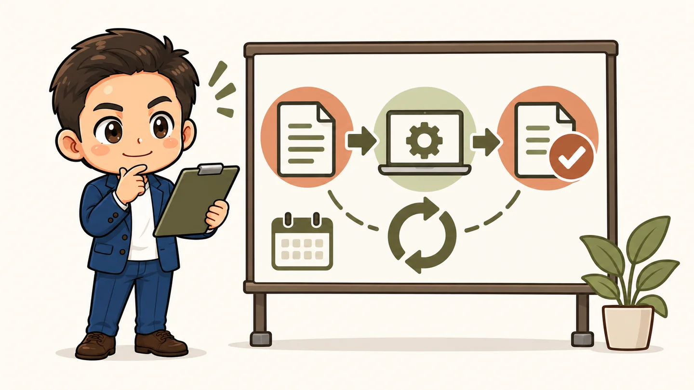

<!-- product-article-character-sheets: tamashiro-yusuke-business-casual-character-sheet-v3.png -->
<!-- product-article-character-check: hero-and-body-verified -->

「自分の仕事にAIを入れたいのですが、毎月いくらぐらいかかりますか？」

T&Lサポート株式会社の玉城祐輔です。日々、AI導入の相談をいただく中で、よく聞かれるのが費用のことです。

私の答えは、**自分で使うところからなら月額数千円規模でも始められる。仕事の流れに組み込み、専門家の支援も受けるなら、そのための予算が別に必要になる**というものです。

同じAIを契約しても、使う人のスキルや、どこまで任せたいかによって総額は変わります。まずは費用の中身を分けて考えてみましょう。

## AI導入の費用は、3つに分けると分かりやすい

| 費用の種類 | 何にお金を払うのか |
| --- | --- |
| ツールの利用料 | AIサービスの契約、必要に応じたAPIや連携サービスの利用 |
| 初期の導入支援 | 業務の整理、設定、試作、使い方の共有 |
| 継続的な運用支援 | 困ったときの相談、動作確認、改善、変更への対応 |

「AIが月額いくらか」と「AIが仕事で使える状態になるまでに、いくらかかるか」は、それぞれ確認する必要があります。

例えば、メールの下書きを自分でAIに頼むなら、ツールの利用料と、自分で試して覚える時間が中心です。一方、社内の資料を整理し、必要な情報を探し、決まった形式で書類を作る仕組みまで整えるなら、設計や確認の作業が増えます。

自分でできる部分が多いほど、外部へ依頼する範囲は小さくできます。ただし、自分で調べる時間や、うまく動かなかったときに直す時間も含めて考えたいところです。

## 月額数千円から、自分の仕事で試してみる

AIをまだあまり使っていない方は、最初から大きな仕組みを作る必要はありません。

メールの下書き、打ち合わせメモの整理、案内文の作成など、日々繰り返している仕事を一つ選んで試す。私は、この始め方で十分に便利さを体感できると考えています。

一例として、ChatGPT Plusの公式案内は月額20米ドルです。1ドル150円と仮定すると3,000円相当ですが、これは換算例で、実際の支払額は為替、税、契約経路などで変わります。契約時の表示を確認してください。[ChatGPT Plusの公式案内](https://help.openai.com/en/articles/6950777-what-is-chatgpt-plus)

ここで大切なのは、上手な質問文を一つ覚えることだけではありません。

- 何を作りたいのか、目的を伝える
- 相手や前提条件、必要な情報を渡す
- 出てきた内容を確認し、違うところを直してもらう

このやり取りに慣れると、同じ契約でも使える場面が広がります。私は、**自分の仕事を順序立てて説明できることも、AIを使うスキルの一つ**だと思っています。

## 高いプランを選ぶ前に、何が足りないかを見る

使う回数が増えると、利用上限に達し、必要なときに使えなくなることがあります。私自身もChatGPTを中心に、ClaudeやGoogleのGeminiを使っており、利用量と費用のバランスは日々考えるところです。

現在はChatGPT Proの月額100米ドルのプランを主に使っています。ただ、私と同じ契約をすべての事業者に勧めたいわけではありません。まず、自分の仕事で何に困っているのかを見てほしいのです。

| 困っていること | 先に見直したいこと |
| --- | --- |
| 回答が期待と違う | 目的、前提、渡している資料、使うモデル |
| 利用上限で作業が止まる | 利用頻度、モデルごとの上限、プラン |
| 毎回コピーや転記が必要 | 仕事の手順や、既存ツールとの連携 |
| 社員が使い続けられない | 実際の業務に合う使い方、担当者、相談先 |

上位プランで解決しやすい問題もあれば、仕事の進め方を見直す必要がある問題もあります。

なお、2026年9月19日の公式案内では、ChatGPT Proには100米ドルと200米ドルの区分がありますが、200米ドル版の新規申込み・アップグレードは一時停止中です。利用上限や申込み条件は変わるため、変更する時点で公式情報を確認してください。[ChatGPT Proの公式案内](https://help.openai.com/en/articles/9793128-what-is-chatgpt-pro)

### 月額契約の上限と、APIの料金は分けて考える

AIの費用では「トークン」という言葉も出てきます。文章などをAIが処理する際の単位で、APIを使った仕組みでは、モデルや処理量などによって費用が変わります。

ChatGPTの月額プランとAPIは別の契約・課金です。Plusの公式案内でも、API利用料は含まれないと説明されています。[API課金についての公式説明](https://help.openai.com/en/articles/6950777-what-is-chatgpt-plus)

そのため、「AIをたくさん使うと支出が増える」という話と、「AIの単価そのものが一律に上がっている」という話は分ける必要があります。予算を考えるときは、月額料金だけでなく、連携に追加料金があるか、使用量が増えたときの費用はどうなるかも確認しましょう。

## AI秘書を仕事に組み込むなら、設計と運用にも予算を

ここでいうAI秘書は、日々の情報整理や書類作成などを、自分の仕事の手順に合わせて手伝ってもらう仕組みです。

そのためには、どの資料を使うか、どんな形で出力するか、誰が確認するかを決める必要があります。専門家の支援を受ける場合、その整理や設定、試しながら直す作業に費用がかかります。

例えば予算を考えるための仮のケースとして、**初期導入に20万〜30万円、導入後はツール代と支援費を合わせて月5万〜6万円程度**を置いてみることはできます。ただし、これは私が想定する一例で、一般的な相場やT&Lサポートの正式な料金を示すものではありません。

対象業務の数、資料の整理状況、連携するシステム、支援期間によって必要な費用は変わります。小さな範囲ならもっと絞れますし、独自開発や複雑な連携が必要なら、この予算では収まらないこともあります。

見積りでは、金額に加えて次の内容を確認しておくと、比較しやすくなります。

- 初期費用で、何ができる状態まで作るのか
- 月額費用に、相談や修正がどこまで含まれるのか
- ツール代、人数分の契約、API利用料は別か
- 担当者が変わったとき、手順を引き継げるか
- 支援を終了しても、会社側で使い続けられるか

AIは、設定したあとも確認と改善が必要です。資料が変わった、担当者が変わった、期待した出力が出なくなった。そのときに誰が見直すかまで決めておくと、日々の業務で使い続けやすくなります。

## すでに使っているGoogleやMicrosoftから考える

AIを導入するために、仕事の道具をすべて入れ替える必要はありません。

Google Workspaceを使っている会社なら、まず契約中のプランに含まれるGeminiの機能を確認する。Microsoft 365を使っている会社なら、今の契約で使えるCopilotの範囲と、追加契約が必要な機能を確認する。この順番が現実的だと私は考えています。

Google WorkspaceではプランごとのAI機能が公式の比較表に掲載されています。機能や利用条件を確かめてから、別のAIサービスを追加するか判断するとよいでしょう。[Google Workspaceのプラン比較](https://workspace.google.com/pricing?hl=ja)

「どの会社のAIが一番か」だけでなく、**普段のメールや書類がどこにあり、誰が使うのか**を見る。そこから選ぶと、導入後の使い方も考えやすくなります。

## AIが広がるほど、作った先で何をするかが大切になる

私は、AIが広く使われるようになると、文章や画像を作る作業だけを請け負う仕事は、今まで以上に価格や速さで比較されやすくなると考えています。

ただ、資料を作れたら、それでお客様の課題が解決するとは限りません。誰に届けるのか、どんな行動につなげるのか、数字を見て次に何を変えるのか。そうした判断まで含めて支援する価値は、さらに問われるはずです。

AIを学ぶ意味も、操作を覚えることだけにとどまりません。自分の仕事を整理し、お客様の困りごとを理解して、改善につなげる。その経験を積むことに、今お金と時間を使う価値があると思っています。

## 最初の1か月は、一つの仕事で効果を確かめる

これから始める方に私が勧めたいのは、毎週繰り返している仕事を一つ選び、1か月試してみることです。

1. メールの下書きや打ち合わせメモなど、対象を一つ決める
2. 今かかっている時間を記録する
3. AIを使い、確認や修正も含めた時間を測る
4. 1か月後に、費用と効果を比べて続け方を決める

例えば、1日15分の作業を20日分減らせたら、月5時間です。これは計算例ですが、その時間をお客様への対応や、本来やりたかった仕事に回せるなら、費用をかける理由が見えてきます。短縮した時間がそのまま売上になるわけではないので、空いた時間の使い道まで考えたいところです。

最初は、入力してよい情報の範囲を確認し、人が内容を見直してから使える仕事を選びましょう。うまくいかなければ元の手順に戻せる、小さな範囲で十分です。

私は、AIにかける費用を、自分の仕事をより良くするための投資と考えています。だからこそ、「いくらのプランにするか」と一緒に、「どの仕事を、どれだけ楽にしたいか」を具体的にしていきたいのです。

AI導入を考えている方は、まず日々の仕事で時間がかかっていることを一つ、書き出してみてください。そこから、自分で試す部分と、支援を受ける部分を分けて考えていきましょう。

*サービス情報の確認日：2026年9月19日。料金・利用上限・提供条件は変更される場合があります。*
