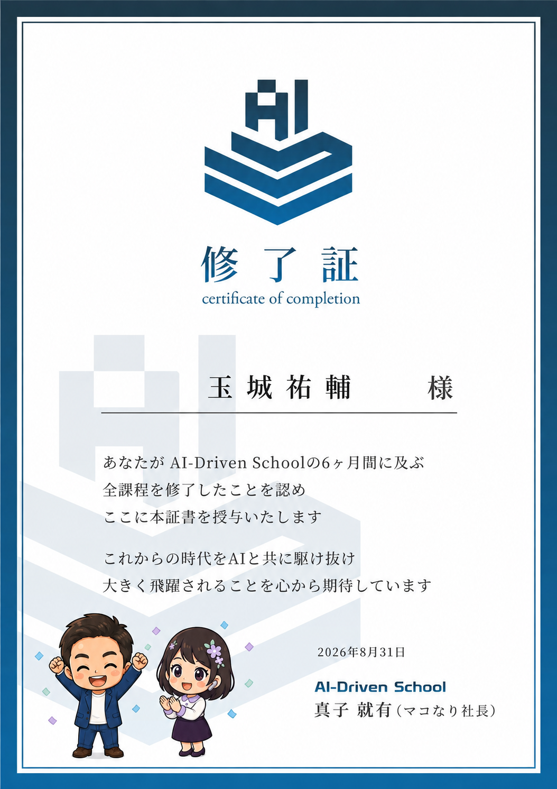
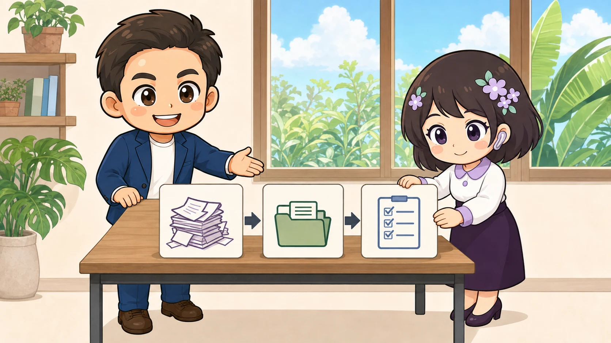

<!-- product-article-character-sheets: tamashiro-yusuke-business-casual-character-sheet-v3.png, rira-character-sheet-v2.png -->
<!-- product-article-character-check: hero-and-body-verified -->

私が大好きなYouTuber、マコなり社長が主催する6か月間のAIスクール「AI-Driven School」を、第1期生として無事に修了しました。

修了証をいただいたときは、うれしさと同時に「なんとか最後まで来られた」という安堵の気持ちがありました。

毎週日曜日の朝に講義を受け、学んだことを試し、うまくいかなければ作り直す。簡単な6か月ではありませんでしたが、自分の仕事で実際に使える「武器」を形にできました。

## 目標は、AIで自分の武器を作れるようになること

このスクールで掲げられていた目標は、「AIで自分の武器を作れるようになる」ことでした。

私にとっての武器は、AIの知識をたくさん覚えることではありません。自分の仕事の中で困っていることを見つけ、AIを使って仕組みにし、実際に動かせる状態まで持っていくことです。

講義を聞いて分かったつもりになるだけでは、仕事は変わりません。小さく作り、使ってみて、思ったとおりに動かなければ直す。その繰り返しが必要でした。

6か月を通して、AIへ質問するだけでなく、日々の業務をどう分ければよいか、どこまでAIに任せ、どこを人が確認するかを考えるようになりました。

## 大変だったからこそ、修了証が本当にうれしい

半年間、順調な週ばかりではありませんでした。

仕事や家庭の予定がある中で、毎週決まった時間を確保する。講義についていきながら、自分の制作も進める。思うように形にならず、何度もやり直すこともありました。

それでも、第1期生として最後まで走り切ることができました。

修了証を見ると、完成したものだけでなく、毎週試行錯誤した時間まで思い出します。だからこそ、今回いただいた修了証は本当にうれしいです。

## 学んだことは、すでに日々の仕事で役立っている

スクールで作った武器は、卒業制作のためだけのものではありません。

すでに自分の業務で使い始めており、情報を整理する、文章のたたき台を作る、繰り返し作業を減らすといった場面で役立っています。

ただし、AIに全部任せればよいとは考えていません。相手の名前、日付、金額、約束する内容など、大切な部分は人が確認する必要があります。

AIに任せる作業と、人が責任を持って判断する作業を分ける。そこまで考えて初めて、業務で使える武器になると思っています。

## 毎週日曜日を支えてくれた家族へ

この6か月を続けられたのは、私一人の力ではありません。

毎週日曜日の朝に講義を受けられるよう、スケジュールを調整し、支えてくれた妻と家族に心から感謝しています。

家族の時間を使わせてもらったからこそ、学んで終わりにはしたくありません。「6か月頑張ってよかったね」と言ってもらえるよう、仕事の成果と収益へきちんとつなげていきます。

本当にありがとう。

## 沖縄県内の事業者支援へつなげていく

私は現在、さまざまなプロジェクトに関わらせていただいています。

そこで感じるのは、「AIを使いたい」という相談の背景に、もっと具体的な困りごとがあることです。

- 書類や情報の整理に時間がかかっている
- 同じ内容を何度も入力している
- 担当者しか分からない仕事が増えている
- 新しい道具を導入しても、現場で使い続けられない

大切なのは、AIを導入すること自体ではありません。今の仕事のどこに時間がかかり、何を変えると本当に楽になるのかを一緒に見つけることです。

今回学んだ知識とスキルを活かし、沖縄県内の事業者の皆さまの「もっと良くしたい」を、これまで以上に支援していきます。

## ここから、作った武器を一つずつ共有します

修了は一区切りですが、学んで終わりではありません。ここからがスタートです。

AIを仕事に活かしたい。デジタルを活用したい。業務を効率化したい。生産性を上げたい。

そう考えている方にとって、「これなら自分の仕事でも試せそう」と思える形で、私が作った武器や活用方法を、このブログで一つずつ紹介していきます。

相談したいことがあれば、現在の仕事の流れや困っていることから聞かせてください。一緒に、最初の一歩から形にしていきましょう。

