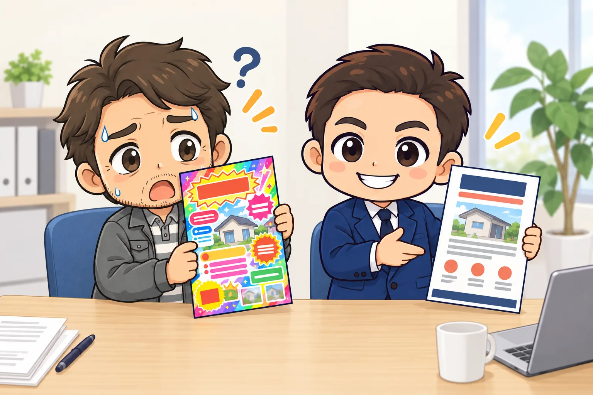
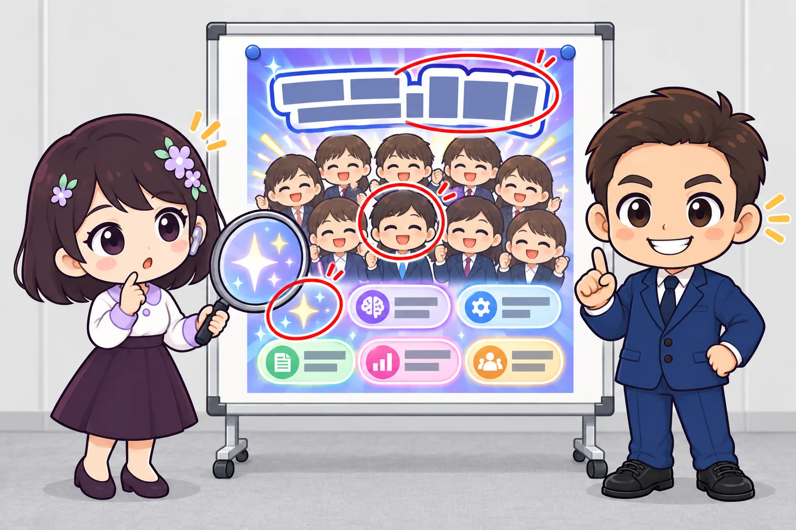
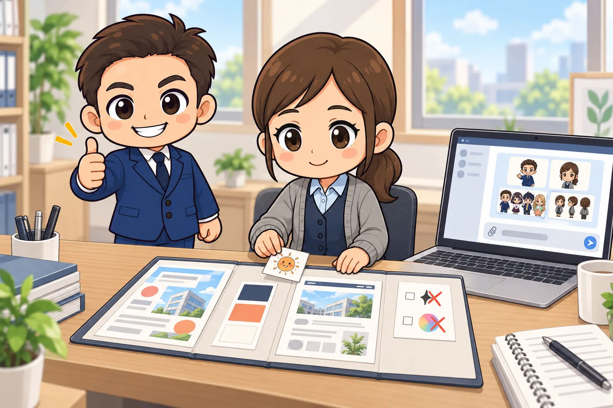
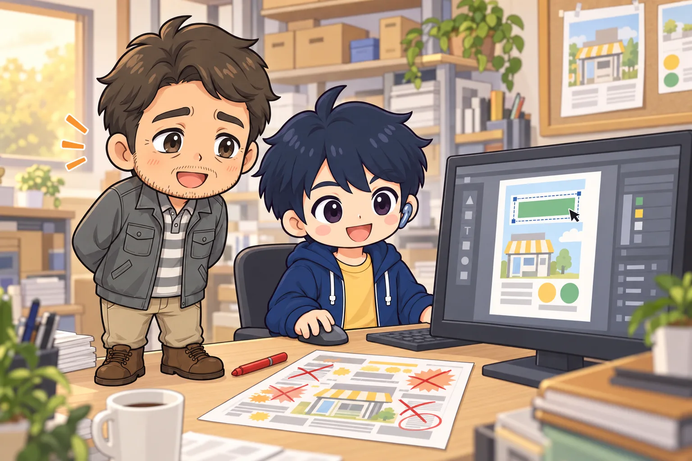

<!-- product-article-character-sheets: tamashiro-yusuke-character-sheet-v5.png, tl-four-character-style-master-v2.png, worried-business-owner-character-sheet-v1.png, rira-character-sheet-v3.png, accounting-staff-character-sheet-v1.png, riku-character-sheet-v3.png -->
<!-- product-article-character-check: hero-and-body-verified -->

「このチラシ、AIで作ったでしょう？」

見た瞬間にそう分かるチラシが、ここ1年で一気に増えました。

ChatGPTやGeminiの画像生成は本当に高性能になり、誰でも数分で見栄えのするチラシを作れるようになりました。私自身も、業務効率化のためにチラシやスライド資料をAIでよく作っています。AIを積極的に使うこと自体は、とても良いことです。

一方で、AIで作ったデザインには共通の特徴があり、見る人にも「AIで作ったんだな」と伝わりやすくなってきました。先日、私の住む町の議員選挙で配られていたチラシにも、そうしたデザインが多く見られました。伝えたい内容や相手によっては、その「AIらしさ」が、作り手の思いを伝える邪魔になることもあります。

おそらく今後、事業者さんからの相談で増えてくるのは「AI臭さをどう消すか」です。この記事では、その原因と解決策を、そのまま使えるプロンプト（AIへの指示文）の例と、参考になるサイトとあわせて整理します。

## 先に結論：AI臭さの正体は「誰も決めていない」こと

AI臭さの原因は、AIを使ったことそのものではありません。**色、文字、構図、絵柄、言葉のうち、人が決めなかった部分をAIが「いちばん無難な平均」で埋める**ことが原因です。

AIは、指示されなかったところを、これまでに学んだ大量の画像の「よくある形」で補います。だから、何も決めずに頼むと、誰が作っても似たチラシになります。AIらしさの印象は、この「平均そのものの見た目」と「人が選んだり削ったりした跡が見えにくいこと」から来ています。

解決策は、次の3つに集約できると考えています。

1. **自社らしさの素材を渡す**：過去のチラシ、ホームページの色、ロゴ、オリジナルキャラクターなど
2. **「使わないもの」を先に決める**：AIがやりがちな飾りを、指示で封じる
3. **仕上げは人がやる**：AIには素材づくりを任せ、文字入れ・削る・確認は人が行う



## 「AIっぽい」と感じられる5つの原因

AIで作られたチラシを並べてみると、作った人もテーマも違うのに、驚くほど共通点があります。

### 1. 全部盛りで、余白がない

グラデーションの背景、キラキラした光、花や花火、紙吹雪などが、画面いっぱいに入っています。AIは「華やかに」「目立つように」と頼まれると要素を足し続けますが、自分から引くことはしません。

プロのデザイナーは、最初に「何を載せないか」を決めます。余白（何も置かない空間）は、見る人の目を大事な情報へ導くための、立派なデザインの一部です。

### 2. 文字の処理が、どれも同じ型

極太のゴシック体に白いフチと影、筆で引いたような黄色い下線、一部の言葉だけをオレンジ色にした強調、角の丸いラベル（「講師」「会場」など）。こうした処理は、多くのAIチラシで繰り返し見かけます。

ここが、いちばん「ChatGPTっぽい」と気づかれやすい部分です。

### 3. 絵柄と表情が、みんな同じ

温かみのある水彩アニメ調のイラストで、登場人物が全員同じような顔をして、全員が口を開けて笑っている。こうした絵を見ると、「本当にあった場面ではない」と無意識に伝わってしまいます。

実写風の人物でも、肌がつるつるで光が均一すぎると、同じ違和感が出ます。

### 4. 細部が崩れたまま残っている

画像の中の日本語が、意味の通らない文字に化けていることがあります。小さな看板や、画面の中のチラシの文字、地図の地名などは特に崩れやすい部分です。

ここは、5つの中でいちばん手を入れる価値がある部分だと考えています。文字の崩れが残っていると、せっかくの内容まで確認不足に見えてしまうことがあるからです。逆に言えば、ここを直すだけでも印象は大きく変わります。

### 5. 言葉が、どこの団体にも当てはまる

「人と人、地域と未来をつなぐ」「今こそ○○の波に乗ろう」のような言葉は、どの会社が使ってもおかしくありません。AI臭さは見た目だけでなく、キャッチコピー（宣伝の一言）が平均的になることでも生まれます。



## AI臭さが問題になる場面、ならない場面

すべてのチラシで、AI臭さを消す必要があるわけではありません。

たとえば、AIの使い方を教える講座のチラシで「画像は生成AIで作成しています」と書いてあれば、AIっぽさはむしろ内容と合っています。季節のイベントや社内向けの案内なら、スピードを優先してもよいでしょう。

一方で、選挙、士業、医療、不動産のように**信頼が商品そのもの**の仕事では、話が変わります。こうした場面では、その人や会社らしさが伝わること自体が、安心感につながります。AIの平均的な見た目のままだと、せっかくの人柄や思いが伝わりにくくなるので、自社らしさを足す工夫をしておきたいところです。

チラシを作る前に「このチラシで信頼を得たいのか、にぎやかさを伝えたいのか」を一度考えておくと、どこまで手をかけるかを決めやすくなります。

## 解決策1：自社らしさの素材をAIに渡す

いちばん効くのは、**AIに「平均」ではなく「自社の見本」を見せる**ことです。ChatGPTもGeminiも、画像を添付して「これを参考に」と指示できます。

渡すとよい素材は、次のようなものです。

- 過去に作ったチラシや名刺、パンフレット（評判が良かったもの）
- 会社のホームページの画面（色と雰囲気が伝わる部分）
- ロゴと、会社で使っている色（カラーコードが分かればなお良い）
- オリジナルキャラクターや、実際の店舗・スタッフの写真
- 「こういう雰囲気にしたい」という他社の良い例（あくまで雰囲気の参考として）

このとき大事なのは、**添付した画像それぞれに「何の参考か」を書く**ことです。OpenAIの公式ガイドでも、参照画像ごとに「人物の参考」「画風の参考」「背景の参考」のように役割を決めて伝えることが勧められています。[OpenAI「Image prompting」](https://developers.openai.com/api/docs/guides/image-prompting)

### プロンプト例：素材を渡してトーンをそろえる

```text
添付した画像を参考に、〇〇（店名・会社名）の新しいチラシのデザイン案を作ってください。

【添付画像の役割】
・画像1：過去のチラシ。レイアウトと文字の大きさのバランスを参考にしてください
・画像2：自社ホームページ。色と雰囲気を参考にしてください
・画像3：自社キャラクター。見た目を変えずにそのまま登場させてください

【色】
・使う色は3色まで：紺（#1F3A5F）、コーラル（#F47F62）、生成り（#FAF6EE）
・背景は生成りの単色。グラデーションは使わない

【用途】
・A4縦の店頭チラシ。50代以上の地元のお客様に向けたもの
・いちばん伝えたいことは「〇月〇日に〇〇を開催すること」
```

同じ素材を毎回添付するのが面倒な場合は、ChatGPTの「プロジェクト」やGeminiの「Gem」のように、指示と資料を保存しておける機能に入れておくと便利です。デザインの道具としてCanvaを使っているなら、ロゴ・色・フォントを登録できる「ブランドキット」に一度まとめておくと、仕上げの工程がぶれにくくなります。[Canvaヘルプセンター「Set up Brand Kits」](https://www.canva.com/help/brand-kit/)



## 解決策2：「使わないもの」を先に決めて封じる

素材を渡しても、AIは「素材＋いつもの癖」を混ぜて出してきます。そこで効くのが、**AIがやりがちな飾りを、先に禁止しておく**ことです。

トンマナ（トーン＆マナー：色や文字、雰囲気の統一ルール）を決めるとき、多くの人は「こうしたい」だけを書きます。AI相手には「これはしない」を書くほうが効果が大きいと私は感じています。

エンジニア向けの記事ですが、AIの手癖として「角丸の枠で囲むレイアウト」と「目を引くための過剰な言い回し」を名指しで禁止し、余白と分かりやすさを優先させる考え方が紹介されています。チラシにもそのまま応用できます。[Qiita「生成AI特有の『AIっぽいデザイン』を脱却する簡単なプロンプト」](https://qiita.com/koheisato/items/850247485b62e19c1f6e)

### プロンプト例：AIの癖を禁止する

```text
次のルールを必ず守ってください。

【使わないもの】
・キラキラ、光の筋、レンズフレア、紙吹雪などの装飾エフェクト
・グラデーションの背景
・文字の白いフチどり、ドロップシャドウ、筆で引いたような下線
・角の丸い枠やラベルで情報を囲むこと
・全員が同じ顔で口を開けて笑っている人物
・「未来をつなぐ」「波に乗ろう」のような、どこにでも当てはまる言葉

【優先すること】
・余白を十分にとる。画面の3割以上は何も置かない
・見出しは1つだけ。情報の優先順位は「日時・場所 → 内容 → 申込方法」
・区切りは余白か、細い直線だけで表す
```

### プロンプト例：絵の質感を「平均」から外す

イラストや写真風の画像を作るときは、画風や光を具体的に指定すると、よくあるAIの絵柄から離れます。LIFULLのクリエイティブチームの記事では、光の向きや時間帯、構図の割合、「やってほしくないこと」まで言葉で設計する方法がまとめられています。[LIFULL CREATIVE「AI画像は言葉のディレクションが9割」](https://note.com/lifull_creative/n/ncd3bfa01c88d)

```text
・画風：線の少ない、色数を抑えた版画風のイラスト。水彩アニメ調にしない
・光：夕方の斜めから差す光。影ははっきり出す
・人物：年齢も表情もばらばらな3人。笑顔は1人だけ。カメラ目線にしない
・構図：人物は画面の下3分の1に小さく配置し、上側は文字を入れるために空けておく
```

## 解決策3：AIには素材だけ作らせ、仕上げは人がやる

私がいちばんお勧めしたいのが、この分担です。

**AIには、イラストや背景などの「素材」だけを作ってもらい、文字入れと組み立ては人がCanvaやパワーポイントなどで行う**。これだけで、文字化けがなくなり、文字の「型っぽさ」も大きく減ります。人物は実際のスタッフの写真、会場は実際に撮った写真を使えば、その会社にしか作れないチラシになります。

印刷会社のブログで、AIでチラシを作る際に「レイアウト」と「原稿」を分けて指示する検証が公開されています。結論は、雰囲気の比較やたたき台には十分使える一方、文字の精度や細かなそろえ方は人の手直しが必要、というものでした。現場の感覚とも一致します。[上田写真製版所ブログ「AIに丸投げでチラシは作れるのか？」](https://www.uss-ueda.co.jp/blog/ai-poster-design-feasibility/)

### プロンプト例：文字を入れない「素材」として作らせる

```text
チラシの背景に使うイラストを1枚作ってください。

・文字、数字、ロゴは一切入れない（あとで自分で入れるため）
・上半分は、見出しを入れるために何も描かず無地で空けておく
・添付した自社キャラクターを、画面の右下に小さく配置
・色は紺・コーラル・生成りの3色だけ
・装飾エフェクト、グラデーションは使わない
```

どうしても画像の中に文字を入れたい場合は、入れる文字を「」で囲んで一字一句指定し、「それ以外の文字は入れない」と書き添えます。OpenAIとGoogleの公式ガイドのどちらでも、文字はかぎかっこや引用符で囲み、書体や位置まで具体的に指定する方法が紹介されています。[Google Cloud公式ブログ「Nano Banana のプロンプト方法の究極ガイド」](https://cloud.google.com/blog/ja/products/ai-machine-learning/ultimate-prompting-guide-for-nano-banana?hl=ja)

それでも崩れることはあるので、**文字は最終的に人の目で一字ずつ確認する**ことを前提にしてください。



## 仕上げに「3割削る」確認をする

完成したら、最後に要素を3割減らすつもりで見直します。一つずつ「この飾りがなくて困る人はいるか」と問いかけると、ほとんどの装飾は消せます。

あわせて、次の点も確認してください。

- 画像の中の文字に、意味の通らない字や誤字がないか
- 日時、場所、電話番号、料金などの数字が正しいか
- 人物の指の数や、手の形がおかしくないか
- 地図や建物が、実際と違っていないか
- 「この会社にしか書けない言葉」が1つ以上入っているか

最後の項目は、見た目以上に大事です。「地域と未来をつなぐ」ではなく「毎月第2土曜の午前、〇〇公民館で開く無料の相談会」のように、具体的な事実を書くだけで、言葉はAIの平均から離れていきます。

AIにこの確認を手伝ってもらうこともできます。

```text
添付したチラシを、初めて見る地元のお客様の目線でチェックしてください。
・読めない文字、誤字、不自然な日本語
・「AIで作った」と感じさせる装飾や表現
・なくても伝わる要素（削除候補）
を、それぞれ箇条書きで指摘してください。修正案は出さなくてかまいません。
```

## 参考になるサイト

ここまでに紹介したものも含め、AI臭さを減らすための考え方やプロンプトの参考になるページをまとめておきます。内容は各サイトの公開時点のものです（2026年9月25日確認）。

**公式のガイド**

- [OpenAI「Image prompting」](https://developers.openai.com/api/docs/guides/image-prompting)：文字の指定方法、参照画像の役割の分け方、「変えないもの」の伝え方など（英語）
- [Google Cloud公式ブログ「Nano Banana のプロンプト方法の究極ガイド」](https://cloud.google.com/blog/ja/products/ai-machine-learning/ultimate-prompting-guide-for-nano-banana?hl=ja)：Geminiの画像生成で、参照画像の使い方、文字の描き方、構図や光の指定方法
- [Canvaヘルプセンター「Set up Brand Kits」](https://www.canva.com/help/brand-kit/)（英語）：ロゴ・色・フォントをまとめて登録し、仕上げの工程をそろえる方法

**実践例・考え方**

- [LIFULL CREATIVE「AI画像は言葉のディレクションが9割。『生成っぽさ』を消す画像設計術９選！」](https://note.com/lifull_creative/n/ncd3bfa01c88d)：主役と脇役、構図、光、素材感、NG条件を言葉で設計する方法
- [Qiita「生成AI特有の『AIっぽいデザイン』を脱却する簡単なプロンプト」](https://qiita.com/koheisato/items/850247485b62e19c1f6e)：角丸の枠と過剰な言い回しを禁止し、余白で整理する考え方
- [上田写真製版所ブログ「AIに丸投げでチラシは作れるのか？」](https://www.uss-ueda.co.jp/blog/ai-poster-design-feasibility/)：レイアウトと原稿を分けたプロンプトで、チラシを実際に作った検証
- [ITmedia ビジネスオンライン「『AIっぽさ丸出し』の画像から脱却せよ 実際にチラシを作ってみた」](https://www.itmedia.co.jp/business/articles/2609/15/news014.html)：GeminiとCanvaを組み合わせてチラシを作る過程とプロンプトの紹介

## デザイナーの仕事は「1枚作る」から「その会社の型を作る」へ

AI臭さを消したいという相談は、これからデザイナーさんのもとにも増えていくと思います。ただ、その中身は少しずつ変わっていくはずです。

これまでは「チラシを1枚作ってほしい」という依頼が中心でした。これからは、**その会社専用の色、文字、キャラクター、禁止事項、お手本をまとめた「型」を作る**ことに価値が移っていくと私は考えています。一度その型ができれば、事業者さん自身がAIで何枚作っても、自社らしさは崩れません。

AIを使うこと自体を恥ずかしがる必要はまったくありません。大事なのは、AIに任せる部分と、自分で決める部分を分けることです。まずは次のチラシを作るとき、過去のチラシを1枚添付して、「キラキラとグラデーションは使わない」と一行書き添えるところから始めてみてください。それだけでも、仕上がりの印象はかなり変わります。
