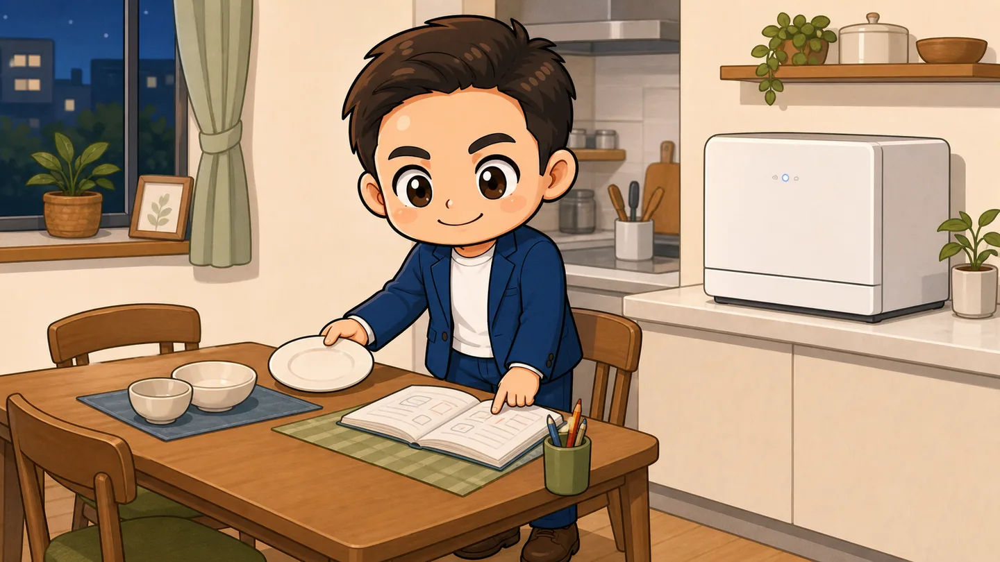
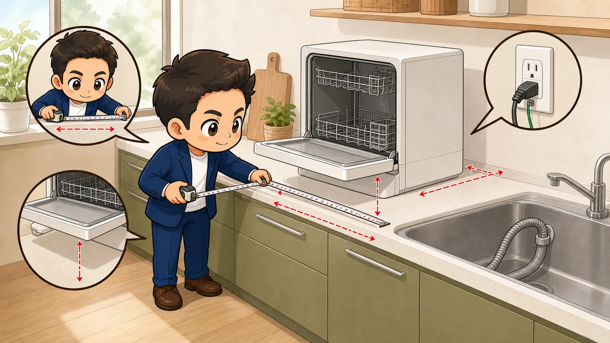
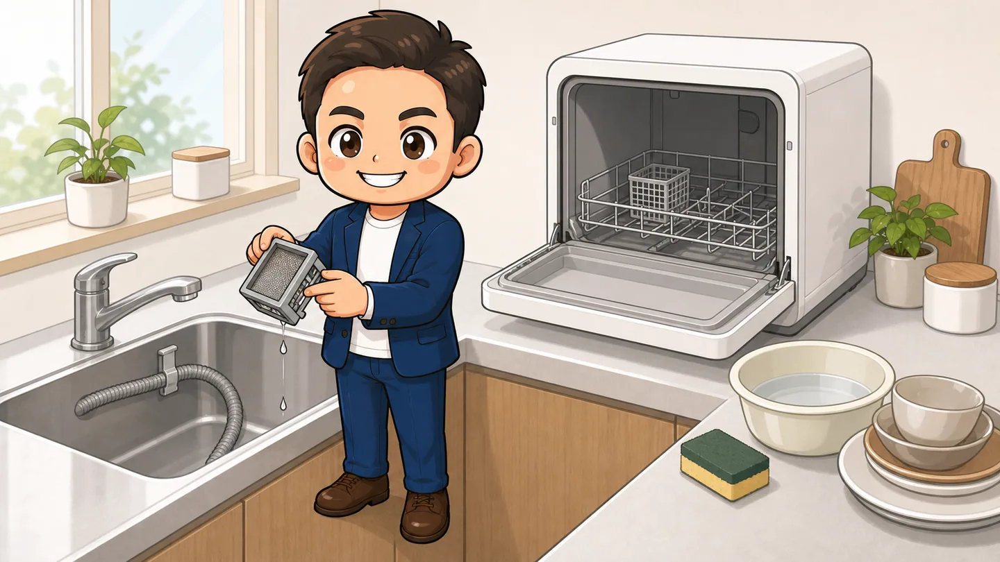

<!-- product-article-character-sheets: tamashiro-yusuke-business-casual-character-sheet-v3.png -->
<!-- product-article-character-check: hero-and-body-verified -->

夕食が終わると、シンクには家族分の皿と茶碗が残ります。

子どもの明日の準備を見たい。洗濯物も片付けたい。でも、その前に食器を洗わなければいけない。

AVAKYO タンク式食器洗い乾燥機 AV-01は、そんな毎日の食器洗いを任せるために使っている卓上型の食洗機です。タンクへ水を入れる方式なので、水道の分岐工事をしなくても設置できます。

私が使っていて助かるのは、**電源、給水、排水を確保できれば、設置場所を考えやすいこと**です。ただし、置くだけですべて終わる家電ではありません。給水の手間と排水の安全、普段の食器が入るかまで確認して選ぶ必要があります。

  
  

    
Amazon.co.jp

    <h3>AVAKYO タンク式食器洗い乾燥機 AV-01</h3>
    
水道の分岐工事をせず、タンクへ給水して使える1-3人用の卓上食洗機です。

    <a class="affiliate-product-button" href="https://amzn.to/4qijmBm" target="_blank" rel="sponsored noopener noreferrer">Amazon.co.jpで商品を見る</a>
    
広告・アフィリエイトリンクです。紹介料は玉城祐輔個人に帰属します。価格、在庫、販売元、保証、付属品、型番はAmazonの商品ページでご確認ください。

  

## 先に結論。工事より、毎回の給排水が気にならない家庭に向いている

AV-01は、水道の分岐工事が難しい賃貸住宅や、まず食洗機を使い始めたい家庭に向いています。

特に合いやすいのは、次のような人です。

- 1-3人分の普段使いの食器を洗いたい
- 水道の分岐工事をせずに食洗機を置きたい
- 食器洗い中に、子どもの準備やほかの家事を進めたい
- 幅45cmほどの本体を常設できる
- 使うたびに給水し、排水ホースを確認できる

Amazonの商品情報では、標準収納容量は食器16点、使用水量は1回7.5Lと案内されています。茶碗や深い器、大皿を多く使う家庭では、点数どおりに入るとは限りません。

私は、食洗機の価値を「食器に触れる時間がゼロになること」ではなく、**洗浄中にその場を離れられること**だと考えています。食べ残しを落とす、かごへ並べる、給水する、片付ける作業は残ります。それでも、1枚ずつ洗い続ける時間を別のことへ使えます。

## 食洗機に任せると、次の家事へ移れる

食後の流れは、次のように変わります。

1. 食べ残しや大きな汚れを取り除く
2. 食器同士が重ならないよう、かごへ並べる
3. 食洗機用として指定された洗剤を入れる
4. タンクへ必要な水を給水し、排水ホースを確認する
5. 運転を始め、ほかの家事へ移る
6. 終了後に食器と庫内を確認する

AV-01の商品情報では、70℃の高温洗浄、上下の回転ノズル、複数の洗浄コース、熱風乾燥が案内されています。汚れの種類と食器の耐熱表示を見て、取扱説明書に合うコースを選びます。

食洗機を使えない木製品、漆器、耐熱表示のないプラスチック、形が変わりやすい薄い容器などは、無理に入れません。まず家庭でよく使う茶碗、平皿、コップ、箸が入るかを考える方が、カタログ上の点数だけで選ぶより確実です。

## タンク式は、水道工事を給水の手間へ置き換える

タンク式の一番分かりやすい利点は、水道の分岐工事をしなくても使い始められることです。

一方で、運転するたびに水を入れます。AV-01は1回7.5Lの使用水量が案内されているため、付属の小さな容器で何度も往復すると、給水を負担に感じることがあります。

シンクから近い場所へ置く。水を運びやすい給水容器を用意する。給水口へ無理なく手が届く高さにする。この動線まで作ることが、使い続けるためには大切です。

| 洗い方 | 始めやすさ | 毎回必要なこと | 向いている使い方 |
| --- | --- | --- | --- |
| 手洗い | 新しい置き場所は不要 | 食器を1点ずつ洗う | 食器が少なく、調理器具もすぐ洗いたい |
| AV-01のタンク給水 | 水道の分岐工事は不要 | 食器を並べ、給水し、排水を確認する | 少人数分をまとめて洗い、洗浄中に離れたい |
| 分岐水栓式の別機種 | 蛇口の適合確認や工事が必要 | 食器を並べて運転する | 1日に何度も使い、給水の手間も減らしたい |

水道工事がないことと、給排水の管理がいらないことは別です。ここを分けて考えると、タンク式が自分に合うか判断しやすくなります。

## 購入前は、幅だけでなく扉と排水まで測る

Amazonの商品情報では、本体寸法は幅45cm、奥行41cm、高さ49cm、重さ17.5kgと案内されています。

購入前は、次の順番で実際の置き場所を測ります。

1. 幅45cmと奥行41cmの本体が安定して置けるか
2. 高さ49cmに加え、給水や手入れに必要な上の空間があるか
3. 前扉を開き、かごを引き出せる奥行があるか
4. 電源コードが、取扱説明書で指定されたコンセントへ届くか
5. 排水ホースが、折れたり外れたりせずシンクへ届くか
6. 17.5kgの本体と、食器、水の重さを載せられる台か

本体が置けても、扉を開くと通路をふさぐことがあります。吊り戸棚の下では、給水や清掃のときに手が入りにくい場合もあります。

段ボールや養生テープで幅45cm、奥行41cmの範囲を作り、扉を開く側にも物を置いてみると、キッチンでの存在感を想像しやすくなります。

## 排水ホースは、外れない位置へ固定する

タンクへ水を入れられても、排水先がなければ運転できません。

シンクへ排水する場合は、ホースの先が動かないよう、付属品と取扱説明書に従って固定します。排水中に外れると、床や収納へ水が流れるおそれがあります。

シンクから離れた場所で容器へ排水する方法は、容器の容量不足、ホースの外れ、捨て忘れが起きやすくなります。私は、まずシンクへ安全に流せる置き方から考える方がよいと思います。

運転前に見る項目は、3つへ絞れます。

- 排水ホースが折れていない
- ホースの先がシンク内で固定されている
- 排水口やシンクに、水の流れを止める物がない

## 16点は目安。いつもの食器で考える

AV-01は1-3人用、食器16点が目安です。

ただし、16点という数字は、決められた種類と大きさの食器を並べた場合の目安です。深い丼、大きなワンプレート、厚いマグカップ、保存容器を入れると、入る数は少なくなります。

購入前に、夕食後の食器を一度並べてみます。

- 茶碗と汁椀はいくつあるか
- 直径の大きな皿を毎日使うか
- 水筒、フライパン、鍋も一緒に洗いたいか
- 子ども用食器に、食洗機対応の表示があるか

鍋やフライパンまで一度に洗いたい家庭では、この大きさでは足りない可能性があります。食器はAV-01、調理器具は手洗いと分けられるなら、役割がはっきりします。

## 最初の一週間は、標準的な食器だけで試す

届いた日に、いきなりすべての食器を詰め込む必要はありません。

1. 取扱説明書を読み、付属品、給水、排水、電源を確認する
2. 空の状態で、指定された初回確認を行う
3. 平皿、茶碗、コップなど、形が分かりやすい食器から入れる
4. ノズルの回転を妨げないよう、食器の重なりをなくす
5. 終了後に汚れ残り、水滴、におい、排水漏れを確認する
6. 次の運転から、食器の向きと量を少しずつ調整する

最初から最短コースだけを選ばず、取扱説明書の標準的なコースで洗い上がりを見ます。汚れが残るときは、洗剤を増やす前に、食器の重なり、ノズルの動き、フィルター、コースの選び方を確認します。

## フィルターと給排水を、使うたびに戻す

食洗機は、汚れた食器を入れる家電です。食べ残しはフィルターへ集まり、庫内や給排水まわりには水分が残ります。

手入れの頻度と方法は取扱説明書に従います。少なくとも、運転後に次の状態を見ておくと、次に使うとき慌てません。

- フィルターへ食べ残しがたまっていない
- 庫内に食器や水が残っていない
- 給水口やタンクに汚れがない
- 排水ホースが外れたり折れたりしていない
- 異臭、異音、水漏れがない

異常な音、焦げたにおい、水漏れ、電源まわりの異常がある場合は、使用を続けません。安全に操作できる状態で運転を止め、電源を切り、取扱説明書と販売元の案内を確認します。

## 故障した日は、手洗いへ戻れるようにする

食洗機が止まっても、食器はその日のうちに出ます。

私は、普通のスポンジと食器用洗剤、洗い桶を残しておきます。運転途中で止まった場合は、食器を洗い直す必要があるかを取扱説明書で確認し、判断できないときは手洗いへ戻します。

排水できない、水が本体内に残る、エラーが繰り返す場合は、無理に分解しません。型番、購入日、販売元、注文番号を確認し、Amazonの注文履歴から販売元または保証窓口へ連絡します。

この製品は、2026年8月15日時点でメーカーの公式製品サイトと公開取扱説明書を確認できませんでした。購入前に、日本語の取扱説明書、保証期間、初期不良時の連絡先、交換部品の入手方法までAmazonの商品ページと販売元へ確認しておくと安心です。

## こんな人には合わないかもしれません

- キッチンに幅45cm、奥行41cmほどの常設場所を作れない
- 前扉を開く空間や、安全な排水先を確保できない
- 毎回7.5Lを給水することが負担になる
- 4人以上の食器や、大きな調理器具まで一度に洗いたい
- 食洗機非対応の食器を多く使っている
- メーカー公式のサポート情報や公開取扱説明書を重視する

水道工事なしで始められることは、大きな利点です。ただし、毎日の給水と排水が続けられないと、使わなくなります。

買う前に置き場所を測る。夕食後の食器を並べる。給水容器を持って動いてみる。ここまで試してから選ぶと、生活に合うか判断しやすくなります。

## よくある疑問

### 水道工事は本当にいらない？

タンクへ手動で給水する使い方なら、水道の分岐工事は不要です。電源、給水する動線、排水ホースを安全に固定できるシンクは必要です。

### 3人家族の夕食分を一度に洗える？

商品情報の目安は1-3人用、食器16点です。深い器、大皿、保存容器を多く使うと入る数は減ります。調理器具は手洗いに分ける前提で考えると判断しやすくなります。

### 普通の台所用洗剤を使ってよい？

使いません。泡が多く出る洗剤は故障や水漏れの原因になるおそれがあります。取扱説明書で指定された食洗機用洗剤を使います。

### シンクから離れた場所にも置ける？

電源と給水だけでなく、安全な排水先が必要です。まず排水ホースをシンク内へ確実に固定できる場所を優先します。容器へ排水する場合は、容量不足や捨て忘れを含めて管理できるか確認してください。

### 乾燥が終われば、そのまま食器棚として使える？

乾燥後も水滴や湿気が残る場合があります。食器と庫内を確認し、取扱説明書に従って取り出しと換気を行います。長期間の保管場所として使う前提にはしません。

### 保証や修理はどこへ連絡する？

購入前にAmazonの商品ページで販売元と保証内容を確認します。購入後は注文履歴を残し、取扱説明書と保証に記載された窓口へ連絡します。メーカー公式サイトを確認できないため、販売元の確認は特に大切です。

## 商品情報を確認する

  
  

    
Amazon.co.jp

    <h3>AVAKYO タンク式食器洗い乾燥機 AV-01</h3>
    
購入前に、型番AV-01、ASIN B0GL8B11GT、設置寸法、給排水方法、保証、付属品をご確認ください。

    <a class="affiliate-product-button" href="https://amzn.to/4qijmBm" target="_blank" rel="sponsored noopener noreferrer">Amazon.co.jpで商品を見る</a>
    
広告・アフィリエイトリンクです。紹介料は玉城祐輔個人に帰属します。価格、在庫、販売元、保証、付属品はAmazonの商品ページでご確認ください。

  

- [Amazon.co.jpの商品ページ。ASIN B0GL8B11GT](https://www.amazon.co.jp/dp/B0GL8B11GT)
- [食洗機には専用洗剤を使う理由。Panasonic公式](https://sumai.panasonic.jp/dishwasher/q_a/detergent.html)
- [異音、水漏れ、電源異常時の点検案内。Panasonic公式](https://panasonic.jp/dish/support.html)
- [Amazonアソシエイト・プログラム運営規約](https://affiliate.amazon.co.jp/help/operating/agreement/)

商品名、型番、ASIN、商品画像、紹介リンク、仕様、一般的な食洗機の洗剤・安全案内、Amazonアソシエイト規約は、2026年8月15日に確認しました。AVAKYOのメーカー公式製品サイトと公開取扱説明書は確認できていません。
