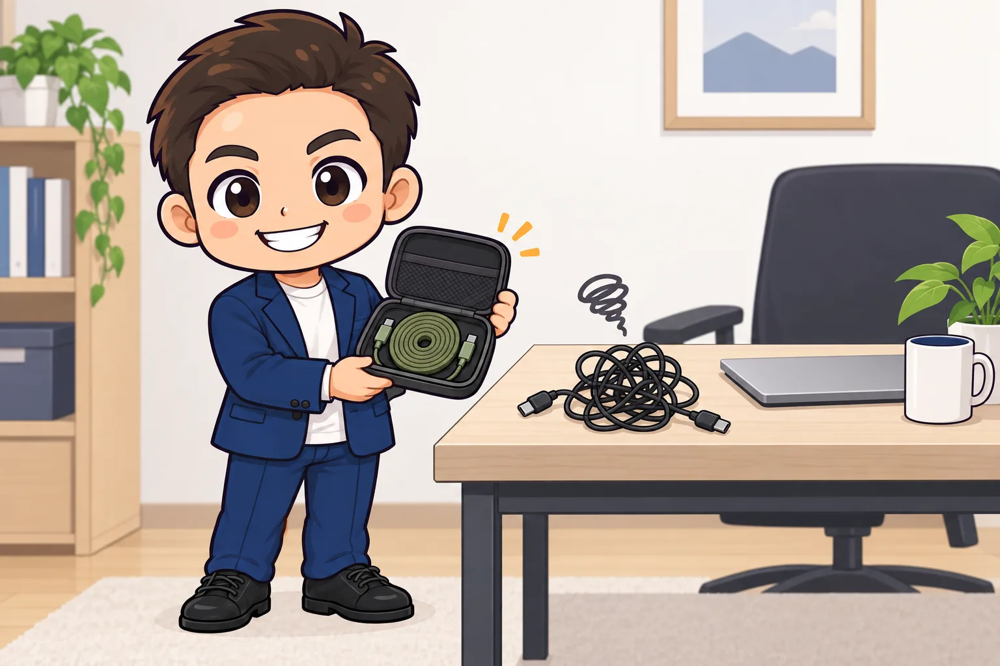
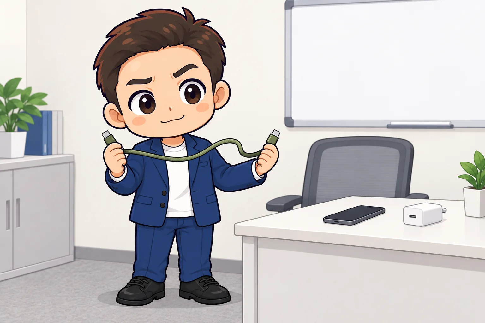

<!-- product-article-character-sheets: tamashiro-yusuke-character-sheet-v5.png, tl-four-character-style-master-v2.png, tamashiro-yusuke-business-casual-character-sheet-v3.png -->
<!-- product-article-character-check: hero-and-body-verified -->

カバンからケーブルを出したら、絡まっている。

会議室の机に置いたら、余った分がだらんと垂れる。しまうときは、また指でくるくる巻いて、バンドで留める。

一回ずつは数秒の手間です。でも、外で仕事をする日は、これを一日に何度もやります。

CIOのフラットスパイラルケーブルは、この「巻く・留める・ほどく」を減らすためのUSB-Cケーブルです。ケーブルの中に磁石が入っていて、**手を離すと自分で平たい渦巻きに戻ります。**

  
  

    
Amazon.co.jp

    <h3>CIO フラットスパイラルケーブル CtoC PD240W 480Mbps（モスグリーン 1.5m）</h3>
    
両端USB-Cの平型ケーブル。磁石内蔵で渦巻き状にまとまり、最大240Wの充電に対応します。1mと1.5m、6色があります。

    <a class="affiliate-product-button" href="https://link.amazon/B0ghAzKXZ" target="_blank" rel="sponsored noopener noreferrer">Amazon.co.jpで商品を見る</a>
    
広告・アフィリエイトリンクです。紹介料は玉城祐輔個人に帰属します。価格、在庫、カラー、長さはAmazonの商品ページでご確認ください。

  

## 先に結論。「持ち歩いて、机で使って、すぐしまう」人のケーブル

このケーブルが向いているのは、次のような人です。

- ノートPCやスマホの充電ケーブルを、毎日カバンに入れて持ち歩く
- カフェ、コワーキング、客先、会議室など、使う場所が日によって変わる
- ケーブルバンドや巻き取り式のリールが、なんとなく面倒で続かなかった
- 机の上の充電ケーブルの「余り」が気になる

逆に、買う前に知っておきたいことが3つあります。**普通のケーブルより重い。片手でスッと伸ばせない。データ転送は速くない。** 詳しくは後半で書きます。

私はこのケーブルを「充電ケーブルの決定版」とは考えていません。**しまう手間を減らすことに振り切った、持ち歩き用のケーブル**です。そこに価値を感じるかどうかで、合う・合わないが分かれます。

## しくみは単純。平たいケーブルに磁石が入っている

公式の製品情報では、ケーブル部分に磁石を内蔵し、ケーブル同士がくっついて渦巻き状にまとまる、と説明されています。表面はナイロンの編み込みです。

使い方は、両端を持って必要な長さだけ引き出し、使い終わったら手を離すだけ。磁石がケーブル同士を引き合わせて、平たい円盤のような形に戻ります。

主な仕様は次のとおりです（2026年9月26日にCIO公式サイトとAmazonの商品ページで確認）。

| 項目 | 内容 |
| --- | --- |
| 端子 | 両端USB-C |
| 充電 | USB PD対応、最大240W（PD3.1 EPR対応） |
| データ転送 | USB2.0、最大480Mbps（理論値） |
| 映像出力 | 非対応 |
| 長さ | 1m、1.5m |
| 色 | ライトブラック、ナチュラルホワイト、モスグリーン、シェルピンク、カームブルー、エアリーパープル |

少しだけ用語の補足をします。

- **USB PD**（USB Power Delivery）は、USB-Cで大きな電力をやり取りするための共通ルールです。スマホもノートPCも、この方式で急速充電します。
- **240W**は「ここまで流せる」という上限です。実際の充電速度は、充電器と機器の側で決まります。65Wの充電器につなげば65Wまでです。
- **USB2.0、480Mbps**は、データ転送の規格と速さです。充電が目的なら気にしなくてよい数字ですが、パソコンとスマホで写真や動画を大量にコピーする用途には向きません。
- **映像出力非対応**は、このケーブルでノートPCと外部モニターをつないでも画面は映らない、という意味です。

## 変わるのは「使う瞬間」ではなく「しまう瞬間」

充電そのものは、普通のUSB-Cケーブルと同じです。差が出るのは、使い終わったあとです。

普通のケーブルなら、指で巻いて、バンドで留めて、ポーチに入れる。このケーブルなら、手を離して、ポーチに入れる。動作が2つ減ります。

もうひとつ、机の上でも差が出ます。磁石でくっついている部分をほどいた分だけ長さが出るので、**使う長さだけ引き出して、余りは渦巻きのまま置いておく**ことができます。ノートPCと充電器の距離が30cmなら、30cmだけ出す。残りは平たい円盤として机の端に置いておく。余ったケーブルが机の下へ垂れる、という光景が減ります。

平型なので、薄いパソコンスリーブやポーチの隙間にも入ります。[ROOMIEの記事](https://www.roomie.jp/2026/01/1677379/)では1m版の厚みが7mmと紹介されています。

## 1mと1.5m、どちらを選ぶか

私なら、用途で分けます。

- **持ち歩き専用なら1m。** カフェや会議室では、コンセントから机までが近いことが多いです。軽いほうが、毎日カバンに入れるには有利です。
- **家や事務所の机にも置くなら1.5m。** 床のコンセントから机の上まで届かせるには、1mでは足りない場面が出てきます。

迷ったら、いま使っているケーブルの長さを測ってみてください。「足りなくて困った」記憶があるなら1.5m、「余って困った」記憶しかないなら1mです。

## 買う前に知っておきたい3つのこと

### 1. 普通のケーブルより重い

磁石が入っている分、同じ長さの一般的なケーブルより重くなります。メーカーは重量を公表していませんが、Amazonのレビューでは重さについての指摘が最も多く、1m版で60g前後という実測を載せている記事も複数あります。

手に持つと「ずっしり」と感じる重さです。カバンの重さ全体からすれば小さな差ですが、**軽さを最優先で選ぶ人には向きません。**

### 2. 片手でスッと伸ばせない

磁石が常にケーブルを中心へ引き戻そうとします。そのため、片方の端だけを持って引っ張っても、もう片方がついてきてしまいます。**両端を持って、両手で引き伸ばす**のが基本の動きです。

また、ナイロン編みの平型ケーブルはコシがあり、柔らかいゴム系のケーブルのようにはしなりません。充電しながらスマホを手に持って操作する、という使い方には少し窮屈です。

同じCIOには、ゴム系の素材で戻る力を弱めた「フレックススパイラルケーブル」という兄弟製品もあります。すぐしまう使い方が中心ならフラット、充電しながら端末を動かす使い方が中心ならフレックス、という分け方が分かりやすいです。

### 3. データ転送はUSB2.0、映像は出せない

前述のとおり、データ転送はUSB2.0（最大480Mbps）で、映像出力には対応していません。

「充電ケーブル」として買うなら問題ありません。ただ、1本でモニター接続まで済ませたい人や、カメラの動画をパソコンへ頻繁にコピーする人には、別のケーブルが必要です。

### おまけ。磁石が入っている前提で扱う

磁石入りなので、金属の机の脚やブックエンドにくっつきます。これは便利な面もあります。

一方で、私は磁気カードや医療機器の近くでの保管は、念のため避けるようにしたいと思っています。公式に注意書きがあるわけではありませんが、磁石を持ち歩く道具である、という前提は頭に置いておきます。

## 小さな会社で使うなら、会議室の備品にする

私がこのケーブルを会社で使うなら、個人の持ち物ではなく**会議室や共用スペースの備品**として置きます。

- 会議室の机に1本、来客が充電に困ったときに貸せる
- 色が6色あるので、部屋ごと・用途ごとに色を分けると、持ち出しても戻る場所が分かる
- 使い終わったら手を離すだけなので、片づけのルールを説明しなくても机が散らからない

ケーブル1本の管理を厳密にする必要はありません。ただ、「誰のケーブルか分からないものが会議室に溜まる」問題は、色分けと定位置でかなり減ります。

## 届いた日に試すこと

1. 手を離したときに、きれいな渦巻きに戻るか確認する。最初は少し形が落ち着かないことがあります
2. 自分の充電器と機器で、普段どおり充電が始まるか確認する
3. 普段の場所（机、カフェ、会議室）で、必要な長さを一度引き出してみる
4. いつも使うポーチやスリーブに入れて、厚みと重さを確かめる

1〜2日はいつものケーブルも一緒に持ち歩き、重さと取り回しが自分に合うと感じてから、置き換えると安心です。

## こんな人には合わないかもしれません

- カバンを1gでも軽くしたい
- 充電しながらスマホを手で持って操作する時間が長い
- 1本でモニター接続やデータ転送までまとめたい
- ケーブルは机に固定して、持ち歩かない

このケーブルは、「しまう手間」を減らすために、重さと取り回しを少し差し出しています。その交換が自分に合うかどうかを、先に考えてから選ぶと失敗しません。

## よくある疑問

### iPhoneでも使える？

USB-C端子のiPhone（iPhone 15以降）なら使えます。Lightning端子のiPhoneには使えません。

### 240Wの充電器を持っていなくても意味がある？

あります。240Wは上限で、手持ちの充電器の出力で充電されます。将来、大きな出力のノートPCや充電器に替えても、このケーブルのまま使えます。

### 磁石でスマホや時計が壊れない？

一般的なスマホやノートPCは、ケーブル内蔵程度の磁石で壊れることはありません。ただ、磁気ストライプのカードや医療機器については、念のため近づけない運用をおすすめします。

### 巻き取り式のリールケーブルと何が違う？

リール式は、本体の巻き取り機構でケーブルを収納します。その分だけ厚みが出ます。フラットスパイラルは機構がなく、ケーブル自身が平たく丸まるので、薄いポーチにも入ります。代わりに、リール式のように「引き出した長さを固定する」力はありません。

## 商品と公式情報を確認する

  
  

    
Amazon.co.jp

    <h3>CIO フラットスパイラルケーブル CtoC PD240W 480Mbps（モスグリーン 1.5m）</h3>
    
両端USB-Cの平型ケーブル。磁石内蔵で渦巻き状にまとまり、最大240Wの充電に対応します。1mと1.5m、6色があります。

    <a class="affiliate-product-button" href="https://link.amazon/B0ghAzKXZ" target="_blank" rel="sponsored noopener noreferrer">Amazon.co.jpで商品を見る</a>
    
広告・アフィリエイトリンクです。紹介料は玉城祐輔個人に帰属します。価格、在庫、カラー、長さはAmazonの商品ページでご確認ください。

  

- [CIO公式 Flat Spiral Cable CtoC 1.5m（CIO-NLSC-FL-CC15）の製品情報](https://connectinternationalone.co.jp/cioproduct/cable/spiral/cio-nlsc-fl-cc15/)

この記事の製品仕様は、2026年9月26日にCIO公式サイトとAmazonの商品ページで確認しました。
