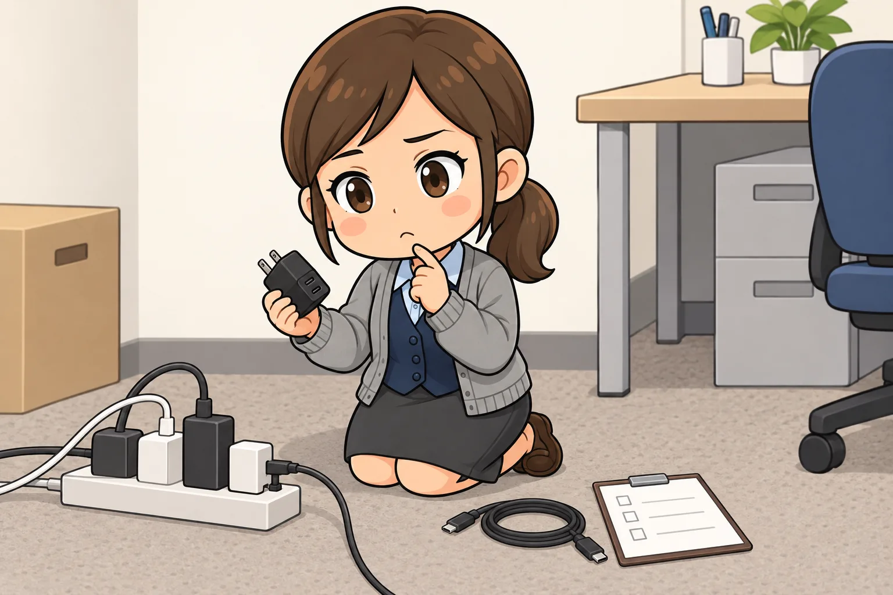

<!-- product-article-character-sheets: tamashiro-yusuke-character-sheet-v5.png, tl-four-character-style-master-v2.png, tamashiro-yusuke-business-casual-character-sheet-v3.png, worried-business-owner-character-sheet-v1.png, accounting-staff-character-sheet-v1.png -->
<!-- product-article-character-check: hero-and-body-verified -->

セミナー会場の壁ぎわで、コンセントを探す。見つかっても、隣のプラグと近すぎて自分の充電器が入らない。鞄の中には、ノートPC用とスマホ用で充電器が二つ。

セミナー講師や商工会の相談窓口で外へ出る日が多い私にとって、こうした充電器まわりの小さな手間は、地味に積み重なっていました。

そこで今年の9月に買ったのが、CIOの薄型充電器 **NovaPort SLIM DUOII 45W2C** です。USB-Cの差し込み口が二つ、厚さ約12.5mm、重さ約70g。ノートPCとスマホの充電器を、鞄の中でこれ一つにまとめる目的で選びました。

  
  

    
Amazon.co.jp

    <h3>CIO NovaPort SLIM DUOII 45W2C</h3>
    
USB-C×2ポート、最大45Wの薄型充電器。180°スイングプラグ、厚さ約12.5mm、約70g。ブラックとホワイトがあります。充電ケーブルは付属しません。

    <a class="affiliate-product-button" href="https://www.amazon.co.jp/dp/B0H3278SLM?tag=tamashirotool-22" target="_blank" rel="sponsored noopener noreferrer">Amazon.co.jpで商品を見る</a>
    
広告・アフィリエイトリンクです。価格、在庫、カラー、付属品はAmazonの商品ページでご確認ください。

  

## 先に結論。持ち歩き用の一台としては十分、大きなノートPCの主力充電器には向かない

この充電器が合うのは、外出先でノートPCとスマホの両方を充電したいけれど、鞄はできるだけ薄く軽くしたい人です。

- MacBook Airのような省電力のノートPCと、スマホを一緒に持ち歩いている
- PCスリーブやポーチの薄いポケットに、充電器も入れてしまいたい
- 会場やホテルの狭いコンセント、隣とぶつかりやすい延長タップで困った経験がある

反対に、MacBook Proや大きめのWindowsノートを「使いながらしっかり充電したい」人には、出力が足りません。USB-Aの差し込み口も無いので、昔からのケーブルをそのまま使いたい人にも向きません。

## 一言でいうと、どんな充電器か

公式仕様を、仕事で使う目線で言い換えます。

**USB-Cが2口で、合計最大45W。** W（ワット）は充電の勢いを表す数字で、大きいほど速く充電できます。スマホは20W前後あれば十分に速く、MacBook Airクラスのノートは45Wで実用的に充電できます。

**USB PDとPPSに対応。** USB PDは、USB-Cで急速充電をするための共通ルールです。PPSは、GalaxyやPixelなどのAndroidスマホが使う、電圧を細かく調整して速く充電する方式です。どちらも「対応していれば、その機器の本来の速さで充電できる」と考えれば足ります。

**180°スイングプラグ。** コンセントに差す金属部分が、本体に対して0°から180°まで開きます。壁に本体を沿わせて差せるので、机の裏やベッド脇でも出っ張りにくく、しまうときは折りたためます。

**厚さ約12.5mm、約44.2×78.8mm、約70g。** 面積は名刺より少し小さく、厚さは指一本分ほど。ノートPCの純正充電器と比べると、かなり薄い部類です。

**NovaIntelligenceとNovaSafety2.0。** つないだ機器に合わせて電力を自動で振り分ける仕組みと、本体の温度を見ながら発熱を抑える仕組みです。どちらもCIO独自の呼び方で、利用者が設定する項目はありません。

## 薄さは、鞄の中と壁ぎわの両方で効く

私がこの充電器を選んだ一番の理由は、出力の数字ではなく薄さです。

鞄の中では、PCスリーブの前ポケットや書類の隙間に入ります。ノートPC、ケーブル一本、この充電器で、外出先の充電セットが完結します。

壁ぎわでは、スイングプラグが効きます。一般的な充電器はコンセントから箱が突き出しますが、この充電器は本体を壁に沿わせて差せるため、机や椅子の裏でも邪魔になりにくい形です。

延長タップでも、本体が薄い分だけ隣のプラグを塞ぎにくくなります。ただし幅は約44mmあるので、差し込み口の間隔が狭いタップでは隣と干渉することがあります。ここは、普段使う会場や自宅のタップで一度試してみるのが確実だと思います。

## 2台同時に差すと、何が起きるか

ここが、この充電器を買う前に一番理解しておきたい点です。

公式仕様では、2ポート同時のときの配分は「30W＋15W」「15W＋30W」「20W＋20W」のいずれかで、合計は45Wまでと案内されています。どの組み合わせになるかは、つないだ機器を見て自動で決まります。

つまり、ノートPCとスマホを同時に差すと、ノートPC側は最大でも30Wになります。単独で差したときの45Wは出ません。

第三者のレビューでは、MacBook AirとiPhone 17 Proを同時につないだときに、おおよそ27Wと14Wに分かれたと報告されています。[マクリンのレビュー記事](https://makuring.jp/novaport-slim-duo2-45w2c/)

MacBook Airで文書作成や資料の確認をしている程度なら、30Wでも電池が減っていく場面は少ないはずです。一方、動画の書き出しやオンライン会議のような重い作業を続けると、充電が追いつかない時間帯が出てきます。MacBook Proのように純正充電器が60W以上の機種では、単独でも足りません。

私はこれを欠点というより、順番の問題だと考えています。**先にスマホを差して満たし、抜いてからノートPCに集中させる。** この運用にすると、外出先での不満はかなり減ります。

## 仕事の場面での使い方

### セミナー講師や外回りの日

会場でノートPCを電源につなぎ、同じ充電器からスマホも充電しておきます。スマホはタイマー、資料の確認、決済の受け付けなど、講師の手元でよく使う道具です。

ケーブルは、長め（1m以上）のUSB-Cケーブルを一本と、短いケーブルを一本入れておくと、コンセントの位置に左右されにくくなります。壁のコンセントが遠い会場は多いので、長いケーブルのほうが出番があります。

### 小さな会社の共用備品として

会議室や来客用の「貸し出し充電器」としても向いています。薄いので引き出しに入り、スマホもノートPCも一つでまかなえます。

会社の備品にするなら、次の点を決めておきます。

- 本体に会社名や管理番号のラベルを貼り、備品台帳に購入日と購入先を記録する
- 後述する延長保証の登録を、購入時に総務担当者がまとめて行う
- ケーブルは別売りなので、充電器と一緒に保管する組み合わせを決める

充電器は単価が小さい消耗品ですが、来客に貸したまま戻らない、誰の私物か分からなくなる、ということが起こりやすい道具です。台帳に一行あるだけで、探す時間が減ります。

## 購入前に確認したいこと

1. **ケーブルは付属しません。** 両端がUSB-CのケーブルでノートPCを充電するなら、60W以上に対応したケーブルを選べば十分です。手持ちのケーブルが対応しているか、表示を確認します。
2. **USB-Aの差し込み口はありません。** 片側が大きい四角のUSB-Aケーブルは使えません。iPhoneはUSB-C端子の機種か、USB-C to Lightningケーブルが必要です。
3. **自分のノートPCが45Wで足りるか。** 純正充電器に書かれたW数を見ます。60W以上なら、同じ厚さの上位モデル [NovaPort SLIM DUOII 65W2C](https://connectinternationalone.co.jp/cioproduct/adapter/novaport/cio-g65w2c-n2-s/) のほうが安心です。
4. **色はブラックとホワイト。** 表面はざらっとした質感で、指紋が目立ちにくい仕上げと案内されています。
5. **保証は登録で2年に延びます。** CIOの標準保証は1年ですが、公式サイトで会員登録と延長保証登録をすると最大2年になります。無料ですが、購入履歴が必要で、フリマサイトで買ったものは対象外です。Amazonの注文番号を控えておきます。
6. **海外でも使えます。** 入力は100〜240Vに対応しているので、渡航先のコンセント形状に合わせる変換プラグだけ用意します。

## 使い始めた日に試しておくこと

- ノートPCを単独で差し、充電中の表示が出るか確認する
- ノートPCとスマホを同時に差し、両方が充電されるか確認する
- 普段使う会場や自宅の延長タップで、隣のプラグと干渉しないか試す
- 充電中に本体が温かくなるのは想定内ですが、異臭や触れないほどの高温になった場合は使用をやめ、メーカーのサポートに相談する

## 合わない人

- MacBook Proや大きめのWindowsノートを、使いながら主力の充電器で充電したい人
- USB-Aのケーブルやアクセサリーをそのまま使いたい人
- ケーブル込みで一式そろえたい人
- 3台以上を同時に充電したい人

これらの人は、65Wクラスや3ポート以上のモデルを検討したほうが、後悔が少ないと思います。

## よくある疑問

### MacBook Airを使いながら充電できますか？

単独で差せば最大45Wなので、一般的な事務作業なら充電しながら使えます。スマホと同時に差すとノートPC側は30Wまでになり、重い作業中は電池が増えにくい時間帯があります。

### 65Wモデルとどちらを選べばよいですか？

厚さは同じ約12.5mmで、65Wモデルは約90gと少し重く、面積も一回り大きくなります。2台同時のときの配分も45W＋20Wや30W＋30Wになります。スマホとMacBook Airまでなら45W、純正充電器が60W以上のノートPCを持ち歩くなら65W、という分け方が分かりやすいと思います。

### 発熱は大丈夫ですか？

小型の急速充電器は、充電中に温かくなるのが普通です。この製品は本体の温度を監視して出力を調整する仕組みが入っていると案内されています。それでも異常な熱さや異臭があれば、使用をやめてメーカーへ相談してください。

### 出張や海外でも使えますか？

100〜240Vに対応しているので、変換プラグがあれば使えます。ただし、電圧の異なる地域での使用可否や注意事項は、取扱説明書の記載に従ってください。

  
  

    
Amazon.co.jp

    <h3>CIO NovaPort SLIM DUOII 45W2C</h3>
    
USB-C×2ポート、最大45Wの薄型充電器。180°スイングプラグ、厚さ約12.5mm、約70g。ブラックとホワイトがあります。充電ケーブルは付属しません。

    <a class="affiliate-product-button" href="https://www.amazon.co.jp/dp/B0H3278SLM?tag=tamashirotool-22" target="_blank" rel="sponsored noopener noreferrer">Amazon.co.jpで商品を見る</a>
    
広告・アフィリエイトリンクです。価格、在庫、カラー、付属品はAmazonの商品ページでご確認ください。

  

## 公式情報と確認日

- [CIO公式 NovaPort SLIM DUOII 45W2C 製品ページ](https://connectinternationalone.co.jp/cioproduct/adapter/novaport/novaport-slim-duo-ii-45w2c/)
- [CIO公式 製品延長保証サービスの案内](https://connectinternationalone.co.jp/cionews/information/%E6%96%B0%E3%81%9F%E3%81%AA%E3%83%A6%E3%83%BC%E3%82%B6%E3%83%BC%E3%82%B5%E3%83%9D%E3%83%BC%E3%83%88%E3%81%A8%E3%81%97%E3%81%A6%E3%80%81%E5%85%A8cio%E8%A3%BD%E5%93%81%E3%81%AB%E3%81%8A%E3%81%91/)

*出力、サイズ、重量、2ポート同時の配分、保証の条件は、2026年9月26日にCIO公式サイトで確認しています。仕様や保証条件は変わることがあるため、購入時には最新の公式情報をご確認ください。*
