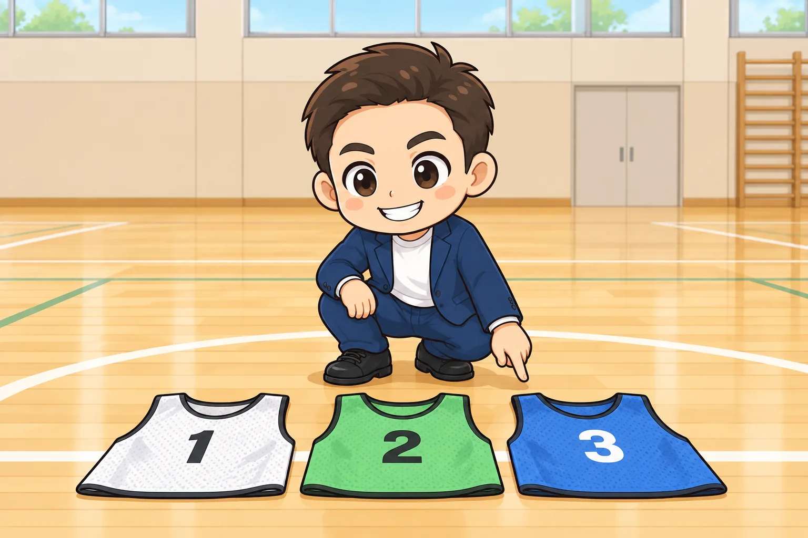
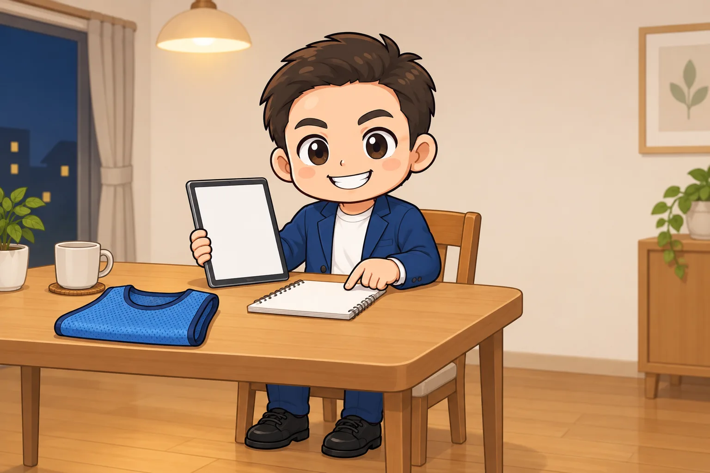
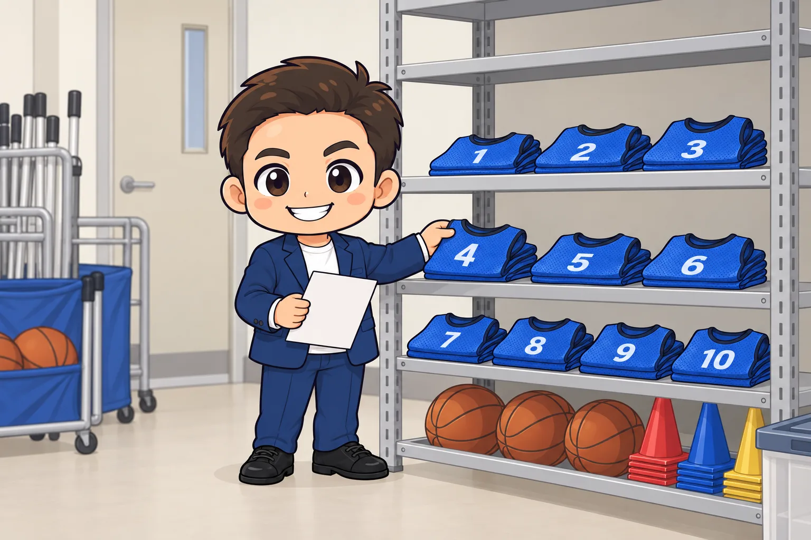

<!-- product-article-character-sheets: tamashiro-yusuke-character-sheet-v5.png, tl-four-character-style-master-v2.png, tamashiro-yusuke-business-casual-character-sheet-v3.png -->
<!-- product-article-character-check: hero-and-body-verified -->

長男がバスケ部で、私は父母会の連絡係をしています。

きっかけは、ビブスの数が合わなくなったことでした。うちの部にあるのは白と緑の2色。そのうち緑が数枚なくなっていて、残りは10枚ほどです。

もうひとつ、子どもたちから出ていた声があります。**汗でびっしょりになったビブスを、次の子がそのまま着ることがある**。交代のたびに脱いで渡すので、当然そうなります。これに抵抗がある、と。

数が足りないことと、使い回しに抵抗があること。この2つは、別々の問題に見えて、実は同じ打ち手で解けます。

買うことにしたのは、Amazonで買えるFungoalの番号入りビブス、青の21枚セットです。この記事では、なぜこの組み合わせにしたのかを順番に書きます。

  
  

    
Amazon.co.jp

    <h3>Fungoal ビブス 番号入り ゼッケン</h3>
    
前後に番号が入ったメッシュのビブスです。番号のセット、サイズ、色を選んで買います。

    <a class="affiliate-product-button" href="https://amzn.to/3TePjyn" target="_blank" rel="sponsored noopener noreferrer">Amazon.co.jpで商品を見る</a>
    
広告・アフィリエイトリンクです。紹介料は玉城祐輔個人に帰属します。価格、在庫、カラー、サイズ、番号のセット内容、付属品はAmazonの商品ページでご確認ください。

  

## 先に結論。番号入り21枚は「1人1枚を固定する」ために買う

番号入りビブスの使いどころは、練習中のチーム分けではありません。無地でも色が違えばチームは分かれます。

私が選んだ理由は、**部員1人に1枚を割り当てて、その子の番号のビブスをその子だけが着る状態にできる**ことです。

そうすると、こうなります。

- 自分のビブスしか着ないので、**他人の汗で濡れたものを着ることがなくなる**
- ビブスが個人の持ち物になるので、**なくなったときに誰の番号か分かる**
- 洗うのは各家庭になり、**父母会で洗濯当番を回す必要がなくなる**

うちの部は20名以下です。だから21枚で全員分そろい、この運用が成り立ちます。

逆に言えば、部員が21人を超えるチームでは、この運用はそのままでは回りません。その場合は素直に「共有の道具」として扱うことになり、番号入りを選ぶ理由も薄くなります。

## 21枚という枚数は、人数から逆算する

Amazonでは番号のセットが4通りから選べます。

| 番号のセット | 枚数 | 向いている場面 |
| --- | --- | --- |
| 1番から11番 | 11枚 | チーム分けの道具として共有で使う |
| 12番から16番 | 5枚 | 11枚では足りないときの追加分 |
| 17番から21番 | 5枚 | さらに追加するとき |
| 1番から21番 | 21枚 | 部員20名前後に1人1枚ずつ渡す |

共有の道具として使うなら、11枚で足ります。コートに立つのは5人ですから、片方のチームが着るだけなら11枚でも余ります。

**1人1枚にするなら、必要なのは部員数です。** ここで枚数の考え方が変わります。うちは20名以下なので、21枚セットがちょうど足ります。

22番以上が必要なチームは、Amazonのセットでは足りません。Fungoalの公式サイトに「番号指定ビブス」があるので、そちらを見てください。

## 色は「今あるビブスと並べて」決める

青にしたのは、うちに白と緑があるからです。3色そろえば、対戦の組み合わせが増えます。

Fungoalは11色から選べますが、公式サイトには、色分けに向かない組み合わせが名指しで書かれています。

- イエローとグリーン
- ブルーとスカイブルー
- レッドとピンク
- グレーとホワイト

白と緑に足すなら、この一覧に引っかからない色を選ぶことになります。青は問題ありません。

**注意したいのは、同じ「青」でもブルーとスカイブルーは別の色として並んでいる**ことです。すでに水色系のビブスを持っているチームは、濃いブルーを選ばないと体育館の照明の下で見分けがつきにくくなります。

もうひとつ、**チームの練習着やユニフォームと同じ色を避ける**ことも確認してください。色分けした意味がなくなります。

## サイズは「何年使うか」で決める

Fungoalのビブスは、ジュニア、ユース、フリーの3サイズです。公式サイトの案内は次のとおりです（2026年9月23日確認）。

| サイズ | 着丈と身幅 | 対象の目安 |
| --- | --- | --- |
| ジュニア | 55 x 45cm | 10歳くらいまで |
| ユース | 60 x 55cm | 11歳から13歳くらい |
| フリー | 70 x 60cm | 14歳以上 |

公式サイトでは、この目安は男性の体格を基準にしており、女子は高校生以上でもユースが適当と案内されています。

1人1枚で渡す場合、サイズ選びの考え方が共有のときと変わります。共有なら「真ん中のサイズでそろえる」で足りますが、個人持ちなら**その子が卒部するまで着られるか**で選びます。

- 中学1年生で渡して3年生まで使うなら、フリー
- ミニバスの低学年が中心ならジュニア、高学年が中心ならユース

ビブスは体に合わせる服ではありません。大きめのほうが脱ぎ着が速く、ユニフォームや長袖の上からも着られます。

## 注文前に3つ選ぶ。ここを取り違えやすい

この商品は、Amazonの同じページの中で3つの選択肢が並んでいます。

1. **番号**（1番から11番 / 1番から21番 / 12番から16番 / 17番から21番）
2. **サイズ**（フリー / ジュニア / ユース）
3. **色**（11色）

同じページの中で切り替わるので、**選び直したつもりで別の組み合わせのまま買ってしまう**ことがあります。カートに入れる前に、商品名の下に表示されている選択内容をもう一度読んでください。

あわせて、次の点も商品ページで確認します。

- 枚数が、選んだ番号のセットと合っているか
- 収納袋が何枚付くか（商品説明と実際の組み合わせで変わります）
- 返品と交換の条件。サイズが合わなかったときに戻せるか
- 出荷元と販売元。誰から買っているか

父母会のお金で買う場合、領収書やインボイスの発行条件も先に見ておくと、あとで会計担当者に聞かれずに済みます。

## 素材は薄手のメッシュ。個人持ちなら、洗い方を全家庭に配る

生地はメッシュのポリエステルで、適度な伸縮性があると公式サイトに書かれています。夏は通気性が良く、汗をかいても乾きが速い。冬は上着の上から着られます。

ただし、メッシュは薄手です。**下に着ている服の色が、ある程度透けます**。公式サイトのレビュー要約でも、生地が薄めという声が挙がっていると紹介されています。

洗濯は、公式サイトのガイドで次のように案内されています。

- 洗濯ネットに入れる
- プリントを守るため、裏返して中性洗剤で洗う
- 乾燥機とアイロンは使わない
- 陰干しする

番号はプリントです。**乾燥機の熱と、直接のアイロンがいちばんの敵**になります。

ここが、1人1枚にするときの注意点です。洗うのが父母会の当番なら、注意するのは1人で済みます。各家庭で洗うようになると、**20軒に同じ洗い方が伝わっていないといけません**。

私は、この4行をそのまま連絡グループに貼って配るつもりです。ルールを増やすのではなく、洗い方だけを1回共有する。それ以上は決めません。

## 1人1枚の運用を、どう回すか

ここからは商品そのものではなく、父母会としての運用の話です。うちはまだ検討中で、これから始めるところです。

考えているのは、この4つだけです。

1. **部員ごとに番号を割り振る**。一度決めたら、その年度は変えない
2. **割り振りは連絡グループに一度流すだけ**。名簿は作るが、更新の仕組みは作らない
3. **ビブスは各自が持ち帰って洗い、各自が持ってくる**。忘れた子のために、余った番号を予備として体育館に置く
4. **年度末に全員から回収し、枚数を数えてから次の学年へ渡す**

紛失がゼロになるとは思っていません。ただ、**共有の道具だと「なくなった」で終わる**ところが、個人持ちなら「何番がない」まで分かります。これだけで、探す手がかりが増えます。

緑が数枚なくなったときも、誰がどこに置いたのか、最後まで分かりませんでした。次は同じことにしたくない、というのが正直なところです。

あわせて、スプレッドシートや管理アプリは作らないつもりです。**仕組みを増やすほど、続かなくなる**からです。番号を書いた紙が1枚あれば足ります。

ビブスは消耗品です。破れたり、プリントが薄くなったりします。同じ番号を1枚だけ買い足すことはできないので、足りなくなったら5枚セットで補充する前提にしておくと気が楽です。

## チーム名を入れたいなら、Amazonではなく公式サイト

Amazonで買えるのは、番号だけが入ったビブスです。チーム名や団体名を入れたい場合は、Fungoalの公式サイトから注文します。

公式サイトでは、版代がかからず、1枚あたりのプリント代だけで名入れができると案内されています（2026年9月23日確認）。方式はシルクスクリーンで、インクは白か黒のみ。メッシュ生地の性質上、細い線や小さな文字は表現できないと明記されています。

使い分けは、こう考えると整理できます。

| | Amazon | Fungoal公式サイト |
| --- | --- | --- |
| 名入れ | できない | できる |
| 届くまで | 早い | 名入れありは日数がかかる |
| 送料 | 商品ページの条件による | 地域別に設定されている |
| 向いている場面 | すぐ練習で使いたい | チーム名を入れて長く使いたい |

沖縄や離島に住んでいる場合、通販の送料は本州より高く設定されていることが多く、Fungoalの公式サイトもそうなっています。急ぎで練習に使いたいならAmazon、名入れして長く使いたいなら公式サイト、という分け方が現実的です。

## 合わない人

- **部員が21人を超える**。1人1枚にできないので、番号入りを選ぶ利点が小さくなります
- **公式戦で使いたい**。これは練習とチーム分け用です。公式戦は各連盟のユニフォーム規定に従ってください
- **背番号を選手ごとに指定したい**。番号は1番から順に入っており、特定の番号だけを選んで買うことはできません
- **下に着た服を透けさせたくない**。薄手のメッシュなので、ある程度は透けます
- **乾燥機で一気に乾かしたい**。プリントが傷むため、公式サイトは乾燥機を避けるよう案内しています
- **22番以上が必要**。Amazonのセットでは足りないので、公式サイトの番号指定ビブスを見てください

## よくある質問

**共有で使うなら、番号は要りますか。**

チーム分けだけが目的なら要りません。無地のほうが安く済みます。番号が効くのは、1人1枚に固定したいときです。

**最初は何枚買えばいいですか。**

共有で使うなら、コートに立つ人数プラス予備。1人1枚にするなら、部員数から決めます。うちは20名以下なので21枚セットにしました。

**公式戦で使えますか。**

練習用です。公式戦のユニフォームは、所属する連盟や大会の規定で決まります。ミニバスも中学の大会も規定があるので、必ず確認してください。

**洗濯機で洗えますか。**

公式サイトでは、洗濯ネットに入れ、裏返して中性洗剤で洗い、乾燥機とアイロンは避けて陰干しする方法が案内されています。

**サイズが合わなかったら交換できますか。**

Amazonの返品と交換の条件は、出品者や商品によって変わります。注文前に商品ページの返品情報を確認してください。

**チーム名を入れられますか。**

Amazonで買えるものには入れられません。名入れはFungoalの公式サイトから注文します。

## この商品を見る

  
  

    
Amazon.co.jp

    <h3>Fungoal ビブス 番号入り ゼッケン</h3>
    
注文前に、番号のセット、サイズ、色の3つがそろっているかご確認ください。

    <a class="affiliate-product-button" href="https://amzn.to/3TePjyn" target="_blank" rel="sponsored noopener noreferrer">Amazon.co.jpで商品を見る</a>
    
広告・アフィリエイトリンクです。紹介料は玉城祐輔個人に帰属します。価格、在庫、カラー、サイズ、番号のセット内容、付属品はAmazonの商品ページでご確認ください。

  

## 確認した公式情報

仕様は2026年9月23日にメーカー公式サイトで確認しました。変更される場合があるため、注文前に最新の表示をご確認ください。

- [Fungoal公式サイト。番号入りビブスの仕様、サイズ表、素材、名入れ](https://fungoal.com/products/bib)
- [Fungoal公式サイト。ビブスの選び方ガイド](https://fungoal.com/blogs/bib/00_bib-guide_pillar)
- [Amazon.co.jpの商品ページ。ASIN B0FTSFJQ8N](https://www.amazon.co.jp/dp/B0FTSFJQ8N)
