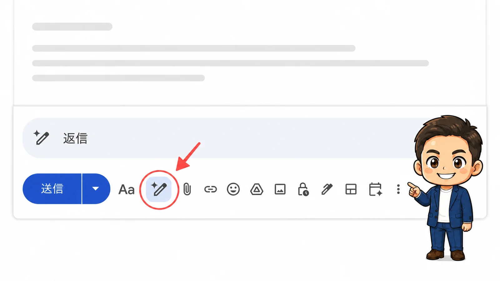

<!-- product-article-character-sheets: tamashiro-yusuke-business-casual-character-sheet-v3.png -->
<!-- product-article-character-check: hero-and-body-verified -->

お客様から届いた問い合わせメールを開き、「どう返そうか」と手が止まる。

メールの内容は理解できていても、失礼のない書き出し、伝える順番、言い回しを考えているうちに時間が過ぎていきます。特にクレームや確認事項の多いメールは、返信を始めるまでが重い仕事でした。

Google Workspaceを使うようになって、私が最初に大きな変化を感じたのが、このメール作成と返信です。

**Gmailの中でGeminiに下書きを頼めるようになり、「最初の一文を書く」というハードルが大きく下がりました。**

しかも、返信前にメールを要約したり、伝えたい要件を整理したりする必要はありません。受信メールの返信欄でGeminiを開き、まず「返信」と入れて下書きを出す。私が便利だと感じているのは、この省力化です。

## 一番の変化は、AIが送信することではなく、下書きから始められること

Geminiが作った文章を、そのまま一発で送れるとは限りません。宛先、日付、金額、約束する内容、添付ファイルは、自分で確認する必要があります。

それでも、白紙の状態から考え始めるのと、たたき台を読んで直すのとでは、負担がまったく違います。

私にとっての生産性向上は、文字を打つ速度が上がったことではありません。**「どう書き始めよう」と悩む時間が減り、確認と判断に集中できるようになったこと**です。

AIを使う前の準備も、できる限り増やしたくありません。一つのクリック、一つの入力、一つの画面移動でも減らすことが、毎日の仕事では効いてきます。

## 以前は、メールを別のAIへ運ぶ作業が必要だった

これまでも、AIにメールの下書きを作ってもらうことはできました。ただし、実際には次のような作業が発生します。

1. Gmailで受信メールを開く
2. 本文をコピーする
3. 別のAIツールを開いて貼り付ける
4. 相手との関係や、これまでの経緯を説明する
5. 生成された文章をGmailへ戻す
6. 内容を確認して送信する

一つひとつは小さな操作ですが、毎日何通も重なると無視できません。画面を行き来するたびに、何を伝えたかったのかも頭の中で組み直す必要があります。

GmailのGeminiなら、メールを開いた場所から下書き作成へ進めます。Googleの公式ヘルプでも、Gmailの「Help me write」で新規メールや返信の下書きを作り、既存文面をフォーマルにする、短くする、内容を追加するといった調整ができると案内されています。

特に返信では、Geminiがスレッド内の過去のメッセージを踏まえて、会話に沿った下書きを作れます。こちらが毎回、メールの経緯をコピーして説明し直す必要はありません。

## 返信は、まず「返信」だけで下書きを出す

正直、AIへ指示するためにメールを要約したり、返信の要件を整理したりすること自体が面倒です。

AIを使うための下準備が新しい仕事になってしまえば、究極の省力化にはなりません。私が最初に求めるのは、完璧な文章ではなく、**返信のたたき台が即座に出ること**です。

### 1. 受信メールの返信欄を開く

まず、届いたメールの返信欄を開きます。この時点で、Gmailには相手から届いたメールと、それまでのやり取りがあります。

本文をコピーして別のAIへ移す必要はありません。返信前に、自分でスレッドを要約する必要もありません。

### 2. Geminiのボタンを押し、「返信」と入れる

返信欄にあるGeminiのボタンを押し、私はまず、これだけ入力します。

> 返信

私の環境では、これでGeminiがメールのやり取りを踏まえた返信の下書きを作ります。

Googleの公式情報でも、「Help me write」はメールスレッド内の過去のメッセージの文脈を理解し、会話に関連する返信下書きを作ると説明されています。

利用環境によっては、開いているメールで「このメールへの返信を提案」を選ぶ導線や、スレッド全体を考慮した返信候補が表示される場合もあります。そのボタンが使えるなら、文字を入力する操作さえ減らせます。

### 3. 必要な修正だけ、後から指示する

まず出てきた下書きを読みます。そのまま使えそうなら、事実関係を確認して送ります。

不足があるときだけ、「金曜日までに一次回答すると入れて」「もう少しやわらかく」「短くして」と追加します。

2026年6月のGoogle公式アップデートでは、最初の下書きに対し、「2行目へ不足情報を加える」「期限を入れる」といった追加指示で文面を更新できる機能も案内されています。

大事なのは、最初から詳しい指示文を作ろうとしないことです。**まず下書きを出し、その下書きに足りない部分だけを直す。**この順番が、もっとも行動を減らせる使い方だと感じています。

## 新規メールは、最低限だけ伝えて下書きを出す

返信メールには、すでに相手とのやり取りがあります。一方、新規メールには返信元となる文脈がありません。そのため、目的だけは短く伝えます。

たとえば、長い依頼文を考える必要はありません。

> 昨日の相談のお礼。来週火曜日までに次の進め方を連絡。

まず下書きを出してから、必要な内容を追加します。新規メールでも、指示文をきれいに書くことへ時間を使わないのがポイントです。

## 過去のメールとDriveに情報があるほど、下書きは実務に近づく

Gmail内でGeminiを使う価値は、文章を生成できることだけではありません。

Googleの公式ヘルプでは、「Help me write」が他のメールやDriveファイルから関連情報を取り込み、下書きを個別化できると説明されています。参照したメールや文書は「Sources」から確認できます。

たとえば、過去のメールに打ち合わせの経緯があり、Driveに見積書や議事録が整理されていれば、必要になったときに情報を探してもらえます。

だから私は、Google Workspaceを単なるメールとファイル保存のセットではなく、**会社の仕事の経緯を、必要な権限の中でAIが参照しやすくする基盤**だと考えています。

ただし、資料名がばらばらで、古い版と最新版が混在していれば、AIも正しい情報を選びにくくなります。Gmailの活用と並行して、Driveのフォルダ、ファイル名、共有権限を整えることが大切です。

## 最後の確認は、必ず人が行う

AIが作るのは、あくまで下書きです。Googleの公式ヘルプにも、Geminiは不正確な内容を生成する場合があるため、提案内容を確認するよう注意書きがあります。

私は、送信前に最低でも次の項目を確認します。

- 宛先と相手の名前は合っているか
- 日付、曜日、時刻は合っているか
- 金額や数量に間違いはないか
- 約束していないことを断定していないか
- 添付すると書いたファイルが付いているか
- 相手との関係に合った言葉遣いか

特にクレーム対応では、きれいな文章を作ることより、事実関係と対応方針を間違えないことが優先です。

## 中小企業は、まず1通の返信から試せばよい

Google Workspaceを導入したからといって、最初から社内のすべての仕事をAI化する必要はありません。

まずは、毎日発生するメールを1通選び、次の順番で試すのがよいと思います。

1. 受信メールの返信欄を開く
2. Geminiのボタンを押し、「返信」と入れて下書きを出す
3. 足りない内容があるときだけ、追加で指示する
4. 宛先、固有名詞、日付、金額、添付を確認して送る

返信候補のボタンが表示される環境なら、それを押して下書きを出すところから始めても構いません。要約や要件整理を挟まず、まず返信案を見ることが大切です。

## Google Workspaceの便利さは、いつもの仕事の中にAIがいること

Google Workspaceで最初に実感した大きな効果は、派手な自動化ではありませんでした。

毎日使うGmailの中で、過去のやり取りを踏まえた返信下書きをすぐに出してもらえること。別のツールへ行き来せず、最後は自分で確認して送れること。

この「いつもの仕事の中で使える」感覚が、メール作成と返信の生産性を大きく変えました。

Google Workspaceをこれから活用するなら、まずはGmailから始める。私はそれが、効果を実感しやすい最初の一歩だと思います。

## 公式情報と利用前の確認

機能は、契約しているGoogle Workspaceのプラン、管理者設定、言語、提供状況によって表示されない場合があります。利用前に自社の環境で確認してください。

- [GmailでGeminiを使ってメールの下書きを作成する｜Gmailヘルプ](https://support.google.com/mail/answer/13955415?hl=ja)
- [GmailでGeminiと共同作業する｜Gmailヘルプ](https://support.google.com/mail/answer/14355636?hl=ja)
- [Gmailで利用できるGemini機能を確認する｜Gmailヘルプ](https://support.google.com/mail/answer/16831098?hl=ja)
- [「Help me write」の日本語対応とスレッド文脈の利用｜Google Workspace Updates](https://workspaceupdates.googleblog.com/2025/04/help-me-write-gmail-language-expansion.html)
- [Google Workspaceにおける生成AIのセキュリティ、コンプライアンス、プライバシー](https://workspace.google.com/security/ai-privacy/?hl=ja)
- [2026年6月のGoogle Workspace機能アップデート｜Google Workspace公式ブログ](https://workspace.google.com/blog/product-announcements/june-2026-workspace-feature-drop)

Googleは、許可なく顧客のWorkspaceデータをWorkspace外の基盤モデルの学習や改善に使わないと説明しています。一方で、社内の共有権限や利用ルールまで自動で整うわけではありません。誰がどのメールやファイルへアクセスできるかは、導入時に管理者が確認する必要があります。

機能と公式情報は、2026年8月21日に確認しました。
