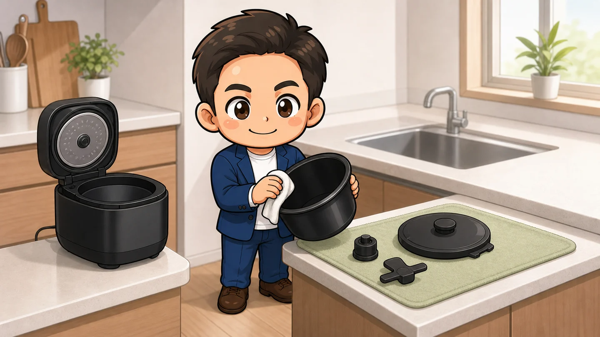
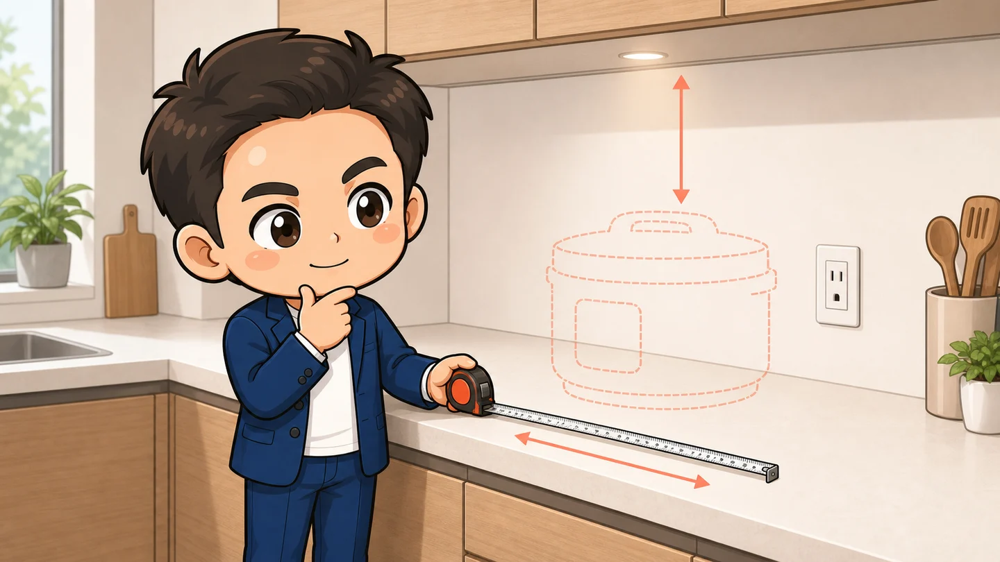

帰宅したら、子どもの荷物を片付ける。宿題を見る。洗濯物を取り込む。

その横で、夕食の鍋も見ていなければいけない。煮立ったら火を弱め、焦げないように混ぜる。毎日のことだからこそ、この同時進行は大変です。

ヘルシオ ホットクックは、材料を入れた後の加熱とかきまぜを任せられる自動調理鍋です。料理が一瞬で完成する機械ではありません。**鍋の前に立つ時間を、家族のための時間へ移す道具**として考えると、役割が分かりやすくなります。

この記事は、玉城本人の使用レビューではありません。指定されたAmazonリンクの「KN-HW24G-R」を、2026年8月15日時点のシャープ公式情報、取扱説明書、第三者の使用レビューをもとに紹介します。

  
  

    
Amazon.co.jp

    <h3>ヘルシオ ホットクック KN-HW24G-R</h3>
    
2.4L、2～6人用の2021年モデル。無線LANと、付属トレイによる2段同時調理に対応します。

    <a class="affiliate-product-button" href="https://amzn.asia/d/077N50rI" target="_blank" rel="sponsored noopener noreferrer">Amazon.co.jpで商品を見る</a>
    
広告・商品リンクです。紹介料が発生する場合は玉城祐輔個人に帰属します。商品画像はシャープ公式のKN-HW24G-R画像です。価格、在庫、販売元、保証内容、付属品はAmazonの商品ページでご確認ください。

  

## 先に結論。調理時間より、手を離せる時間を増やしたい家庭に向いている

KN-HW24Gは、煮物、カレー、スープをよく作る家庭に向いています。材料を切って調味料と一緒に入れ、メニューを選べば、火加減とかきまぜを本体へ任せられます。

特に合いやすいのは、次のような家庭です。

- 夕方は子どもの世話と夕食づくりが重なる
- 3人以上の食事や、翌日分までまとめて作りたい
- 煮込み中にキッチンを離れ、別の家事を進めたい
- 火を使わず、予約調理や保温も使いたい

一方で、短時間で圧力調理したい人、焼き目を付けたい人、洗う部品を増やしたくない人には合わない可能性があります。

指定リンクのKN-HW24Gは2021年9月発売のモデルです。2026年8月15日時点では2024年モデルのKN-HW24Hが販売され、2026年9月17日発売予定のKN-HW24Kも発表されています。**旧モデルとしての価格差と、販売元・保証、新モデルの追加機能を比べてから選ぶこと**が大切です。

## ホットクックが減らすのは、鍋の前にいる時間

ホットクックは電気圧力鍋ではありません。料理によっては、普通の鍋より完成まで長くかかることもあります。

それでも助かるのは、加熱中に鍋を見張らなくてよいことです。シャープ公式では、温度と蒸気のセンサーで火加減を調整し、対応メニューでは「まぜ技ユニット」が加熱の進行に合わせて食材をかきまぜると案内しています。

たとえば夕方なら、次のように役割を分けられます。

1. 帰宅後に食材を切り、内鍋へ入れる
2. 本体でメニューを選び、加熱を始める
3. 調理中に宿題、入浴、洗濯、翌日の準備を進める
4. 完成後に味と火の通りを確認し、食卓へ出す

包丁を使う下ごしらえや、盛り付け、食後の片付けは残ります。全部を自動化するのではなく、**火加減を見る仕事をひとつ手放す**。私はここを大事にして選びたいと思います。

## 2.4Lは、3人以上や作り置きに使いやすい大きさ

KN-HW24Gの調理容量は2.4Lです。シャープは無水カレーを基準に2～6人分の目安としています。

本体は幅345mm、奥行305mm、高さ256mm、重さ約5.8kgです。数字だけでは小さく見えますが、5合炊き炊飯器に近い面積を常に使います。毎回棚から出すより、置いたまま使える場所を作れる家庭の方が続けやすいでしょう。

本体に掲載されたメニューは145件です。煮物やスープのほか、蒸し物、めん、発酵・低温調理、お菓子にも対応します。無線LANへ接続すると、COCORO HOMEとCOCORO KITCHENのレシピサービスを使ってクラウドメニューを本体へ送れます。

付属の蒸しトレイを使う2段同時調理にも対応します。下段でごはんや汁物を作りながら、上段でおかずを蒸す使い方です。ただし、すべての料理を自由に組み合わせられるわけではありません。最初は公式メニューにある組み合わせから試す方が安全です。

## 予約調理は便利。ただし、使えるメニューは限られる

最大予約設定時間は15時間です。朝に食材を入れ、帰宅時刻へ合わせて仕上げる使い方ができます。

予約調理は、単に常温で待って最後に加熱する仕組みではありません。取扱説明書では、食材の衛生面に配慮して先に火を通し、予約時刻に仕上がるよう調理すると説明されています。

ただし、KN-HW24Gで予約できるのは42メニューです。ごはんの予約は最大12時間で、予約後に自動保温へ移らないメニューもあります。

買った初日から自己流の予約へ広げず、次の順番で試すと安心です。

1. 休日に公式レシピどおりの分量で通常調理する
2. 家族が食べる量と味を確認する
3. 同じ公式メニューを短い予約時間で試す
4. 問題がなければ、平日の帰宅時刻へ合わせる

## 洗い物はゼロにならない。内鍋は手洗いする

ホットクックは、食事づくりの手間を別の場所へ移す道具でもあります。

調理後は内鍋だけでなく、内ぶた、蒸気口カバー、つゆ受け、使用した場合はまぜ技ユニットも洗います。内鍋以外の取り外し部品は食洗機を使えますが、フッ素コートの内鍋は食洗機で洗えません。

複数の使用レビューでも、よく挙がっていた不満は「部品が複数ある」「内鍋が大きい」「においの強い料理は早めに洗いたい」という点でした。一方で、鍋やフライパン、コンロ周りの掃除まで含めれば、負担が大きく増えたとは感じないという声もあります。

私は、購入前にシンクへ同じくらいの大きさの鍋を置いてみるのがよいと思います。調理スペースに置けるかだけでなく、**毎日洗って乾かせるか**まで想像すると、使い続けられるか判断しやすくなります。

## 購入前は、置き場所と電源を実際に測る

購入前に確認したいのは、本体寸法だけではありません。

- 幅345mm、奥行305mmを置けるか
- 高さ256mmに加え、ふたを開ける上の空間があるか
- 蒸気が棚や壁、差し込んだ電源プラグへ当たらないか
- 約1.4mの電源コードで、専用コンセントへ届くか
- スライド棚が、食材と水を入れた約12kgの重さに耐えられるか

取扱説明書では、定格15A以上、交流100Vの専用コンセントを単独で使うよう案内しています。延長コードや分岐コンセントを前提に置き場所を決めない方が安全です。

赤い本体はキッチンで存在感があります。寸法と電源に加え、毎日目に入る色として受け入れられるかも確認します。

## 2021年モデルを買う前に、KN-HW24HとKN-HW24Kも比べる

指定リンクのKN-HW24Gには、自動かきまぜ、2段同時調理、無線LAN、予約調理など、ホットクックの中心機能がそろっています。

ただし、2026年8月15日時点では型落ちです。新旧モデルは、次のように見分けられます。

| 型番 | 発売時期 | 主な違い | 購入判断 |
| --- | --- | --- | --- |
| KN-HW24G | 2021年9月 | 145メニュー、蒸しトレイ、約5.8kg | 基本機能を重視し、販売元と保証を確認できる人 |
| KN-HW24H | 2024年8月 | 172メニュー、短時間メニュー、本体底面のお手入れ改善、約6.0kg | 現在購入できる新しい世代を選びたい人 |
| KN-HW24K | 2026年9月17日発売予定 | 197メニュー、もっとトレー、2段調理30メニュー、冷凍ストック対応メニュー、アプリの生成AI機能 | 急がず、発表済みの新機能まで比較したい人 |

外形寸法は3機種とも幅345mm、奥行305mm、高さ256mmです。置き場所の条件はほぼ変わりません。

旧モデルが合わないわけではありません。煮物やスープを任せたいという中心目的はKN-HW24Gでも果たせます。ただし、価格差が小さいなら、新しいレシピやお手入れ、保証条件まで含めてKN-HW24Hも比較した方がよいでしょう。KN-HW24Kはこの記事の確認日時点では発売前です。

## 最初の一週間は、定番3品だけで慣れる

メニュー数が多くても、最初から使いこなす必要はありません。

私なら、具だくさんみそ汁、肉じゃが、カレーのように、家族が普段食べる定番料理から始めます。

1. 公式レシピの分量と切り方を守る
2. まぜ技ユニットなど、画面が案内する部品を付ける
3. 完成後に味と火の通りを確認する
4. 家族に合う味へ、次回から少しずつ調整する
5. 洗う部品の置き場所まで決める

無線LAN設定やクラウドメニューは、その後でも構いません。本体に入っている定番メニューだけで一週間使い、生活の流れに合うかを先に確かめます。

## 停電や故障時は、普通の鍋へ戻れるようにする

電気で動くため、停電や本体エラーがあれば調理は止まります。取扱説明書でも、仕上がりに問題があるときは停電の有無を確認するよう案内しています。

調理が途中で止まった場合、見た目だけで食べられると判断しません。食材を普通の鍋へ移し、中心まで十分に加熱できる状態へ戻します。

エラー表示を取り消しても再び表示される、電源コードや本体が異常に熱い、焦げ臭いにおいや異常な音がするときは、使用を中止して電源プラグを抜きます。分解せず、販売店またはシャープの相談窓口へ連絡します。

譲渡や処分をするときは、COCORO HOMEの機器登録を解除し、本体の無線LAN設定も消去します。便利なクラウド機能を使う製品だからこそ、最後に登録情報を残さないことも大切です。

## こんな人には合わないかもしれません

- 圧力調理で完成時間そのものを短くしたい
- 炒め物や焼き物の香ばしい焼き目を重視する
- キッチンに幅35cmほどの常設場所を作れない
- 大きな内鍋を手洗いするのが負担になる
- 1～2人分を少量ずつ作り、作り置きをしない
- 旧モデルの販売元や保証を確認するのが難しい

少人数なら1.6Lや1.0Lも選択肢です。大きい方が安心と決めず、普段作る量とシンク、収納まで含めて選びます。

## よくある疑問

### 圧力鍋のように、料理が早くできる？

KN-HW24Gは電気圧力鍋ではありません。完成までの時間より、加熱中に鍋から離れられることを目的に選ぶ製品です。

### 無線LANにつながなくても使える？

本体に入っているメニューや手動調理は使えます。クラウドメニューの追加やアプリ連携を使う場合は、無線LANとCOCORO HOMEへの登録が必要です。

### 2段同時調理なら、好きな料理を二つ作れる？

付属の蒸しトレイを使い、上下で2種類を調理できます。ただし、加熱時間や蒸気の条件が合う組み合わせが必要です。最初は公式の2段調理メニューから選びます。

### 朝に肉や魚を入れて、夜まで予約して大丈夫？

予約対応メニューでは、衛生面に配慮した調理工程が組まれています。すべてのメニューが予約できるわけではないため、公式メニューと指定分量を守ります。

### 内鍋も食洗機で洗える？

内鍋は食洗機で洗えません。内ぶた、蒸気口カバー、つゆ受け、まぜ技ユニットなどの取り外し部品は食洗機を使えます。

### KN-HW24Gは今から買ってもよい？

自動かきまぜ、予約、2段調理という中心機能を重視するなら候補になります。ただし2021年モデルです。KN-HW24Hの販売条件と、2026年9月17日発売予定のKN-HW24Kも比べてください。

## 商品と公式情報を確認する

  
  

    
Amazon.co.jp

    <h3>ヘルシオ ホットクック KN-HW24G-R</h3>
    
購入前に、2021年モデルであること、販売元、保証、付属品、新しい2.4Lモデルとの違いをご確認ください。

    <a class="affiliate-product-button" href="https://amzn.asia/d/077N50rI" target="_blank" rel="sponsored noopener noreferrer">Amazon.co.jpで商品を見る</a>
    
広告・商品リンクです。紹介料が発生する場合は玉城祐輔個人に帰属します。商品画像はシャープ公式のKN-HW24G-R画像です。価格、在庫、販売元、保証内容、付属品はAmazonの商品ページでご確認ください。

  

- [KN-HW24Gの公式製品情報](https://jp.sharp/hotcook/products/knhw24g/)
- [KN-HW24Gの仕様と寸法](https://jp.sharp/hotcook/products/knhw24g/spec/)
- [調理、2段同時調理、予約調理の公式説明](https://jp.sharp/hotcook/products/knhw24g/feature/cook/)
- [使いやすさとお手入れの公式説明](https://jp.sharp/hotcook/products/knhw24g/feature/usability/)
- [KN-HW24Gの取扱説明書](https://jp.sharp/support/hotcook/doc/knhw16g-24g_mn.pdf)
- [2024年モデルKN-HW24Hの公式製品情報](https://jp.sharp/hotcook/products/knhw24h/)
- [2026年モデルKN-HW24Kの公式発表](https://corporate.jp.sharp/news/260729-a.html)

第三者の使用感は、価格.com、Rentio PRESS、ITmedia Fav-Log、ノジマのレビューを中心に確認しました。置き場所、洗う部品、得意な煮込み料理、圧力鍋との違いに共通した言及がありました。実閲覧数が公開されていない記事もあるため、検索順位、具体性、更新日を参考に選んでいます。

- [KN-HW24Gの利用者レビュー](https://review.kakaku.com/review/J0000036368/)
- [KN-HW24Gの実機レビュー](https://www.rentio.jp/matome/hotcook-knhw24g-review/)
- [3年間使った人の良い点と注意点](https://www.itmedia.co.jp/fav/articles/2402/28/news157.html)
- [ホットクックのお手入れと得意・不得意](https://www.nojima.co.jp/support/koneta/35693/)

製品仕様、サポート情報、新製品の発売予定は、2026年8月15日に公式情報を確認しました。
