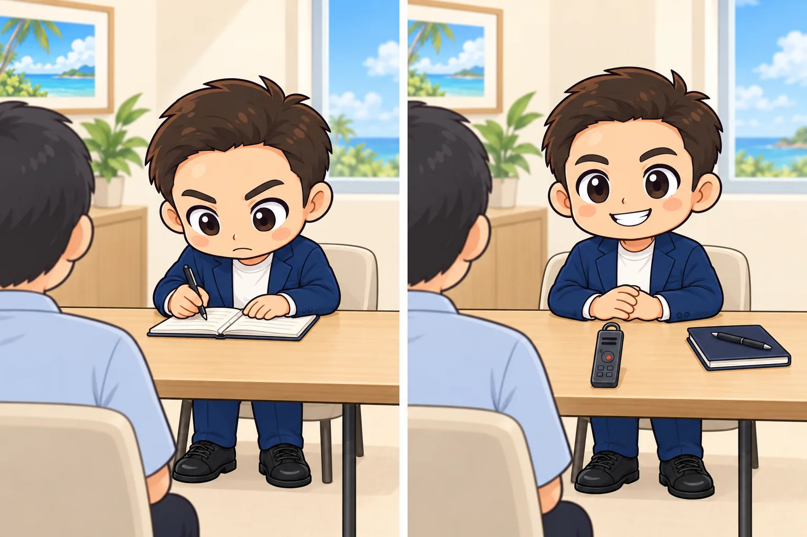
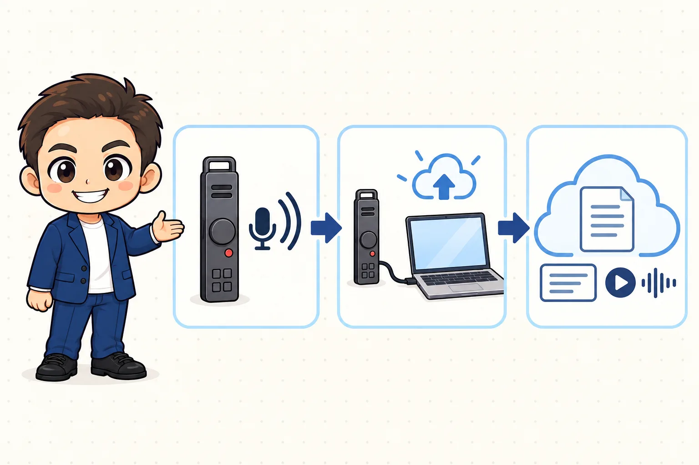
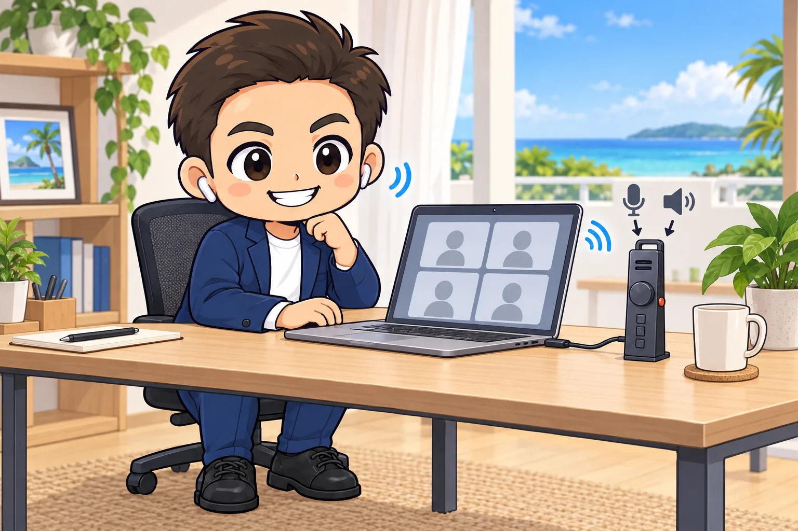
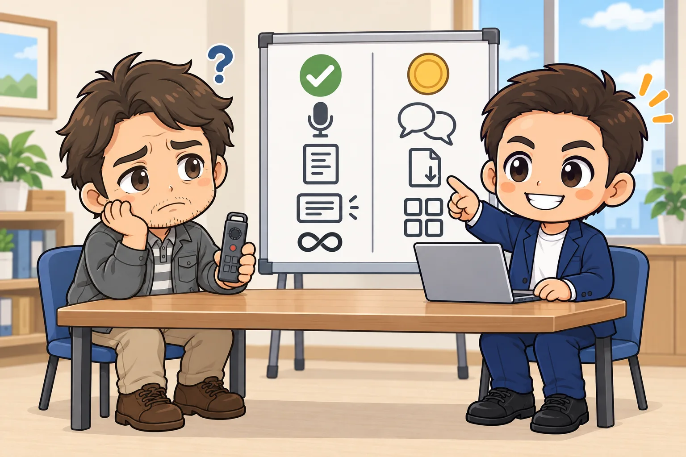

<!-- product-article-character-sheets: tamashiro-yusuke-character-sheet-v5.png, tl-four-character-style-master-v2.png, tamashiro-yusuke-business-casual-character-sheet-v3.png, worried-business-owner-character-sheet-v1.png -->
<!-- product-article-character-check: hero-and-body-verified -->

相談や打ち合わせの最中、メモを取ることに気を取られて、相手の顔を見る余裕がなくなる。終わった後は録音を最初から聞き直して、報告書や議事録を一から書く。

私はこの二つの手間を減らすために、**AIボイスレコーダー「HiDock P1（ハイドック ピーワン）」**を使っています。

一言でいうと、**録音した会話を、文字と要約に自動で変えてくれる小さなレコーダー**です。録音時間や月々の料金を気にせず使えるので、記録を残したい相談や会議をそのまま録れます。

  
  

    
HiDock公式・紹介リンク

    <h3>HiDock P1 AIボイスレコーダー</h3>
    
紹介リンクから購入すると、紹介ページに掲載の対象商品が10%OFFになると公式ページで案内されています。

    <a class="affiliate-product-button" href="https://jp.hidock.com/pages/referral-program?ref=uzxdtbsg" target="_blank" rel="sponsored noopener noreferrer">公式サイトで10%OFFを確認する</a>
    
広告・紹介リンクです。購入により玉城祐輔個人に特典が入る場合があります。割引の適用、価格、在庫、付属品、保証、返品条件は購入画面でご確認ください。

  

## 先に結論。「録音の後の作業」を減らしたい人に合う

HiDock P1が合うのは、相談、商談、オンライン会議が多く、**録音した後の文字起こしや整理まで一つの流れにしたい人**です。

次の三つに当てはまるなら、分かりやすい選択肢です。

- 本体を買った後は、文字起こしとAI要約を月額料金なしで使い続けたい
- 録音、文字起こし、要約を一か所でまとめて見返したい
- 「今月はあと何分文字起こしできるか」を気にせず、必要な会話を録りたい

逆に、録音をクラウド（インターネット上の保存場所）へ一切送りたくない人や、会議が少なくスマートフォンの録音で足りている人には向きません。詳しくは後半の「合わないかもしれない人」で説明します。

## 録音すると、会話中と会話後の動きが変わる

レコーダーを使う一番の効果は、**会話中にメモを書く必要がほぼなくなること**です。相手の話を聞きながら書き続けると、どうしても視線が手元へ下がります。P1で記録を残しておけば、会話中は相手の表情と話の流れに集中できます。

会話が終わった後も変わります。録音を最初から聞き直す代わりに、AIが作った文字起こし（音声を文字にしたもの）と要約（大事な点を短くまとめたもの）を読み、そこから報告書や議事録の下書きを作れます。

## しくみは3つの部品で考えると分かりやすい

HiDock P1は、本体だけで完結する道具ではありません。次の三つが組み合わさって動きます。

1. **P1本体**。録音する小さな機械です。本体に64GBの保存場所があり、録音はまずここに残ります。
2. **パソコンやスマートフォン**。P1をUSB-Cケーブルでつなぎ、録音を送るための窓口になります。
3. **HiNotes（ハイノーツ）**。HiDock社のウェブサービスです。ここへ録音を送ると、文字起こしと要約が作られ、音声と一緒に保存されます。

ポイントは、**録音しただけでは文字起こしは始まらない**ことです。P1本体の録音を、パソコンやスマートフォン経由でHiNotesへ送る操作が必要です。この「送る」作業をアップロードと呼びます。

## 使い方は4ステップ

私が毎回行う流れは、次のとおりです。

1. **録音前に相手へ伝える**。録音すること、何に使うか、誰が確認するかを話し、了承を得ます。
2. **本体のボタンで録音を始める**。対面のときはP1を机の中央に置きます。
3. **終わったらパソコンにつなぐ**。USB-CケーブルでP1をつなぎ、HiNotesを開きます。
4. **アップロードして、要約を確認する**。録音一覧から取り込むと文字起こしと要約が作られます。名前、金額、期限は必ず自分で確認します。

下の画像は、HiDock公式ガイドに載っているHiNotesの実際の画面です。P1が接続されると端末内の録音一覧が開き、アップロードと文字起こしを進められます。画面はアップデートで変わる場合があります。

<figure class="article-screen">
  
  <figcaption>HiDock公式ガイドのHiNotes実画面。端末を接続し、録音を選んでアップロードと文字起こしを進めます。</figcaption>
</figure>

公式は、1時間の録音を1分未満で転送できると案内しています。実際の時間は、つなぐ端末や通信環境で変わります。

## 私がHiDock P1を使う場面

### 相談窓口や対面の打ち合わせ

商工会の相談窓口や、事業所を訪ねての打ち合わせでは、P1単体で録音する「対面モード」を使います。机の中央に置き、終わったらデスクに戻ってHiNotesへ取り込みます。

公式ガイドの集音の目安は約3mです。広い会議室や声の小さい人がいる場面では、置き場所を工夫し、最初に短いテスト録音をしておくと安心です。

相談後は、文字起こしと要約を報告書の下書きに使います。AIが作った文章をそのまま提出せず、固有名詞、金額、期限、担当者を元の音声と照らし合わせます。

### Zoom、Teams、Google Meetなどのオンライン会議

オンライン会議では、P1が**パソコンとイヤホンの間に入る形**で録音します。つなぎ方は次のとおりです。

1. P1をUSB-Cケーブルでパソコンにつなぐ
2. P1のボタンでBluetoothイヤホンをP1に接続する。公式はこの機能を「BlueCatch（ブルーキャッチ）」と呼んでいます
3. 会議アプリの設定で、**マイクとスピーカーの両方を「HiDock P1」にする**

自分の声はP1のマイクから、相手の声はP1を通ってイヤホンへ流れるので、両方の声が録音に残ります。

ここでつまずきやすいのは3番です。片方だけイヤホンを直接選ぶと、相手の声がP1を通らず、録音に入りません。大切な会議の前に、一人で短いテスト通話をして、両方の声が入るか確かめておくと安心です。

### セミナーや長い会議

文字起こしの残り時間を気にせず録音できるのは助かります。ただし、公式FAQによると、**1つの録音ファイルは最大4時間、本体の連続動作は最大8時間**です。

「無制限」なのは文字起こし時間の話で、電池と1ファイルの長さには上限があります。終日の研修やイベントでは、休憩中に充電し、どこでファイルを区切るかを先に決めておきます。

## 無料でできること、有料になること

HiDock公式は、HiDock製品の所有者に対して、AIによる文字起こしと要約を**生涯無料**で提供すると案内しています。2026年9月26日時点のプラン比較では、無料のメンバーシップでも、タイムスタンプ付き文字起こしの時間は無制限です。

つまり、相談や会議が重なった月でも、「残り何分だから今日は録音をやめよう」と考えなくてよいということです。私は、使った時間ではなく、**記録を残す必要があるかどうかで録音を決められる**点に一番魅力を感じています。

一方で、**すべての機能が無料になるわけではありません**。次の機能は、有料のプロメンバーシップの範囲です。

- 話者識別。誰が話したかを色分けして、名前を割り当てる機能
- 要約テンプレートの追加とカスタマイズ。無料でも8種類以上は使えます
- WordやPDFなどへの出力。無料はテキストファイル（.txt）のみ
- NotionやGoogleドキュメントなど、外部サービスへの連携の一部

私の使い方では、文字起こしと要約を読んで自分で下書きを作れば足りるので、無料の範囲で使っています。話者ごとの発言を分けたい人や、Word形式でそのまま提出したい人は、購入前に[HiNotesの現行プラン比較](https://jp.hidock.com/pages/hinotes)を確認してください。

## 録音前の了承と、AIへ送る情報の線引きは必要

レコーダーが小さくても、相手に知らせずに録音してよいとは考えていません。私は、録音すること、目的、誰が確認するかを先に伝えます。

もう一つ大事なのは、**クラウドへ送ってよい情報かどうかを先に決めておくこと**です。HiNotesへアップロードした音声は、HiDock社のサーバーで処理されます。顧客の個人情報、未公開の経営情報、健康情報、パスワードなどが含まれる会話は、録音しない、その部分だけ止める、別の記録方法に切り替える、といった判断が必要です。

また、文字起こしとAI要約には、固有名詞の取り違えや発言の抜けが起こり得ます。要約は議事録の完成品ではなく、**確認すべき下書き**として使います。

## 購入前に確認したいこと

| 確認すること | 2026年9月26日時点の公式の案内 | 私ならこう確認する |
| --- | --- | --- |
| 無料の範囲 | 文字起こし時間は無制限。AI要約も利用可能 | 話者識別や必要な出力形式が有料かを見る |
| 保存 | 本体に64GB。アップロード後はHiNotesに保存 | 録音後のアップロード手順を一度試す |
| 録音時間 | 1ファイル最大4時間、連続動作は最大8時間 | 終日利用なら充電と区切りを決める |
| パソコン | macOS、Windowsに対応 | 会社のPCでHiNotesとUSB機器を使えるか確認する |
| スマートフォン | USB-C接続に対応した端末。iPhoneは15以降 | 自分の端末が対象か公式情報で確認する |
| AIの精度 | 75言語に対応 | 固有名詞、金額、期限は必ず元の音声で確認する |

## 導入初日に試しておくこと

買ってすぐ本番で使うより、次の三つを先に試しておくと、当日に慌てません。

1. 一人で1分ほど話して録音し、HiNotesへアップロードするまでを通しでやってみる
2. 出てきた文字起こしを読み、自分の名前や会社名がどう変換されるかを見ておく
3. オンライン会議で使うなら、テスト通話で自分と相手の両方の声が入るか確かめる

## こんな人には合わないかもしれません

- 録音データをクラウドへ一切送りたくない
- 会議が少なく、スマートフォンの録音だけで足りている
- AIの要約を人が確認する時間も取りたくない
- 会社のパソコンで外部のUSB機器やHiNotesを使えない
- 話者識別、豊富なテンプレート、Word・PDF出力まで追加料金なしで使いたい

## よくある疑問

### 本当に月額料金なしで使える？

HiDock製品の所有者は、標準の文字起こしとAI要約を生涯無料で使えると公式に案内されています。文字起こし時間も無制限です。話者識別や一部の高度な機能には、有料のプロメンバーシップがあります。

### 録音したら、自動でクラウドへ入る？

対面モードでP1単体に録音した音声は、P1を対応端末につなぎ、HiNotesへアップロードする操作が必要です。アップロード後は、音声、文字起こし、要約をウェブ上でまとめて確認できます。

### スマートフォンだけでも使える？

公式は、USB-C接続に対応したスマートフォンとタブレットで使えると案内しています。iPhoneは15以降が対象です。HiNotesのアプリもiOSとAndroidで公開されています。自分の端末が対象かは、購入前に公式情報で確認してください。

### 長時間でも、本当に時間を気にしなくてよい？

文字起こしの残り時間は気にせず使えます。ただし、1ファイルは最大4時間、本体の連続動作は最大8時間です。長い会議では途中でファイルを分け、電池の残量を確認します。

### 文字起こしだけで、議事録は完成する？

完成とは考えない方が安全です。HiNotesの要約を下書きにして、名前、数字、決定事項、期限を人が確認します。

## 紹介リンクから対象商品が10%OFF

紹介ページでは、このリンク経由で対象商品を購入すると、レジで10%OFFが自動で適用されると案内されています。購入を確定する前に、カートまたは決済画面で割引が反映されていることをご確認ください。

  
  

    
HiDock公式・紹介リンク

    <h3>HiDock P1を10%OFFで確認する</h3>
    
無料で使える範囲、必要な有料機能、対応端末を確認してから購入してください。

    <a class="affiliate-product-button" href="https://jp.hidock.com/pages/referral-program?ref=uzxdtbsg" target="_blank" rel="sponsored noopener noreferrer">紹介リンクで公式サイトを開く</a>
    
広告・紹介リンクです。購入により玉城祐輔個人に特典が入る場合があります。割引条件は変更される可能性があるため、購入画面で適用をご確認ください。

  

## 公式情報

- [HiDock P1 公式製品ページ](https://jp.hidock.com/products/hidock-p1)
- [HiNotesの機能とプラン比較](https://jp.hidock.com/pages/hinotes)
- [HiDock P1 Setup Guide](https://www.hidock.com/blogs/user-guide/hidock-p1-setup-guide)
- [HiDock P1 FAQ](https://www.hidock.com/blogs/user-guide/hidock-p1-faq)
- [MacとBluetoothイヤホンで録音・取り込みする公式ガイド](https://www.hidock.com/blogs/user-guide/how-to-record-and-transcribe-teams-meetings-on-mac-with-airpods)
- [HiDock友達紹介プログラム](https://jp.hidock.com/pages/referral-program?ref=uzxdtbsg)
- [最初に公開したnote版の記事](https://note.com/tama_taxlegal/n/n50ec8cfe4865)

製品仕様、HiNotesの無料・有料の範囲、紹介リンクの10%OFFの条件は、2026年9月26日に公式情報を確認しました。
