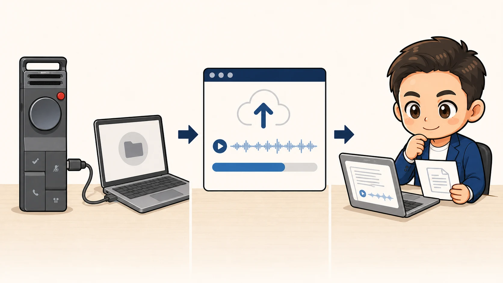
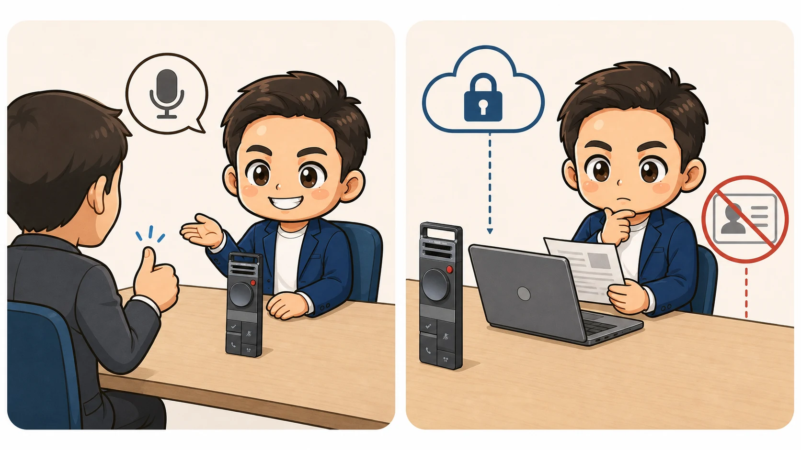
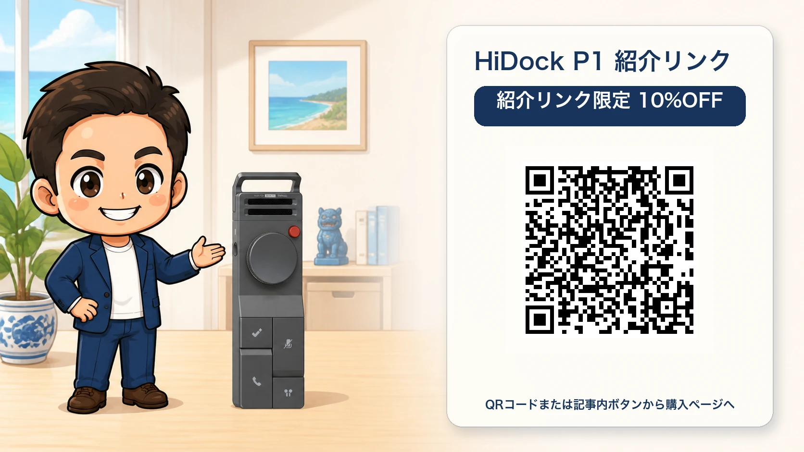

<!-- product-article-character-sheets: tamashiro-yusuke-business-casual-character-sheet-v3.png -->
<!-- product-article-character-check: hero-and-body-verified -->

相談や打ち合わせの最中、手元のノートへ書くことに集中してしまう。終わった後は録音を聞き直し、報告書や議事録を一から作る。

この二つの作業を軽くするために、私が使っているのが**AIボイスレコーダー「HiDock P1」**です。

私が一番魅力を感じているのは、録音機そのものよりも、その後の運用です。文字起こしの残り時間を気にせず、録音をHiNotesへ送れば、音声、文字起こし、要約をウェブ上でまとめて確認できます。

  
  

    
HiDock公式・紹介リンク

    <h3>HiDock P1 AIボイスレコーダー</h3>
    
紹介リンクから購入すると、HiDock全製品が10%OFFになると公式ページで案内されています。

    <a class="affiliate-product-button" href="https://jp.hidock.com/pages/referral-program?ref=uzxdtbsg" target="_blank" rel="sponsored noopener noreferrer">公式サイトで10%OFFを確認する</a>
    
広告・紹介リンクです。購入により玉城祐輔個人に特典が入る場合があります。割引の適用、価格、在庫、付属品、保証、返品条件は購入画面でご確認ください。

  

## 先に結論。会議の回数ではなく、記録を残す必要で録音を決められる

HiDock P1が合うのは、相談、商談、オンライン会議が多く、録音後の文字起こしやファイル整理まで一つの流れにしたい人です。

特に、次の三つを大事にする人には分かりやすい選択肢です。

- 本体購入後、標準の文字起こしとAI要約を追加の月額料金なしで使い続けたい
- 録音、文字起こし、要約をHiNotes上でまとめて見返したい
- 毎月の文字起こし残り時間を気にせず、必要な会話を記録したい

ただし、録音しただけで、すべてが自動的にウェブへ保存されるわけではありません。対面で単体録音した音声は、P1をパソコンや対応スマートフォンへつなぎ、HiNotesからアップロードする工程があります。

## 買い切りで無制限。標準の文字起こしと要約を使い続けられる

HiDock公式は、HiDockデバイスの所有者に対して、AIによる文字起こしと要約を生涯無料で提供すると案内しています。2026年8月21日時点のプラン比較では、無料のメンバーシップでもタイムスタンプ付き文字起こし時間は無制限です。

これは、相談や会議が重なった月に「残り何分だから、今日は録音をやめよう」と考えなくてよいということです。私は、使った時間ではなく、記録を残す必要があるかどうかで録音を決められる点に魅力を感じています。

一方で、**すべての機能が買い切りになるわけではありません**。話者識別、要約テンプレートの追加、Word・PDFなどへの出力、外部サービス連携の一部は有料のプロ機能です。標準範囲で足りるかは、購入前に[HiNotesの現行プラン比較](https://jp.hidock.com/pages/hinotes)で確認してください。

## クラウドストレージ無制限。ローカルの録音フォルダを増やさなくてよい

P1本体には64GBのストレージがあり、公式製品ページではHiNotesのクラウドストレージも無制限と案内されています。

録音をHiNotesへアップロードすると、音声と文字起こし、要約を同じノートとしてウェブ上で確認できます。パソコンへ音声ファイルをコピーし、「会議録音」「会議録音2」「最終版」のようなフォルダを自分で増やさなくてよい。私にとっては、この整理を抱え込まないことが大きな利点です。

HiNotesにはフォルダ、タグ、検索もあります。保存場所を自分で管理しなくても、後から会議名や内容で探せます。

ただし、アップロード前の音声はP1本体にあります。**録音後にHiNotesへ送る操作は必要**です。また、機密情報を無条件にクラウドへ送ってよいという意味でもありません。

## 録音から取り込みまで。実際はこの4段階

私が使う基本の流れは、次のとおりです。

1. 録音前に相手へ目的を伝え、了承を得る
2. HiDockキーを長押しして録音を始める
3. 終了後、P1をUSB-Cでパソコンへつなぎ、HiNotesを開く
4. 録音一覧からアップロードと文字起こしを進め、要約を自分で確認する

下の画像は、HiDock公式ガイドに掲載されているHiNotesの実画面です。P1が接続済みになると、端末内の録音一覧を開き、アップロードと文字起こしを進められます。画面構成はアップデートで変わる場合があります。

<figure class="article-screen">
  
  <figcaption>HiDock公式ガイドのHiNotes実画面。端末を接続し、録音を選んでアップロードと文字起こしを進めます。</figcaption>
</figure>

公式は、1時間の録音を1分未満で転送できると案内しています。実際の所要時間は、接続する端末、録音データ、通信環境で変わります。

## 私がHiDock P1を使う場面

### 商工会などの相談窓口

相手の話を聞きながらメモを取り続けると、どうしても視線が下がります。P1で記録を残すと、会話中は相手の表情と話の流れへ集中しやすくなります。

相談後は、文字起こしと要約を報告書の下書きに使います。AIが作った文章をそのまま提出せず、固有名詞、金額、期限、担当者を原音と照合します。

### 事業所への訪問や対面の打ち合わせ

パソコンへつながなくても、対面モードならP1単体で録音できます。机の中央に置き、録音終了後にデスクへ戻ってHiNotesへ取り込みます。

公式ガイドの集音目安は約3mです。広い会議室や声の小さい人がいる場面では、置き場所を変え、最初に短いテスト録音をしておく方が安心です。

### Zoom、Teams、Google Meet

P1をUSB-Cでパソコンへつなぎ、BluetoothイヤホンをBlueCatchで接続します。会議アプリでは、マイクとスピーカーの両方を「HiDock P1」にします。

片方だけイヤホンを直接選ぶと、相手の声がP1を通らず、録音できないことがあります。大切な会議の前に、自分一人の短い通話で両方の音声が入るか確認します。

### セミナーや長い会議

文字起こし時間の残量を気にせず録音できるのは助かります。ただし、P1は1ファイル最大4時間、対面モードの連続動作は最大8時間と公式FAQにあります。

「無制限」は文字起こし時間とクラウド容量の話です。バッテリーと1ファイルの長さには上限があるため、長時間の研修や終日イベントでは、休憩中の充電とファイルの区切りを決めます。

## 録音前の了承と、AIへ送る情報の線引きは必要

録音機が小さくても、相手に知らせず録音してよいとは考えていません。私は、録音すること、目的、誰が確認するかを先に伝えます。

また、顧客の個人情報、未公開の経営情報、健康情報、認証情報などは、録音前に扱いを決めます。クラウドへ送らない情報が含まれるなら、録音しない、該当部分を止める、別の記録方法に切り替える判断が必要です。

文字起こしとAI要約には、固有名詞の取り違えや発言の抜けが起こり得ます。要約は議事録の完成品ではなく、確認すべき下書きとして使います。

## 購入前に確認したいこと

| 確認すること | 2026年8月21日時点の案内 | 私ならこう確認する |
| --- | --- | --- |
| 無料範囲 | 文字起こし時間は無制限。AI要約も利用可能 | 話者識別や必要な出力形式が有料かを見る |
| 保存 | 本体64GB、クラウドストレージ無制限 | 録音後のアップロード手順を一度試す |
| 録音時間 | 1ファイル最大4時間、対面モード最大8時間 | 終日利用なら充電と区切りを決める |
| パソコン | macOS、Windowsに対応 | 会社PCでHiNotesとUSB機器を使えるか確認する |
| スマートフォン | iPhone 15以降、OTG対応Android | 自分の端末とUSB-C接続を公式情報で確認する |
| AIの精度 | 75言語対応 | 固有名詞、金額、期限を必ず原音で確認する |

## こんな人には合わないかもしれません

- 録音データをクラウドへ一切送りたくない
- 会議が少なく、スマートフォンの録音だけで足りている
- AIの要約を人が確認する時間も取りたくない
- 会社のパソコンで外部USB機器やHiNotesを使えない
- 話者識別、豊富なテンプレート、Word・PDF出力まで追加料金なしで使いたい

## よくある疑問

### 本当に月額料金なしで使える？

HiDockデバイス所有者は、標準の文字起こしとAI要約を生涯無料で使えると公式に案内されています。文字起こし時間も無制限です。話者識別や一部の高度な機能には、有料のプロメンバーシップがあります。

### 録音したら、自動でクラウドへ入る？

対面モードでP1単体に録音した音声は、P1を対応端末へ接続し、HiNotesへアップロードする工程があります。アップロード後は、音声、文字起こし、要約をウェブ上でまとめて確認できます。

### 長時間でも、本当に時間を気にしなくてよい？

文字起こしの月間残り時間は気にせず使えます。ただし、1ファイルは最大4時間、対面モードの連続動作は最大8時間です。長い会議では途中でファイルを分け、充電残量を確認します。

### 文字起こしだけで、議事録は完成する？

完成とは考えない方が安全です。HiNotesの要約を下書きにし、名前、数字、決定事項、期限を人が確認します。

## 紹介リンクからHiDock全製品が10%OFF

紹介ページでは、このリンク経由の購入時にHiDock全製品へ10%OFFが自動適用されると案内されています。購入を確定する前に、カートまたは決済画面で割引が反映されていることをご確認ください。

  
  

    
HiDock公式・紹介リンク

    <h3>HiDock P1を10%OFFで確認する</h3>
    
標準の無料範囲、必要なプロ機能、対応端末を確認してから購入してください。

    <a class="affiliate-product-button" href="https://jp.hidock.com/pages/referral-program?ref=uzxdtbsg" target="_blank" rel="sponsored noopener noreferrer">紹介リンクで公式サイトを開く</a>
    
広告・紹介リンクです。購入により玉城祐輔個人に特典が入る場合があります。割引条件は変更される可能性があるため、購入画面で適用をご確認ください。

  

## 公式情報

- [HiDock P1 公式製品ページ](https://jp.hidock.com/products/hidock-p1)
- [HiNotesの機能とプラン比較](https://jp.hidock.com/pages/hinotes)
- [HiDock P1 Setup Guide](https://www.hidock.com/blogs/user-guide/hidock-p1-setup-guide)
- [HiDock P1 FAQ](https://www.hidock.com/blogs/user-guide/hidock-p1-faq)
- [MacとBluetoothイヤホンで録音・取り込みする公式ガイド](https://www.hidock.com/blogs/user-guide/how-to-record-and-transcribe-teams-meetings-on-mac-with-airpods)
- [HiDock友達紹介プログラム](https://jp.hidock.com/pages/referral-program?ref=uzxdtbsg)
- [最初に公開したnote版の記事](https://note.com/tama_taxlegal/n/n50ec8cfe4865)

製品仕様、HiNotesの無料・有料範囲、紹介リンクの10%OFF条件は、2026年8月21日に公式情報を確認しました。
