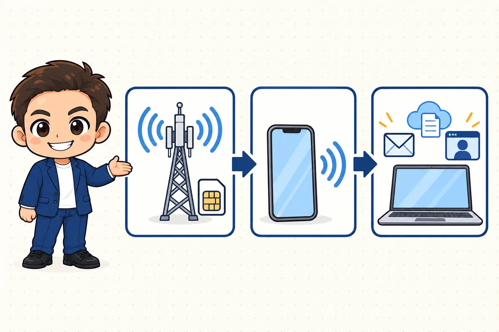
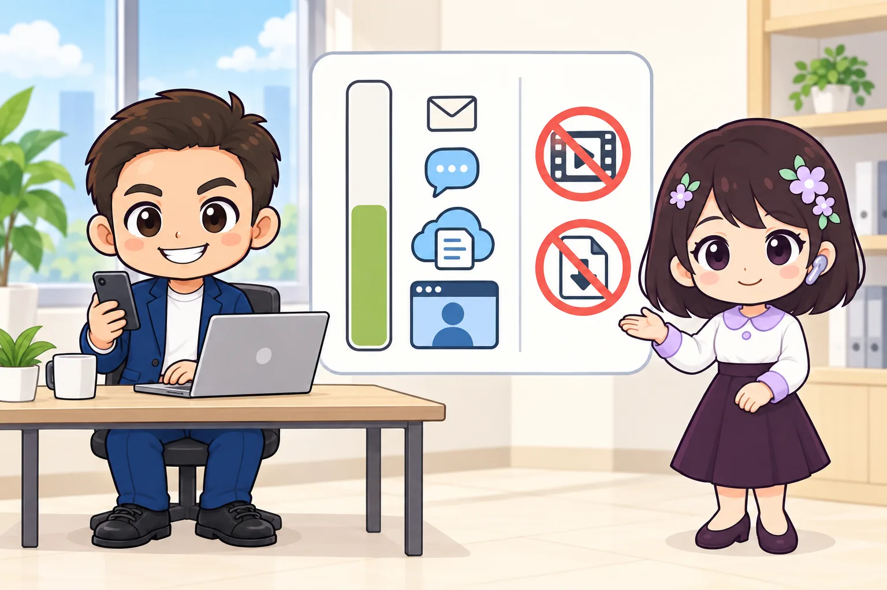
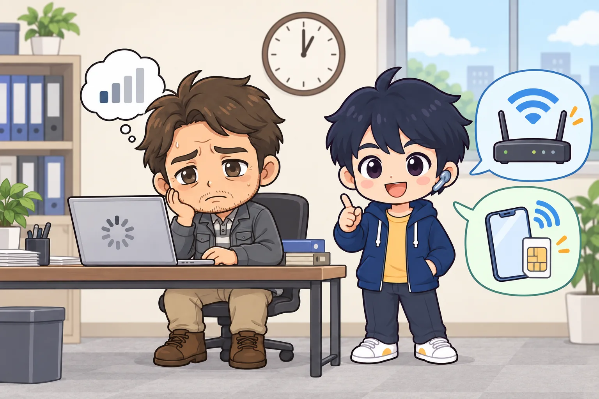

<!-- product-article-character-sheets: tamashiro-yusuke-character-sheet-v5.png, tl-four-character-style-master-v2.png, tamashiro-yusuke-business-casual-character-sheet-v3.png, rira-character-sheet-v3.png, riku-character-sheet-v3.png, worried-business-owner-character-sheet-v1.png, accounting-staff-character-sheet-v1.png -->
<!-- product-article-character-check: hero-and-body-verified -->

外でパソコンを開くたびに、使えるWi-Fiを探す。見つけても、つなぎ方や安全性が気になって落ち着かない。

私はこの手間をなくすために、**スマホのテザリング**を使っています。テザリングとは、スマホの通信をパソコンにも分けて使う機能のことです。スマホが小さなWi-Fiルーターの代わりになります。

契約しているのは、**日本通信SIMの「合理的みんなのプラン」**です。一言でいうと、**スマホ1台の契約で、外でのパソコン仕事の通信までまかなえる、月1,390円のSIM**です。メール、LINE、チャット、クラウドの資料、ウェブ会議まで、私の使い方では月20GBで間に合っています。

  
  

    
Amazon.co.jp

    <h3>日本通信SIM スターターパック</h3>
    
日本通信SIM合理的プランの申込みに使うコードです。SIMカードは同梱されていません。

    <a class="affiliate-product-button" href="https://amzn.to/4zgLclg" target="_blank" rel="sponsored noopener noreferrer">Amazon.co.jpで申込コードを見る</a>
    
広告・アフィリエイトリンクです。紹介料は玉城祐輔個人に帰属します。価格、在庫、申込期限、対象プランをAmazonの商品ページで確認し、公式サイトから直接申し込む場合の初期手数料3,300円とも比較してください。

  

## 先に結論。月20GBで足りる人には、通信費を抑えやすい

合理的みんなのプランは、**スマホの通信と短い通話を、分かりやすい料金でまとめたい人**に向いています。

私が良いと思っているのは、外でパソコンを使うために別のモバイルルーターを持たなくてよいことです。スマホのテザリングをオンにすれば、いつも持っている端末だけで仕事を始められます。

ただし、平日の昼など混み合う時間の速さを何より優先する人には、合わない可能性があります。料金だけで決めず、よく使う場所と時間帯で困らないかを考えることが大切です。

## しくみは「ドコモの電波 → スマホ → パソコン」

日本通信SIMは、いわゆる**格安SIM**です。自社で電波塔を持たず、ドコモの回線を借りてサービスを提供している会社で、こうした会社をMVNO（仮想移動体通信事業者）と呼びます。使えるエリアはドコモと同じです。

流れは次の三つです。

1. **SIMを入れたスマホ**が、ドコモの電波を受け取る
2. **スマホのテザリング**をオンにすると、スマホがWi-Fiのように電波を出す
3. **パソコン**をそのWi-Fiにつなぎ、メール、クラウドの資料、ウェブ会議を使う

ポイントは、**スマホの通信量とパソコンの通信量が、同じ20GBから引かれる**ことです。テザリングに追加料金はかかりませんが、パソコンで使った分もスマホの「今月の残り」から減ります。

## 20GBで何ができるか。私の使い方はこの範囲

私がデータ通信を使う場面は、主に次のとおりです。

- スマホでメール、LINE、チャットを確認する
- 外出先でパソコンをテザリングにつなぐ
- クラウドにある資料を開く
- ウェブ会議に参加する

この使い方で、月20GBに収まっています。自宅や事務所ではWi-Fiを使うので、20GBは「外で必要な分」だけに使う前提です。

一方で、次のような使い方をする人は、同じ20GBでも足りなくなる可能性があります。

- 外で動画を長時間見る
- 写真や動画をひんぱんに送る
- パソコンの大きな更新やソフトのダウンロードまでテザリングで行う

今どれくらい使っているかは、スマホの設定画面と、日本通信SIMのマイページで確認できます。今の契約で毎月どれくらい使っているかを先に見ておくと、20GBで足りるか判断しやすくなります。

## 料金で覚えるのは、三つだけ

2026年9月26日時点の公式料金は、次のとおりです。

- **月額基本料は1,390円**で、20GBのデータ量が含まれる
- **20GBを超えた分は1GBあたり220円**。上限は20GBから50GBまで、1GB単位でマイページから設定できる
- **初期手数料は3,300円**。スターターパックの申込コードを使うと、この手数料に充当される

通話は、次のどちらかを選べます。申込み時に選び、契約後もマイページで変更できます。

- 1回5分までの国内通話かけ放題
- 月70分までの無料通話

無料分を超えた通話は30秒11円です。電話が多い人向けに、月1,600円を足す「通話かけ放題オプション」もあります。専用の通話アプリは要らず、スマホの標準の電話アプリからそのままかけられます。

最低利用期間と解約金はありません。他社へ乗り換えるときの手数料（MNP転出手数料）もありません。

## 20GBを超えても、いきなり使えなくなるわけではない

設定した上限に達すると、低速になります。公式は低速時の速さを数値で示していませんが、短いメッセージのやり取りができる程度と案内しています。

必要なときは、マイページで上限を引き上げれば即時反映されます。請求は設定した上限の金額ではなく、**実際に使った分**です。たとえば上限を22GBにしていても、使ったのが20.8GBなら、請求は1,390円に1GB分の220円を足した1,610円です。

気をつけたいのは、余ったデータ量が翌月に繰り越されないことです。毎月大きく余るなら、もっと小さいプランも比べた方がよいかもしれません。逆に毎月20GBを大きく超えるなら、追加を続けるより50GBプランや他社の大容量プランを比べます。

## 速度は使う場所と時間で変わる。戻り方を決めておく

ドコモと同じエリアで使えることと、いつでもドコモと同じ速さになることは別です。

公式も、通信は**ベストエフォート方式**だと案内しています。ベストエフォートとは「できる限り努力するが、速さは保証しない」という意味で、場所や混み具合で速度が変わります。大きなダウンロードや長時間の動画視聴は、時間帯によって制限される場合があるとも書かれています。

私の普段の使い方ではウェブ会議まで使えていますが、これはすべての場所と時間帯での速さを保証する話ではありません。絶対に途切れさせたくない会議では、次の戻り先を先に決めておきます。

- 会場や事務所のWi-Fiを確認しておく
- 別回線を持つ人や、固定回線のある場所も頼れるようにしておく

## 申込み前に、この四つを確認する

料金だけを見て申し込むと、手続きで止まりやすいところがあります。

### 1. 今のスマホで使えるか

日本通信SIMは、**SIMカード**と**eSIM**を選べます。eSIMは「スマホに内蔵されたSIM」のことで、カードを差し替える手間がない代わりに、機種変更のときは再発行と再設定が必要です。eSIMの発行と再発行は1年に3回まで無料、4回目以降は1,100円です。

端末は、SIMロックが解除されていること（2021年10月以降に発売された端末はもともと解除済み）、ドコモの周波数帯に対応していること、通話にはVoLTE（4G回線での通話）に対応していることが条件です。公式の動作確認情報と端末の仕様で確認します。

### 2. マイナンバーカードを読み取れるか

申込みは日本通信アプリから行い、**本人確認にマイナンバーカードと暗証番号**を使います。カードを読み取れるスマホが必要です。

### 3. 本人名義のクレジットカードがあるか

支払いは、契約者本人名義のクレジットカードです。ほかに、設定用のWi-Fiとメールアドレスも用意します。

### 4. 電話番号を引き継ぐなら、名義がそろっているか

今の電話番号をそのまま使うことをMNP（番号ポータビリティ）といいます。乗り換え元の契約名義とマイナンバーカードの名義が同じである必要があります。家族名義で契約している場合は、先に乗り換え元で名義を変えておきます。対応する事業者なら、事前の予約番号なしで申込みの途中に手続きを進められます。

## スターターパックと直接申込みの違い

公式サイトから直接申し込む場合、初期手数料は3,300円です。

Amazonなどで売られている**スターターパック**は、合理的プランの申込コードです。申込み時にこのコードを入力すると、初期手数料の3,300円に充当されます。その代わり、スターターパック自体の購入代金がかかります。

スターターパックにSIMカードは入っていません。申込コードには期限があります。購入前に、販売価格、申込期限、対象プランを確認し、直接申込みの3,300円と比べてください。

## 乗り換え初日に、この順番で試す

1. 今の端末が対応しているか、公式情報で確認する
2. Wi-Fiが使える場所で、日本通信アプリとマイナンバーカードを準備する
3. 開通後、スマホ単体で通話、SMS、データ通信を試す
4. パソコンをテザリングにつなぎ、普段使うサービスを開く
5. よく使う場所と時間帯でも速さを確認する
6. 前のSIMや契約情報は、移行が終わるまで処分しない

仕事で使うなら、メールを見るだけでなく、クラウド資料の表示とウェブ会議まで試します。普段の使い方を一度通しておくと、「つながるけれど仕事には足りない」という行き違いを減らせます。

## 困ったときは、Wi-Fi・別回線・再発行で戻る

通信は、場所や設備の影響を受けます。私は便利さだけでなく、つながらないときにどう戻るかも大事だと思っています。

- 会議会場や事務所のWi-Fiを確認しておく
- 大事なオンライン会議では、別回線や固定回線も頼れるようにする
- eSIMを消してしまった場合は、マイページから再発行する
- 端末の故障に備え、連絡先と認証の手段を別の場所でも確認できるようにする

SIMカードは新しい端末に差し替えられます。eSIMは端末を変えると再発行が必要です。機種変更の前に、どちらを使っているか確認します。

## こんな人には合わないかもしれません

- 平日の昼を含め、いつでも安定した高速通信を最優先する
- 動画や大容量ファイルで、毎月20GBを大きく超える
- 店頭で初期設定まで手伝ってほしい
- マイナンバーカードを使うオンライン手続きが難しい
- 海外でも、そのままデータ通信を使いたい

日本通信SIMでは、海外での音声通話とSMSは条件付きで使えますが、**海外でのデータ通信は使えません**。海外に行くときは、現地のSIMや海外用eSIMなどを別に用意します。

## よくある疑問

### テザリングに追加料金はかかる？

かかりません。合理的みんなのプランの20GBの中で使えます。端末側でテザリングに対応しているかは確認してください。

### 20GBを超えたらどうなる？

設定した上限までは、1GBあたり220円で追加できます。上限に達すると低速になり、マイページで上限を引き上げると解除されます。

### 5分かけ放題と月70分無料通話は、どちらがよい？

短い電話を何度もかける人は5分かけ放題、1回の電話が長くなりやすい人は月70分が選びやすいです。フリーダイヤルは70分の無料通話を消費しません。ナビダイヤル（0570）などは無料通話の対象外なので、公式の通話条件を確認します。

### 最低利用期間や解約金はある？

ありません。ただし、料金月の途中で解約しても月額基本料は日割りされません。SIMカードは利用終了後に返却が必要です。

### スターターパックを買えば、SIMが届く？

届きません。スターターパックにSIMカードは同梱されていません。中にある申込コードを使い、日本通信アプリから契約手続きを進めます。

## 申込み方法と公式条件を確認する

  
  

    
Amazon.co.jp

    <h3>日本通信SIM スターターパック</h3>
    
日本通信SIM合理的プランの申込みに使うコードです。SIMカードは同梱されていません。

    <a class="affiliate-product-button" href="https://amzn.to/4zgLclg" target="_blank" rel="sponsored noopener noreferrer">Amazon.co.jpで申込コードを見る</a>
    
広告・アフィリエイトリンクです。紹介料は玉城祐輔個人に帰属します。価格、在庫、申込期限、対象プランをAmazonの商品ページで確認し、公式サイトから直接申し込む場合の初期手数料3,300円とも比較してください。

  

- [合理的みんなのプランの公式ページ](https://www.nihontsushin.com/plan/planminna.html)
- [料金・通話・通信仕様の詳細](https://www.nihontsushin.com/plan/planminna_detail.html)
- [スターターパックの公式案内](https://www.nihontsushin.com/shop/shop.html)
- [eSIMの申込み・再発行ガイド](https://www.nihontsushin.com/support/support_esimguide.html)
- [日本通信SIMの注意事項](https://www.nihontsushin.com/contract_notice/TermOfUseNotesPanel_NT-GMVC.pdf)

料金・仕様・申込み条件は、2026年9月26日に公式情報を確認しました。
