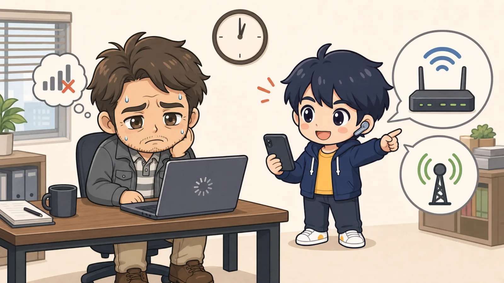
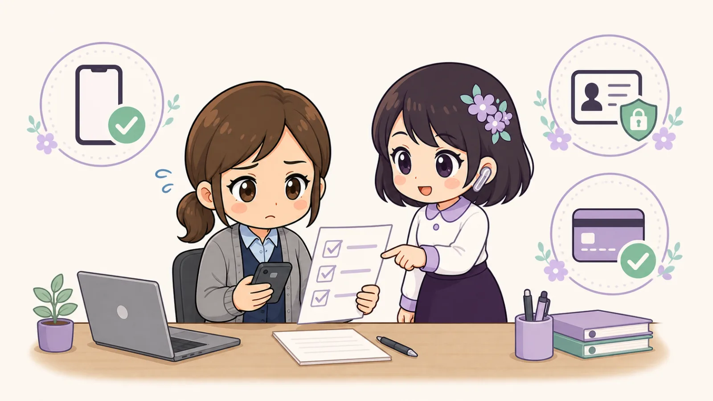

外でパソコンを開くたびに、使えるWi-Fiを探す。

見つけても、接続方法や安全性が気になる。私はこの手間を減らすために、スマホのテザリングを使っています。

契約しているのは、**日本通信SIMの「合理的みんなのプラン」**です。メール、LINE、チャット、クラウド上のデータ利用、ウェブ会議まで、私の使い方では月20GBで間に合っています。

この記事は、私が普段使っている場面と、2026年8月15日に確認した公式仕様を分けてまとめたものです。通信速度は場所、時間帯、端末によって変わるため、「誰にでも十分」とは言い切りません。

  
  

    
Amazon.co.jp

    <h3>日本通信SIM スターターパック</h3>
    
日本通信SIM合理的プランの申込みに使うコードです。SIMカードは同梱されていません。

    <a class="affiliate-product-button" href="https://amzn.to/4zgLclg" target="_blank" rel="sponsored noopener noreferrer">Amazon.co.jpで申込コードを見る</a>
    
広告・アフィリエイトリンクです。紹介料は玉城祐輔個人に帰属します。価格、在庫、申込期限、対象プランをAmazonの商品ページで確認し、公式サイトから直接申し込む場合の初期手数料とも比較してください。

  

## 先に結論。月20GBで足りる人には、通信費を抑えやすい

合理的みんなのプランは、スマホの通信と短い通話を、分かりやすい料金でまとめたい人に向いています。

2026年8月15日時点の公式料金は月額1,390円。20GBに加えて、次のどちらかを選べます。

- 1回5分までの国内通話かけ放題
- 月70分までの無料通話

私が良いと思っているのは、外出先でパソコンを使うために、別のモバイルルーターを持たなくてよいことです。スマホのテザリングをオンにすれば、普段持っている端末だけで仕事を始められます。

ただし、平日昼など混雑する時間の通信速度を優先する人には、合わない可能性があります。料金だけで決めず、よく使う場所と時間帯で困らないかを考えることが大切です。

## 私は、スマホと外のパソコン仕事を一つの20GBで使っている

私がデータ通信を使う場面は、主に次のとおりです。

- スマホでメール、LINE、チャットを確認する
- 外出先でパソコンをテザリングへ接続する
- クラウドにある資料を開く
- ウェブ会議へ参加する

この使い方では、月20GBで間に合っています。外でWi-Fiを探すことも、ほとんどなくなりました。

一方で、動画を長時間見る人、写真や動画を頻繁に送る人、パソコンの大きな更新までテザリングで行う人は、同じ20GBでも足りなくなる可能性があります。

私は、スマホの設定画面と日本通信SIMのマイページで使用量を確認しています。自宅や事務所のWi-Fiも使う前提で、外で必要な通信を20GBに収める使い方です。

## 料金は安い。でも、速度は使う場所と時間で変わる

日本通信SIMはドコモのネットワークを利用しています。ただし、ドコモと同じエリアで使えることと、いつでも同じ速度になることは別です。

公式も、通信はベストエフォート方式で、環境や混雑状況により速度が変わると案内しています。大容量のダウンロードや連続したストリーミングは、時間帯によって制限される場合があります。

第三者の利用レポートや速度測定も確認しました。料金とデータ量を評価する声が多い一方で、平日昼などに遅さを感じるという声もあります。反対に、同じ時間帯でも問題なく使えたという報告もあり、評価は分かれています。

私の普段の使い方ではウェブ会議まで利用できていますが、これはすべての場所や時間帯での速度を保証する話ではありません。仕事の会議を絶対に途切れさせたくない場面では、会場のWi-Fiや別回線へ戻れるようにしておきます。

## 20GBを超えても、いきなり使えなくなるわけではない

公式仕様では、20GBを超えた分は1GBあたり220円です。上限は20GBから50GBまで、1GB単位でマイページから設定できます。

設定した上限へ達すると低速度になります。必要なときは上限を引き上げると、即時反映されます。

気をつけたいのは、余ったデータ量が翌料金月へ繰り越されないことです。毎月大きく余るなら、もっと小さいプランも比較した方がよいかもしれません。毎月20GBを大きく超えるなら、追加を続けるより50GBプランや他社の大容量プランを比べます。

## 申込み前に、端末・本人確認・支払い方法を確認する

料金だけを見て申し込むと、手続きで止まりやすいところがあります。

### 今の端末で使えるか

日本通信SIMはSIMカードとeSIMを選べます。端末が対応する周波数帯とVoLTEに対応しているか、公式の動作確認情報と端末仕様を確認します。

eSIMはすぐに始めやすい一方、機種変更時には再発行と再設定が必要です。公式案内では、eSIMの発行・再発行は1年に3回まで無料、4回目以降は1,100円です。

### 申込みに必要なものがそろっているか

現在の公式案内では、日本通信アプリ、マイナンバーカードと暗証番号、契約者本人名義のクレジットカードなどが必要です。設定用のWi-Fiとメールアドレスも用意します。

今の電話番号を引き継ぐ場合は、転出元と申込先の契約名義をそろえます。対応事業者ならMNPワンストップで、事前の予約番号なしに手続きを進められます。

### スターターパックと直接申込みを比べたか

公式サイトから直接申し込む場合、初期手数料は3,300円です。

Amazonなどで販売されるスターターパックは、合理的プランの申込コードです。これを使うと申込み時の初期手数料は発生しませんが、スターターパック自体の購入代金がかかります。

スターターパックにはSIMカードが入っていません。購入前に、販売価格、申込期限、対象プランを確認し、直接申込みと比べてください。

## 乗り換え初日に、この順番で試す

1. 今の端末が対応しているか、公式情報で確認する
2. Wi-Fiが使える場所で、アプリと本人確認書類を準備する
3. 開通後、スマホ単体で通話、SMS、データ通信を試す
4. パソコンをテザリングへつなぎ、普段使うサービスを開く
5. よく使う場所と時間帯でも速度を確認する
6. 前のSIMや契約情報は、移行が終わるまで処分しない

仕事で使うなら、メールを見るだけでなく、クラウド資料の表示とウェブ会議まで試します。普段の使い方を一度通しておくと、「つながるけれど仕事には足りない」という行き違いを減らせます。

## 困ったときは、Wi-Fi・別回線・物理SIMへ戻れるようにする

通信は、場所や設備の影響を受けます。私は便利さだけでなく、つながらないときにどう戻るかも大事だと思っています。

- 会議会場や事務所のWi-Fiを確認しておく
- 大事なオンライン会議では、別回線を持つ人や固定回線も頼れるようにする
- eSIMを消してしまった場合は、マイページから再発行する
- 端末故障に備え、連絡先と認証手段を別の場所でも確認できるようにする

SIMカードは新しい端末へ差し替えられます。eSIMは端末を変えると再発行が必要です。機種変更の前に、どちらを使っているか確認します。

## こんな人には合わないかもしれません

- 平日昼を含め、いつでも安定した高速通信を最優先する
- 動画や大容量ファイルで、毎月20GBを大きく超える
- 店頭で初期設定まで手伝ってほしい
- マイナンバーカードを使うオンライン手続きが難しい
- 海外でも、そのままデータ通信を使いたい

日本通信SIMでは、海外での音声通話とSMSは条件付きで利用できますが、海外データ通信は利用できません。海外へ行くときは、現地SIMや海外用eSIMなどを別に用意します。

## よくある疑問

### テザリングに追加料金はかかる？

合理的みんなのプランのデータ量として利用できます。端末側でテザリングに対応しているかは確認してください。

### 20GBを超えたらどうなる？

設定した上限までは、1GBあたり220円で追加できます。上限へ達すると低速度になり、マイページで上限を引き上げると解除されます。

### 5分かけ放題と月70分無料通話は、どちらがよい？

短い電話を何度もかける人は5分かけ放題、1回の電話が長くなりやすい人は月70分が選びやすいです。無料通話の対象外となる番号もあるため、公式の通話条件を確認します。

### 最低利用期間や解約金はある？

公式案内では、最低利用期間と解約金はありません。ただし、料金月の途中で解約しても月額基本料は日割りされません。SIMカードは利用終了後に返却が必要です。

### スターターパックを買えば、SIMが届く？

スターターパックにSIMカードは同梱されていません。中にある申込コードを使い、日本通信アプリから契約手続きを進めます。

## 申込み方法と公式条件を確認する

  
  

    
Amazon.co.jp

    <h3>日本通信SIM スターターパック</h3>
    
日本通信SIM合理的プランの申込みに使うコードです。SIMカードは同梱されていません。

    <a class="affiliate-product-button" href="https://amzn.to/4zgLclg" target="_blank" rel="sponsored noopener noreferrer">Amazon.co.jpで申込コードを見る</a>
    
広告・アフィリエイトリンクです。紹介料は玉城祐輔個人に帰属します。価格、在庫、申込期限、対象プランをAmazonの商品ページで確認し、公式サイトから直接申し込む場合の初期手数料とも比較してください。

  

- [合理的みんなのプランの公式ページ](https://www.nihontsushin.com/plan/planminna.html)
- [料金・通話・通信仕様の詳細](https://www.nihontsushin.com/plan/planminna_detail.html)
- [スターターパックの公式案内](https://www.nihontsushin.com/shop/shop.html)
- [eSIMの申込み・再発行ガイド](https://www.nihontsushin.com/support/support_esimguide.html)
- [日本通信SIMの注意事項](https://www.nihontsushin.com/contract_notice/TermOfUseNotesPanel_NT-GMVC.pdf)

料金・仕様・申込み条件は、2026年8月15日に公式情報を確認しました。
