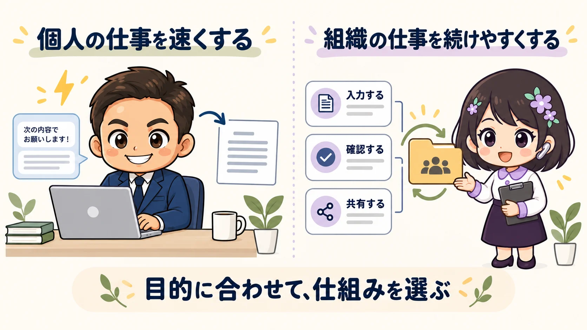
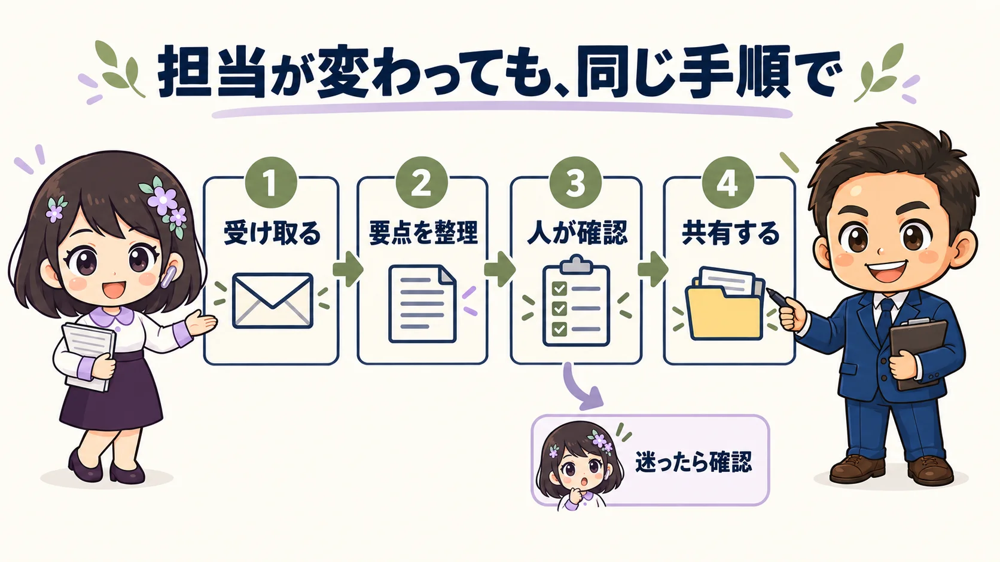

<!-- product-article-character-sheets: tamashiro-yusuke-character-sheet-v4.png, rira-character-sheet-v2.png -->
<!-- product-article-character-check: hero-and-body-verified -->

「AIを活用したい」。

同じ言葉でも、頭に思い浮かべているものは、人によってかなり違うと思います。メールを早く書きたい人もいれば、声をかけるだけで仕事を全部終わらせてくれる仕組みを想像する人もいるでしょう。

T&Lサポート株式会社の玉城祐輔です。私が組織へのAI導入で大切にしているのは、**誰が担当しても、決めた手順で一定の品質に近づけられ、担当者が変わった後も使い続けられること**です。

「AIに何をさせられるか」と同じくらい、「その組織で、誰がどう使い続けるか」を考えたい。今回は、私が言う「組織としてのAI活用」の前提をお伝えします。

## 「AI活用したい」の中身を、最初にそろえる

たとえば、次の三つは、どれもAI活用の相談です。

- 自分が毎日書いているメールや資料を、もっと早く作りたい
- 社員や会員が、同じ手順で情報を整理・共有できるようにしたい
- 複数のシステムをつなぎ、決まった業務を自動で進めたい

必要な道具も、作る仕組みも、準備も違います。個人で試せることもあれば、組織の資料や権限、業務手順を整理してから進めることもあります。

これを全部「AI活用」という言葉で話すと、同じ話をしているつもりで、期待がずれてしまいます。

私が「担当者が替わっても困らない情報共有」を説明しているときに、相手は「自分の作業を一気に終わらせる方法」を期待しているかもしれない。それでは、どちらの話も相手に届きません。

**どのAIを使うかを決める前に、誰の、どの仕事を、どんな状態にしたいのかをそろえる。** 私は、この確認が欠かせないと考えています。

## 個人の速さと、組織で使い続けられること

私自身、自分の仕事を速くするためにAIを使います。文章を整理したり、開発を進めたり、調べた内容をまとめたり。個人がAIを使いこなせるようになることには、大きな価値があります。

ただ、私ができることを、そのまま全員に求めれば組織で使えるようになる、とは思っていません。

目的の伝え方、渡す資料の選び方、出力の確かめ方、うまくいかないときの直し方。同じAIを使っていても、こうした経験によって、使える範囲や得られる結果は変わります。

| 見るところ | 個人の仕事を速くする活用 | 組織で使い続けるための活用 |
| --- | --- | --- |
| 主に使う人 | 自分 | 複数の担当者、次の担当者 |
| 工夫すること | 自分に合った指示や使い方 | 入力項目、出力形式、確認手順をそろえる |
| 確かめたいこと | 自分の時間や手間が減ったか | 他の人も使え、確認や引継ぎが滞らないか |

これは、どちらが上かという話ではありません。個人の効率化から生まれた工夫が、組織の仕組みになることもあります。

私が組織を支援するときは、AIが得意な人の成果だけでなく、普段それほどAIを触らない人も、仕事の中で無理なく使えるかを見たいのです。

## 「知っている」を、日々の業務で使える形にする

メールをAIで要約する。会議を録音して議事録を作る。申込情報をまとめて共有する。

機能だけを聞けば、「それはもう知っている」と感じる方もいると思います。その反応自体は自然です。

ただ、私が確かめたいのは、その機能を知っているかに加えて、**組織の普段の仕事として、実際に回っているか**ということです。

### メールを要約した後、誰が動くのか

宜野湾青年会議所では、代表メールやメールで受けるFAXの内容を整理し、LINE WORKSへ共有する仕組みを使っています。添付資料はGoogle Driveへ保存し、通知から確認できるようにしています。

ここで重視しているのは、要約文を作ることだけではありません。何の連絡が届き、どんな対応が求められ、元の資料はどこにあるのかを、主要メンバーが同じ場所で確認できることです。

特定の人がメールを見て、一人ずつ伝える。その手間を減らし、届いた情報から「では、誰が対応するか」を話せるようにしたいのです。

### 議事録を作った後、次の行動につながるか

会議の内容をAIで文字にすることも、入口の一つです。

その後、決まったことは何か、担当は誰か、期限はいつかを確認し、共有する。次の会議で進捗を確かめる。そこまでつながって初めて、記録が実務に役立つと考えています。

議事録を作れる人が一人いる状態から、決めた形で共有できる状態へ。そのために、道具と一緒に手順も整えます。

### 毎回うまい指示を書かなくても、案内を作れるか

私が開発しているSeminarFlowでは、開催情報を入力すると、決まったデザインの案内ページを作れます。申込受付や関係者との情報共有も、一つの流れで扱います。

毎回、担当者がAIへの指示を工夫してチラシやフォームを一から作る方法もあります。一方で、例会やセミナーの運営では、必要な項目を入力すれば同じ形式に整う方が、担当交代に対応しやすい場面もあります。

この部分は、生成AIがその都度考えているわけではありません。AIを活用して開発した仕組みの中で、決まった処理はプログラムに任せています。

**AIに任せる部分と、決まった手順で処理する部分と、人が判断する部分を組み合わせる。** 私にとって、それも組織のAI活用を進める大切な仕事です。

実際の通知画面や運営ツールは、[宜野湾青年会議所でのAI・デジタル活用事例](https://m-260919-01.surge.sh)にまとめています。

## 再現性を高めるために、先に決めておくこと

私が目指す「誰が使っても同じような効果」は、AIが毎回まったく同じ文章を出すという意味ではありません。

必要な情報が抜けず、確認すべき点が分かり、担当者が次の作業へ進める。その状態に近づけるため、仕事の入口と出口をそろえるということです。誰でも説明なしに使える、必ず同じ成果が出る、と約束するものでもありません。

たとえば、メールの共有なら、次のことを決めておきます。

1. **何を受け取るか**：対象のメールや資料、扱ってよい情報の範囲
2. **何をそろえて出すか**：要点、必要な対応、期限、元資料の場所
3. **誰が確認するか**：内容の誤りや、対応の必要性を判断する担当者
4. **迷ったらどうするか**：読み取れない内容は推測で進めず、元資料や人に確認する
5. **誰が手入れするか**：担当交代や業務変更の際に、設定と手順を見直す人

この仕組みを作る側には、業務を整理する力や技術が必要です。その準備をすることで、使う側が毎回複雑な指示を考えなくても進められるようにします。

使い方を共有し、小さな業務で試し、確認や修正にかかる手間も見る。うまくいかなければ手順を直す。この積み重ねまで含めて、導入だと考えています。

## 私は「何でも解決するドラえもん」は約束できない

AIに期待が集まるほど、相談を受ける側として気をつけたいことがあります。

私自身を「頼めば何でも解決してくれる人」と思っていただいたり、「何でも自動でやってくれるドラえもんを作れる人」と期待されたりすると、その期待には応えられないことがあります。

自分の仕事を一気に速くしたいという希望が悪いわけではありません。私もそうした使い方をしますし、対象を絞れば、自動化できる業務もあります。

ただ、仕事の内容も、使う資料も、例外も決めないまま、「全部うまくやってくれる状態」を約束することはできません。組織側の確認や担当者の協力が必要になる場面もあります。

**私が怖いのは、相談してくださる方ではなく、期待のずれに気づかないまま引き受けてしまうことです。**

だから、最初に「今回はここを改善する」「ここは人が確認する」「ここまでは今回の対象にしない」と言葉にしたい。それは、できることを小さく見せるためではなく、約束した範囲を仕事で使える形にするためです。

## 相談するときは、今の仕事を一つ教えてください

私が特に力を入れたいのは、情報や操作が特定の人に集中している組織で、他の人にも渡せる仕組みを作ることです。

もし求めているのが「自分だけが使う、高度なAI操作をもっと身につけたい」という支援なら、その目的を先に教えていただけると、話す内容を合わせやすくなります。組織の運用を整える支援とは、必要な進め方が変わるからです。

相談の前に、次の三つを書き出してみてください。

- **誰が困っているか**：自分、特定の担当者、チーム全体のどこか
- **何が滞っているか**：繰り返している作業や、確認待ちになっている場面
- **どうなれば助かるか**：速くしたいのか、他の人にも任せたいのか、自動で進めたいのか

たとえば「AIを導入したい」から、「担当者が休んでも、届いた案内と対応期限を他の人が確認できるようにしたい」へ。ここまで具体的になると、AIを使う場所も、今ある道具で足りる場所も、一緒に考えられます。

その仕事を、次の担当者も続けられるようにするには何が必要か。私はそこから、組織としてのAI活用を提案していきたいと思っています。

- [具体的なAI・デジタル活用事例を見る](https://m-260919-01.surge.sh)
- [玉城祐輔の活動・プロフィールを見る](/about/)
