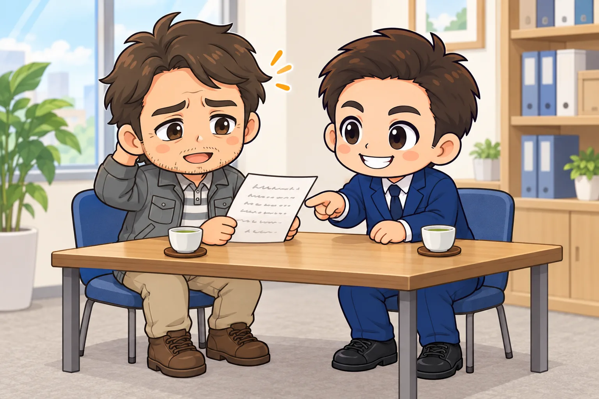
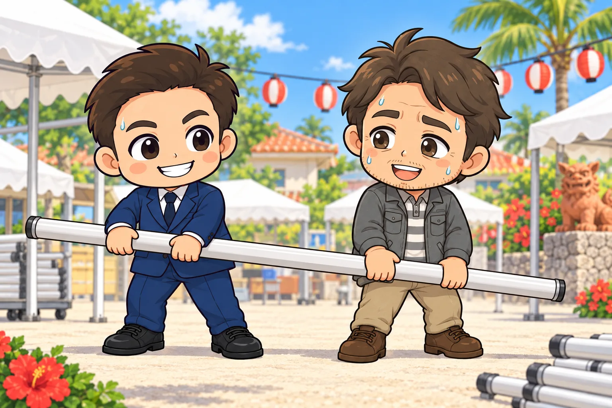
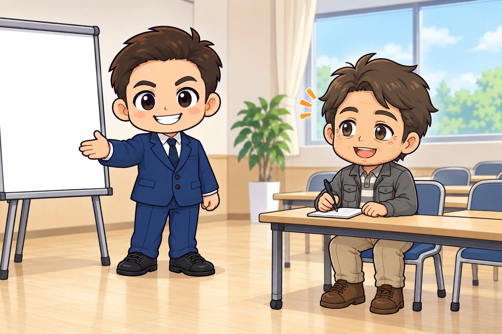
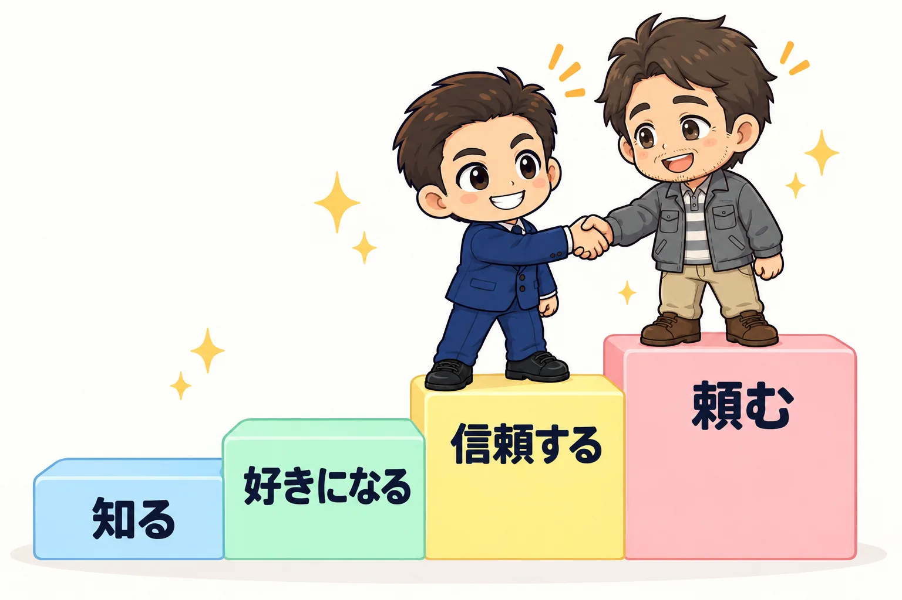

<!-- product-article-character-sheets: tamashiro-yusuke-character-sheet-v5.png, worried-business-owner-character-sheet-v1.png -->
<!-- product-article-character-check: hero-and-body-verified -->

「商工会って、何をしてくれるところなんですか？」

事業者さんから、よくこう聞かれます。
会費を払っているけれど、正直よく分からない。
入るかどうか迷っている。そんな声も多いです。

私は商工会の職員として働いていた時期があり、今は専門家として相談を受ける側にいます。
そして青年部の一員として、地域の活動にも参加しています。
職員、専門家、部員。3つの立場を経験して分かった商工会の魅力を、3つにまとめました。

## 先に結論

商工会の魅力は、次の3つです。

1. 無料で経営の相談ができる
2. 融資や補助金など、お金の相談の入口になる
3. 一緒に汗をかくことで、営業しなくても思い出してもらえる

1つ目と2つ目は、ご存じの方も多いと思います。
私がいちばん伝えたいのは3つ目です。
営業が苦手な人ほど、商工会はうまく使える場所だと考えています。

## 魅力1：無料で相談できる「経営のかかりつけ医」

商工会には経営指導員がいます。
事業者の相談に乗ることが仕事の職員です。
相談にお金はかかりません。

記帳、税金、人の雇い方、集客、ITの使い方、お店の引き継ぎ。
「これ、誰に聞けばいいんだろう」と思ったことを、まず持ち込める場所です。
職員さんだけで答えられない分野は、専門家につないでくれます。

病院でいえば、近所のかかりつけ医です。
いきなり大きな病院、つまり有料のコンサルタントを探さなくても、まずはここで話を聞いてもらえます。

### 元職員として伝えたいこと

相談は、準備して来る人ほど得をします。
「売上が落ちている」だけでなく、「いつから、何が、どれくらい」を少し書いて持って行く。
それだけで、話は一気に具体的になります。

完璧な資料は要りません。
メモ1枚で十分です。

## 魅力2：お金の相談の入口になる

商工会は、融資や補助金の入口でもあります。
代表的なものを2つ紹介します。

### 持続化補助金は、商工会の書類が必要

小規模事業者持続化補助金は、チラシやホームページなど、販路を広げる取り組みに使える補助金です。
申請には、商工会・商工会議所が発行する「事業支援計画書（様式4）」が必要になります。
つまり、申請の前に必ず商工会を通ることになります。

様式4はその場ですぐ出るものではありません。
締切直前は窓口が混み合うので、早めに相談するのがおすすめです。

### マル経融資は、日頃の相談が条件

マル経融資（小規模事業者経営改善資金）は、商工会の推薦で利用できる国の融資制度です。
担保も保証人も要りません。
沖縄では、沖縄振興開発金融公庫が貸し手になります。

ただし、原則として6か月以上、商工会の経営指導を受けていることが条件です。
制度の詳しい条件は、[沖縄振興開発金融公庫の公式案内](https://www.okinawakouko.go.jp/service/purpose/p001/1676539128/)で確認できます（2026年9月28日確認）。

ここに、商工会との付き合い方のヒントがあります。
お金が必要になってから駆け込むより、普段から顔を出しておく。
そのほうが、いざというときに話が早く進みます。

## 魅力3：一緒に汗をかくと、営業しなくても思い出してもらえる

ここからが、私がいちばん伝えたい話です。

正直に言うと、私は飛び込み営業や訪問営業がとても苦手です。
知らない会社のドアを叩いて、自分のサービスを説明する。
考えるだけで足が重くなります。

だから私が大事にしているのは、会う前に知ってもらっている状態をつくることです。
私がどんな人間で、何ができるのか。
それを先に知ってもらえていれば、営業に行かなくても声がかかります。

### 今まさに起きていること

青年部の活動を続けていると、他の地域の青年部の仲間とつながります。
その仲間を通じて、他の地域の商工会の職員さんにも「一緒に動いている玉城さん」として知ってもらえました。

すると、その商工会が補助金やAI活用のセミナーを企画するときに、私を思い出してくれます。
講師として呼んでいただく機会が、今どんどん増えています。

一緒に汗をかいた時間が、あとからセミナー講師という仕事になって返ってきた。
私にとっては、まさにこの流れです。

こちらから売り込んだことは一度もありません。
必要なときに名前が浮かぶ人になっていた。それだけです。

元職員の目線で言うと、これはとても自然なことです。
職員さんが講師や専門家を探すとき、まず頭に浮かぶのは「知っている人」「一緒に動いたことがある人」です。

### 人が仕事を頼むまでの4段階

人が誰かに仕事を頼むまでには、順番があると私は考えています。

1. 知る
2. 好きになる
3. 信頼する
4. 頼む

飛び込み営業は、知らない人がいきなり4段階目の「頼む」を目指すものです。
うまくいかなくて当然だと思います。

祭りの準備やイベントの運営を一緒にやると、この4段階を自然に上がっていけます。
約束を守る人か。段取りはいいか。一緒にいて感じがいいか。
説明しなくても、並んで作業しているうちに伝わります。

名刺交換で渡せるのは、名前だけです。
一緒に動いた時間は、人柄と腕前まで渡してくれます。
名刺100枚より、一緒に汗をかいた1回。私はそう思っています。

### 売り込み目的で参加しない

ひとつだけ、大事な注意点があります。
最初から売り込みのつもりで参加すると、周りにはすぐ伝わります。
それでは逆効果です。

まず役に立つこと。
見返りを期待せずに動いた結果として、あとから声がかかる。
順番を間違えないことがいちばん大切です。

商工会の活動は、ただのボランティアに見えるかもしれません。
でも長い目で見れば、いちばん確実な営業活動だと私は考えています。

## 商工会が合わない人

公平のために、合わない人についても書いておきます。

- すぐに売上を上げる方法だけを知りたい人
- 地域の行事や集まりに、まったく時間を割けない人
- 相談しても、自分で手を動かす気持ちがない人

1つ目と2つ目の人でも、無料相談と補助金の窓口としては十分に使えます。
3つ目の魅力は、時間をかけて効いてくるものだと思ってください。

## よくある質問

### 会員でなくても相談できますか？

多くの商工会では、会員でなくても経営相談を受け付けています。
ただ、扱いは地域によって違うので、まずは地元の商工会に電話で聞いてみるのが確実です。

### 青年部には誰でも入れますか？

青年部は、商工会の会員事業所で働く若手の経営者や後継者などが集まる組織です。
年齢の上限や入会の条件は地域ごとに決まっているので、地元の商工会に確認してください。

### 忙しくて活動に出られないときは？

毎回参加する必要はありません。
年に数回でも、同じ人と顔を合わせることに意味があります。
大きな行事の準備だけでも手伝ってみると、関係は一気に近くなります。

## まずは地元の商工会に顔を出してみる

商工会は、困ったときに相談できる場所です。
そして、一緒に汗をかいた人が、あとで仕事の声をかけてくれる場所でもあります。

まずは一度、地元の商工会に顔を出してみてください。
相談ごとがなくても、「どんな活動をしていますか」と聞くだけで十分です。
