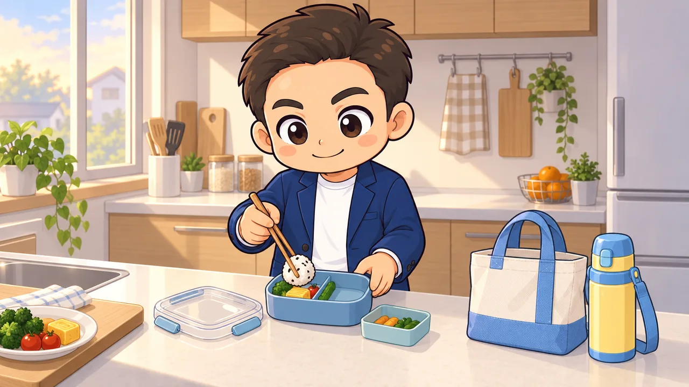
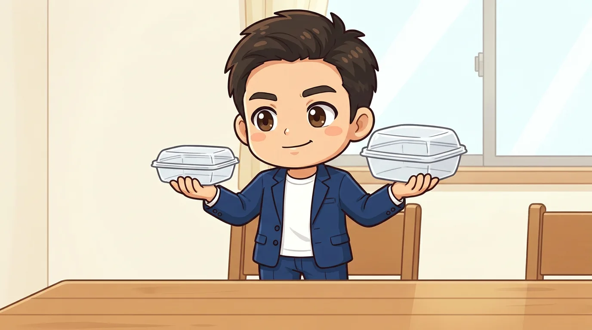
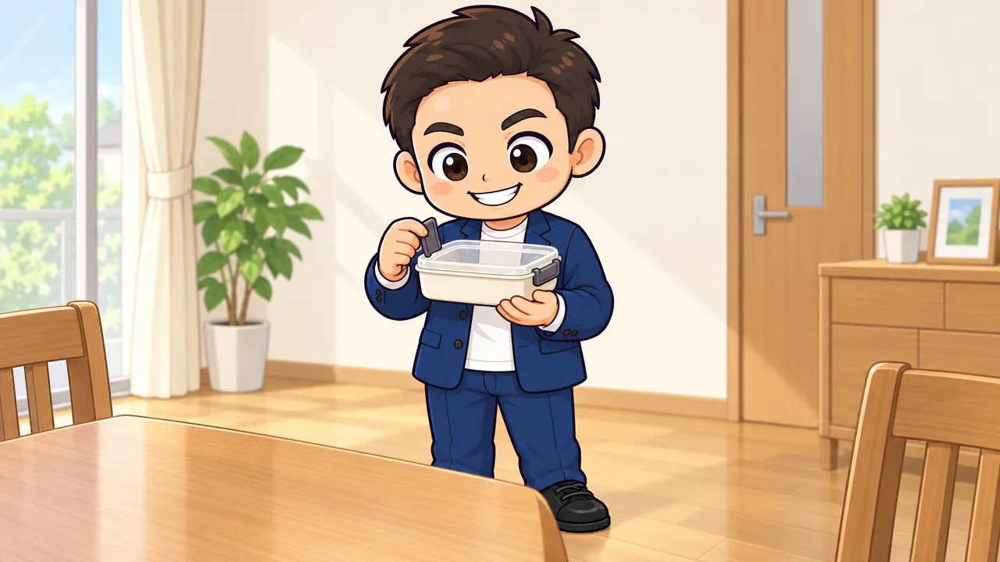
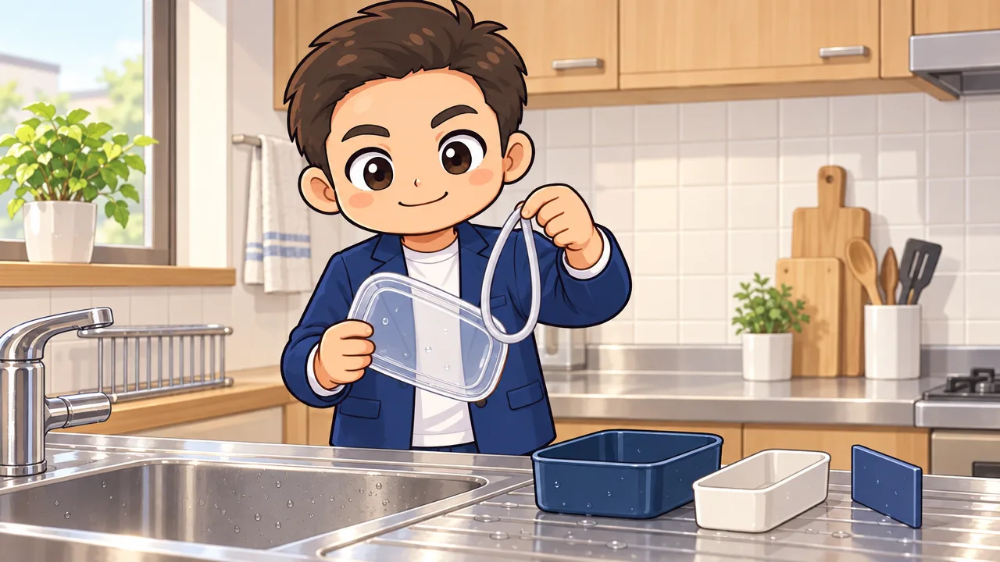

<!-- product-article-character-sheets: tamashiro-yusuke-character-sheet-v5.png, tl-four-character-style-master-v2.png, tamashiro-yusuke-business-casual-character-sheet-v3.png -->
<!-- product-article-character-check: hero-and-body-verified -->

知人から相談を受けました。1歳の子の保育園用にお弁当箱を探していて、**270mlか360mlかで決めきれない**、という話です。

調べると、3歳ごろまでは270ml前後が目安、360mlはそのあと、という案内がよく出てきます。数字だけ見れば、1歳に360mlは大きすぎます。

それでも、その人が最後に選んだのは360mlのほうでした。スケーターの「ふわっと盛れるフタ」のパンどろぼう柄です。決め手のひとつは、親のほうがパンどろぼうを気に入っていたこと。

私は子どもが4人います。その経験から言うと、**この選び方は間違っていません**。理由を順番に書きます。

  
  

    
Amazon.co.jp

    <h3>スケーター 弁当箱 子供 360ml ふわっと盛れるフタ パンどろぼう QAF2BAAG-A</h3>
    
1段360ml。130mlの中子と名前シールが付きます。フタを外して電子レンジ可、食洗機可、日本製です。

    <a class="affiliate-product-button" href="https://amzn.to/4y6woF3" target="_blank" rel="sponsored noopener noreferrer">Amazon.co.jpで商品を見る</a>
    
広告・アフィリエイトリンクです。紹介料は玉城祐輔個人に帰属します。価格、在庫、柄、付属品はAmazonの商品ページでご確認ください。

  

## 先に結論。360mlを選んでいい。ただし1歳のうちは満杯にしない

私の考えはこうです。

- **容量は「今ちょうどいい大きさ」ではなく、「何年使うか」で選ぶ**
- **1歳のうちは、360mlの箱に少なく詰める**
- **柄は親が気に入ったものでいい。子どもが嫌がる年齢まではまだ間がある**

270mlを選べば、1歳の今はぴったりです。ただ、その分だけ早く小さくなります。年少から年中で買い替えることになる。

360mlを選ぶと、今は大きい。でも**詰める量は親が決められます**。箱が大きくて困ることは、詰め方で消せます。

うちは4人とも、この考え方で長く使いました。お弁当箱は毎日洗って毎日使う道具です。買い替えの回数が減るのは、思っているより効きます。

## サイズの目安を、そのまま受け取らない

[保育園のお弁当のサイズを扱った記事](https://mamanoko.jp/articles/29528)では、おおむね次のように紹介されています。

| 年齢の目安 | よく紹介される容量 |
| --- | --- |
| 3歳ごろまで | 270ml前後 |
| 3歳から4歳ごろ | 360ml |
| 5歳ごろ | 450ml |

この目安は間違っていません。同じ記事にも、食べる量は子どもによって差が大きいので目安として考えるように、と書かれています。

ただ、この区切りが前提にしているのは**「箱を満杯にする」**ことです。満杯にしない前提なら、ひとつ上を先に取っておいても困りません。

スケーターの公式オンラインショップも、399ml以下を「未就学児や小食の方におすすめサイズ」としてひとつのまとまりで扱っています。360mlは、未就学児の範囲の上のほうにある、という位置づけです。

## 1歳に360mlは「半分でも多い」。だから中子と仕切りが効く

この商品の説明には、判断に使える数字が書かれています。**お弁当箱の半分に入るご飯の量は、お茶碗（約200ml）で約0.9杯分**。

つまり、360mlの半分にご飯を詰めるだけで、大人の茶碗1杯近くになります。1歳の子には、**半分でも多い**ということです。

ここで効くのが付属品です。この弁当箱には、**130mlの中子**が1個付いています。仕切りも高めに作られています。

1歳のうちの使い方は、こう考えると分かりやすくなります。

- **中子だけにおかずを入れ、残りのスペースにご飯を少し**。それで十分な日がある
- **中子を外し、高い仕切りで小さく区切る**。量を減らしても片側に寄らない
- 年齢が上がるにつれて、**詰める面積を広げていく**

箱の大きさは変えられませんが、**詰める量と区切り方は毎日変えられます**。1歳で360mlを選ぶというのは、そういう運用を前提にした選び方です。

逆に言えば、「箱いっぱいに詰めて、全部食べきった経験をさせたい」という考え方なら、270mlのほうが素直です。ここは家庭の方針で分かれます。

## この弁当箱に入っているもの

仕様はメーカーの公式情報で確認しました（2026年9月23日時点）。

| 項目 | 内容 |
| --- | --- |
| 容量 | 360ml（130mlの中子1個付き） |
| サイズ | 幅14.8 x 奥行12.3 x 高さ5.6cm |
| フタ | ドーム型。AS樹脂 |
| 本体・中子・仕切り | ポリプロピレン |
| 止具 | ABS樹脂 |
| パッキン | シリコーンゴム |
| 電子レンジ | フタを外せば可 |
| 食洗機 | 可 |
| 抗菌 | 銀イオンAg+を練り込み。SIAA認証マーク取得 |
| 生産国 | 日本 |
| 付属品 | 名前シール |

いくつか、実際の朝に効くところを補足します。

**フタがドーム型**なので、のりや卵焼きが押しつぶれにくい。フタに貼り付いて、開けたときにご飯がえぐれる、ということが起きにくくなります。

**抗菌は「練込」**です。表面のコーティングではなく素材に混ぜ込む方式なので、洗っても落ちる類のものではありません。ただし、抗菌は腐らないという意味ではありません。夏場は保冷剤を使ってください。

**止具付きのロック式**です。パッキンと合わせて、汁気がにじみにくい構造になっています。

## 買う前に、園に2つ確認する

ここがいちばん大事です。**園のルールは園ごとに違います**。

1. **保温庫を使うか**。使う園では、対応していないお弁当箱は持ち込めないことがあります
2. **フタの形に指定があるか**。園によって、一段・ロック式・キャラクターなしなどの条件が出ることがあります

そのうえで、家で確認してほしいことがひとつあります。**子どもが自分でフタを開けられるか**です。

1歳の子が自分で開けるのは、正直まだ難しい。保育士さんが開けてくれる園がほとんどだと思います。ただ、**いつかは自分で開ける日が来ます**。

ロック式は、コツをつかめば子どもでも扱えるようになると言われます。買ったら、**食卓で何回か一緒に開け閉めして練習しておく**。これだけで、本人の「できた」が早く来ます。

## 買ったその日にやること

やることは3つだけです。

1. **名前シールを貼る**。付属しています。フタと本体の両方に貼る
2. **中子と仕切りとパッキンを一度すべて外し、洗って組み直す**。どこが外れるかを親が把握しておく
3. **開け閉めを子どもと一緒に試す**。まだできなくていい。触らせておく

洗うときは、**パッキンを外して洗う**のを習慣にしてください。付けっぱなしで洗うと、溝に汚れが残ります。1歳の弁当箱は毎日使うので、ここが一番差が出ます。

食洗機に入れるときは、耐熱温度を見ておきます。**フタと止具は100度、本体と中子と仕切りとパッキンは140度**までです。食洗機の乾燥が高温になる機種では、フタの置き場所に気をつけてください。

なくしやすいのはパッキンです。外して洗う以上、排水口に流してしまうことがあります。この型には**交換用パッキンがパーツとして単品で売られています**（品番556302）。なくしても、本体ごと買い直す必要はありません。

## 柄は親が決めていい。ただし期限がある

パンどろぼうの柄を選んだ理由が「親が好きだから」でも、私は問題ないと思っています。

1歳の子は、まだ自分でキャラクターを選びません。毎朝それを開けて詰めるのは親です。**親が見て気分が上がるほうが、続きます**。

ただし期限はあります。年中から年長になると、自分で選びたがる子が出てきます。うちもそうでした。そのときは、**柄を買い替えるのではなく、そこが買い替えどきだと考える**ほうが気が楽です。

360mlを1歳で買えば、年中あたりまでは容量が足ります。年長でよく食べるようになったら、そのとき大きいほうへ。柄で買い替えたくなったときも、同じタイミングで考えればいい。そういう順番です。

## 合わない人

- **箱いっぱいに詰めて完食させたい**。1歳なら270ml前後のほうが素直です
- **園が保温庫を使う**。対応の指定がある場合は、その条件に合う商品を選んでください
- **キャラクターものが禁止の園**。無地や柄なしを選ぶことになります
- **汁気の多いおかずを入れたい**。パッキンと止具は付いていますが、完全密閉の商品ではありません
- **食洗機の高温乾燥で毎回回したい**。フタと止具の耐熱は100度です
- **二段にしたい**。これは1段の商品です

## よくある質問

**1歳で360mlは本当に大きすぎませんか。**

満杯にすれば大きすぎます。この記事は「少なく詰めて長く使う」前提です。箱いっぱいに詰めたいなら270ml前後を選んでください。

**中子は必ず使わないといけませんか。**

いりません。外して、高い仕切りだけで区切っても使えます。おかずが少ない日は中子だけ使う、という使い方もできます。

**電子レンジで温められますか。**

フタを外せば可です。フタごと温めることはできません。

**食洗機に入れられますか。**

可です。耐熱温度はフタと止具が100度、本体・中子・仕切り・パッキンが140度です。

**抗菌だから夏も安心ですか。**

いいえ。抗菌は菌が増えにくくする加工で、傷まないという意味ではありません。夏場は保冷剤を使ってください。

**パッキンをなくしたら買い替えられますか。**

買えます。スケーターの公式オンラインショップに、この型（QA2 / QA2BA / QAF2BA / QAF2BAAG）専用の交換用パッキンがパーツとして並んでいます（品番556302、抗菌加工、2026年9月23日時点で187円）。在庫と価格は変わるので、必要になったときに公式で確認してください。

## この商品を見る

  
  

    
Amazon.co.jp

    <h3>スケーター 弁当箱 子供 360ml ふわっと盛れるフタ パンどろぼう QAF2BAAG-A</h3>
    
注文前に、容量360mlであること、柄、付属品をAmazonの商品ページでご確認ください。

    <a class="affiliate-product-button" href="https://amzn.to/4y6woF3" target="_blank" rel="sponsored noopener noreferrer">Amazon.co.jpで商品を見る</a>
    
広告・アフィリエイトリンクです。紹介料は玉城祐輔個人に帰属します。価格、在庫、柄、付属品はAmazonの商品ページでご確認ください。

  

## 確認した公式情報

仕様は2026年9月23日に確認しました。変更される場合があるため、注文前に最新の表示をご確認ください。

- [スケーター公式オンラインショップ。抗菌ふわっとフタタイトランチボックス 1段/360ml パンどろぼう（JAN 4973307646942）](https://www.skater-onlineshop.com/shop/g/g4973307646942/)
- [スケーター株式会社 公式サイト](https://www.skater.co.jp/)
- [Amazon.co.jpの商品ページ。ASIN B0C93TQY6N](https://www.amazon.co.jp/dp/B0C93TQY6N)

パンどろぼうは柴田ケイコ氏の絵本作品です（©Keiko Shibata/KADOKAWA）。
