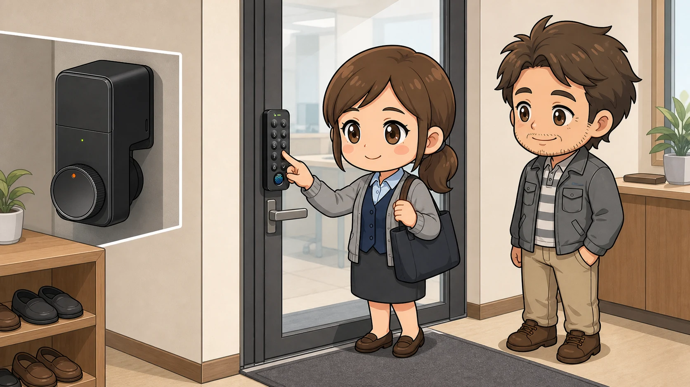
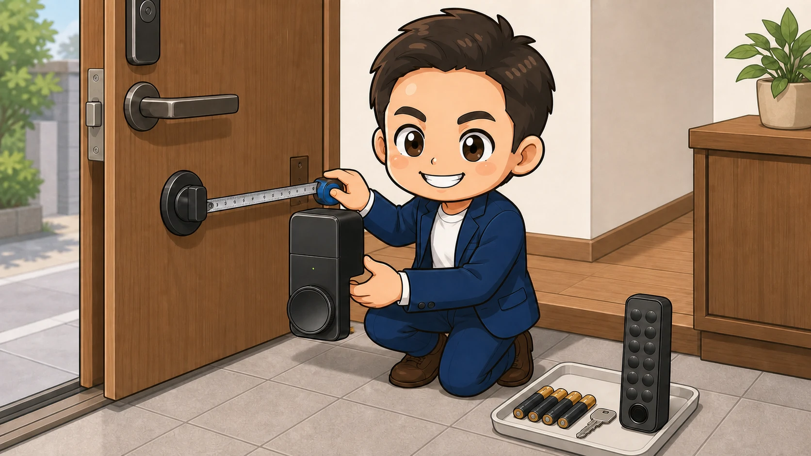

子どもの荷物と買い物袋で、両手がふさがっている。

玄関まで帰ってきてから、鞄の底にある鍵を探す。会社では、最初に来る人と最後に帰る人のために、合鍵を増やしていく。

ひとつひとつは小さな手間です。でも、毎日くり返すと、ちゃんと面倒です。

SwitchBot ロックProは、その手間を減らす後付け型のスマートロックです。派手なスマートホームを作るためというより、**玄関で鍵を出す回数を減らすための道具**として紹介します。

この記事では公式仕様を確認したうえで、子育て家庭と小さな会社で使うなら何を決めておきたいか、私なりの運用目線でまとめました。

  
  

    
Amazon.co.jp

    <h3>SwitchBot ロックPro＋指紋認証パッド</h3>
    
ロックPro本体と、指紋・暗証番号などで解錠できるパッドのセットです。

    <a class="affiliate-product-button" href="https://amzn.to/4hszTQF" target="_blank" rel="sponsored noopener noreferrer">Amazon.co.jpで商品を見る</a>
    
広告・アフィリエイトリンクです。価格、在庫、カラー、付属品はAmazonの商品ページでご確認ください。

  

## 先に結論。便利さは、指紋認証パッドと予備の鍵で完成する

SwitchBot ロックProは、室内側のサムターンに取り付けて、鍵の開け閉めを自動化する製品です。大がかりな工事をせずに設置でき、取り付け後も今までの物理鍵を使えます。

私は、次のような人に合う道具だと思います。

- 荷物や抱っこで、玄関前では片手しか使えない
- 子どもへ物理鍵を持たせることに不安がある
- 会社の合鍵を増やさず、利用者ごとに権限を管理したい
- 鍵の閉め忘れを減らしたい

一方で、ロックPro本体だけでは、玄関の外から指紋や暗証番号で開けられません。鍵を出さない運用を目指すなら、指紋認証パッドとのセットが分かりやすい選択です。

もうひとつ大事なのが、物理鍵を手放さないことです。

**普段は指紋などで入り、機器や電池に問題があれば物理鍵へ戻る。** この二段構えなら、便利さだけに寄りかからずに使えます。メーカーも、電池切れによる締め出しを防ぐため、従来の鍵を持ち歩くよう案内しています。

## ロックProで変わるのは「鍵」より「玄関での動き」

公式ページでは、ロックProは幅広いサムターンへ対応する無段階可変構造、単3電池4本、室内側から押して操作できるクイックキーなどが特徴として案内されています。

ただ、暮らしの中で分かりやすい変化は、細かな仕様よりも玄関での動きです。

帰宅したら、鍵を探さず指を置く。外出するときは、閉め忘れをオートロックで補う。会社なら、スタッフごとに解錠方法を登録し、退職時に削除する。

スマートロックを選ぶときは、機能の数よりも、**家族や社員が毎日どの方法で開けるか**を先に決めると迷いにくくなります。

| 開け方 | 向いている人・場面 | 先に決めたいこと |
| --- | --- | --- |
| 指紋 | 荷物が多い家族、日常的に出入りする社員 | 一人ずつ登録し、実際の指で何度か試す |
| 暗証番号 | 指紋が使いにくい人、一時的な利用者 | 共通番号を使い回さず、不要になったら削除する |
| 対応カード | スマホを持たない家族 | 紛失時に誰が停止するか決める |
| スマホ・Apple Watch | 自分の端末を管理できる大人 | 充電切れに備えて別の開け方も用意する |
| 物理鍵 | 電池切れや機器不調などの非常時 | 家へ入れない場所に置かない |

## 子育て家庭では、家族全員が開けられることが大切

子育て中の玄関は、思っている以上に忙しい場所です。

- 抱っこや荷物で両手がふさがる
- 雨の日に、外で鍵を探したくない
- 子どもが先に帰る日に、鍵を持たせるのが心配
- 外出後に「ちゃんと閉めたかな」と気になる

指紋で開けられれば、鍵やスマホを取り出す動作をひとつ減らせます。スマホを持たせていない子どもにも使いやすい方法です。

ただし、家族全員が同じ方法でうまく開けられるとは限りません。指紋が安定しないときのために、暗証番号や対応カードなど、本人が使える第二の方法も用意しておきます。

私なら、オートロックは最後に設定します。

まず物理鍵を持ったまま外へ出て、家族全員の指紋や暗証番号で開けられるか試す。その確認が終わってから、自動施錠を有効にします。便利な機能ほど、戻れる状態を作ってから使う方が安心です。

公式サポートによると、ロックProは電池残量が20％以下になると自動施錠を行いません。設定したから終わりではなく、電池残量を見る人も決めておきます。

## 小さな会社では、合鍵を増やす前にルールを作る

社員数が少ない会社では、鍵の管理が総務担当者ひとりに集まりがちです。

「今日は誰が最後に帰るのか」

「新人へ合鍵を渡してよいか」

「退職した人から、鍵を返してもらったか」

ロックProと指紋認証パッドを使えば、物理的な合鍵を増やさず、利用者ごとに指紋や暗証番号を登録できます。来客や短期利用には、期間限定パスワードやワンタイムパスワードも選べます。

ただし、製品を付けただけでは鍵の管理は完成しません。私なら、導入前に次の5点を一枚の台帳へまとめます。

1. 会社用のSwitchBotアカウントを誰が管理するか
2. 誰に、どの解錠方法を、いつ登録したか
3. 入社、異動、退職時に誰が登録と削除をするか
4. 電池交換と月ごとの動作確認を誰が担当するか
5. 不具合時の物理鍵を、どこで誰が管理するか

個人のメールアドレスだけに管理を寄せると、担当者が休んだ日や退職時に困ります。会社として引き継げる管理方法にしておくことが大切です。

遠隔での権限管理には、解錠方法ごとに違いがあります。公式サポートでは、ハブ製品へ接続するとパスコードを遠隔で追加・削除できます。一方、指紋とNFCカードは遠隔追加に対応しておらず、ハブ接続時の遠隔削除に対応しています。会社で使うなら、入社時は現地登録、退職時はその日のうちに削除する流れまで確認しておきます。

なお、ロックProは一般的な入退室管理システムそのものではありません。厳格な監査記録、複雑な権限設定、警備会社との連携が必要な事業所では、専用システムを含めて検討した方がよい場合があります。

## 購入前は、ドア・人・もしもの3つを確認する

### ドアを確認する

公式ページには、サムターンの形や大きさ、つまみの中心からドア枠までの距離など、購入前の確認項目があります。

「約99％のドアロックに対応」という案内があっても、自宅や会社のドアに付くかは別の話です。先に玄関錠の写真を撮り、必要な寸法を測ります。サムターン周辺に段差がある場合や、ドア枠との距離が近い場合は、貼り付ける場所まで確認します。

賃貸住宅なら管理会社、会社なら建物管理者への確認も忘れないようにします。後付け型ですが、粘着テープや固定部品を使います。

### 使う人を確認する

家族や社員ごとに、普段の解錠方法と予備の方法を決めます。指紋だけ、スマホだけと、ひとつに絞りすぎないことがポイントです。

また、商品名が似ていても、セットに含まれるパッドや対応カードは同じとは限りません。購入画面で本体、指紋認証パッド、付属品の組み合わせを確認します。

### もしものときを確認する

ロックPro本体は電池で動きます。家庭なら大人、会社なら総務担当者など、残量確認と交換をする人を決めます。

物理鍵も使える状態で残します。電池切れ、機器の不調、スマホの故障が同時に起きても家へ入れるか。そこまで想像しておくと、導入後の不安が減ります。

## 設置初日に、この順番で試す

取り付け記事では、貼り付け作業に目が向きがちです。けれども、私が大事だと思うのは貼ったあとの確認です。

1. テープを剥がす前に、サムターンと本体の位置を仮合わせする
2. 取扱説明書どおりに固定し、アプリで施錠・解錠位置を校正する
3. 物理鍵を持って外へ出て、指紋、暗証番号などを一人ずつ試す
4. 家族や社員が困ったときの連絡先を決める
5. 最後にオートロックや通知を設定する

最初から完全なキーレスを目指さなくて大丈夫です。数日は物理鍵も持ち歩き、解錠方法と電池表示に問題がないことを確認してから、日常の運用へ移します。

## ハブが必要なのは、外から見たい・操作したいとき

玄関の前で指紋や暗証番号を使って開けることと、外出先から状態を確認したり操作したりすることは別です。

公式サポートでは、ロックProを外出先から遠隔で施錠・解錠するには、SwitchBotハブ製品が必要と案内されています。会社でパスコードを遠隔管理したい場合にもハブが必要です。

まずは目的を二つに分けます。

- 玄関で鍵を出す回数を減らしたい
- 外出先から確認、通知、操作、権限管理までしたい

前者が目的なら、ロックProと指紋認証パッドから始める。後者まで必要なら、対応するハブを加える。この順番なら、必要のない機器まで一度に買うことを防げます。

## こんな人には合わないかもしれません

- ドアやサムターンが適合しない
- 電池交換やアプリ設定を管理する人が決まらない
- 物理鍵を持つこと自体を完全になくしたい
- 会社で専用の入退室管理や警備連携が必要
- 粘着テープを含め、ドアへ何も取り付けられない

便利な道具は、買えば自動的に暮らしを整えてくれるものではありません。

**誰が使い、困ったときにどう戻すか。** そこまで決めて初めて、毎日の手間を減らしてくれます。

## よくある疑問

### ロックProを付けたあとも、今の鍵は使える？

使えます。ロックProは室内側へ後付けする製品なので、従来の物理鍵は非常時の手段として残せます。

### 指紋認証パッドは必須？

ロックPro本体をアプリなどで操作するだけなら必須ではありません。ただ、子どもや社員が玄関の外からスマホを出さずに開ける運用なら、指紋認証パッドとのセットが分かりやすいです。

### オートロックを最初から使ってもよい？

機能としては設定できます。ただし、物理鍵を持ち、家族や社員の解錠方法をすべて試したあとに有効にする方が安心です。電池残量が20％以下では自動施錠されない点にも注意します。

### 会社なら、ハブも一緒に買うべき？

外出先からの施錠・解錠や、パスコードの遠隔追加・削除まで行うなら必要です。現地での解錠だけが目的なら、まずロックProと指紋認証パッドで運用を試す考え方もあります。

## 商品と公式情報を確認する

  
  

    
Amazon.co.jp

    <h3>SwitchBot ロックPro＋指紋認証パッド</h3>
    
ロックPro本体と、指紋・暗証番号などで解錠できるパッドのセットです。

    <a class="affiliate-product-button" href="https://amzn.to/4hszTQF" target="_blank" rel="sponsored noopener noreferrer">Amazon.co.jpで商品を見る</a>
    
広告・アフィリエイトリンクです。価格、在庫、カラー、付属品はAmazonの商品ページでご確認ください。

  

- [SwitchBot ロックProの公式製品情報](https://www.switchbot.jp/products/switchbot-lock-pro)
- [ロックProの購入前確認事項](https://support.switch-bot.com/hc/ja/articles/19927262382999-%E3%83%AD%E3%83%83%E3%82%AFPro%E3%82%92%E3%81%94%E8%B3%BC%E5%85%A5%E5%89%8D%E3%81%AE%E7%A2%BA%E8%AA%8D%E4%BA%8B%E9%A0%85)
- [ロックProのオートロック設定と注意点](https://support.switch-bot.com/hc/ja/articles/20339592012055-%E3%83%AD%E3%83%83%E3%82%AFPro-%E8%87%AA%E5%8B%95%E6%96%BD%E9%8C%A0-%E3%82%AA%E3%83%BC%E3%83%88%E3%83%AD%E3%83%83%E3%82%AF)
- [遠隔施錠・解錠とハブ接続の案内](https://support.switch-bot.com/hc/ja/articles/20695154903575-%E3%83%AD%E3%83%83%E3%82%AFPro%E3%81%AE%E9%81%A0%E9%9A%94%E6%96%BD%E9%8C%A0-%E8%A7%A3%E9%8C%A0-%E3%83%8F%E3%83%96%E3%81%AB%E6%8E%A5%E7%B6%9A%E3%81%99%E3%82%8B%E6%96%B9%E6%B3%95)
- [指紋・NFCカードの遠隔追加と削除](https://support.switch-bot.com/hc/ja/articles/18489033073431-%E6%8C%87%E7%B4%8B-NFC%E3%82%AB%E3%83%BC%E3%83%89%E3%81%AE%E9%81%A0%E9%9A%94%E8%BF%BD%E5%8A%A0-%E5%89%8A%E9%99%A4%E3%81%8C%E3%81%A7%E3%81%8D%E3%81%BE%E3%81%99%E3%81%8B)
- [パスコードの遠隔追加と削除](https://support.switch-bot.com/hc/ja/articles/13280021958423-%E3%83%91%E3%82%B9%E3%82%B3%E3%83%BC%E3%83%89%E3%81%AE%E9%81%A0%E9%9A%94%E8%BF%BD%E5%8A%A0-%E5%89%8A%E9%99%A4%E3%81%8C%E3%81%A7%E3%81%8D%E3%81%BE%E3%81%99%E3%81%8B)
- [スマートロック製品の安全上・使用上の注意](https://support.switch-bot.com/hc/ja/articles/7615796100247-SwitchBot%E3%83%AD%E3%83%83%E3%82%AF%E8%A3%BD%E5%93%81%E3%81%AE%E5%AE%89%E5%85%A8%E4%B8%8A%E3%81%A8%E4%BD%BF%E7%94%A8%E4%B8%8A%E3%81%AE%E3%81%94%E6%B3%A8%E6%84%8F)

この記事の製品仕様は、2026年8月15日に公式情報を確認しました。
