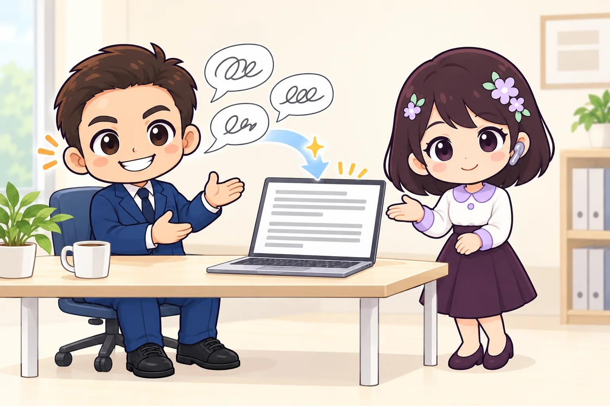

<!-- product-article-character-sheets: tamashiro-yusuke-character-sheet-v5.png, tl-four-character-style-master-v2.png, rira-character-sheet-v3.png, worried-business-owner-character-sheet-v1.png, accounting-staff-character-sheet-v1.png -->
<!-- product-article-character-check: hero-and-body-verified -->

「頭の中では言いたいことが決まっているのに、打つのが追いつかない」

「スマホの音声入力を試したけれど、『えー』や言い直しまで全部文字になって、結局手で直している」

メールやチャットの返信に、毎日かなりの時間を取られていないでしょうか。

**Typeless（タイプレス）** は、話した内容をAIが整えてから文字にしてくれる音声入力アプリです。「えーと」などの口ぐせを消し、言い直した部分は最後の言い方だけを残し、箇条書きにしたい内容は箇条書きに整えます。**「しゃべったまま」ではなく「書いたような文章」で入る**のが、普通の音声入力との一番の違いです。

## 先に結論：「打つのが遅い」より「考えを文章にするのが重い」人に効く

Typelessが向いているのは、次のような人です。

- キーボード入力が苦手で、メールやチャットの返信に時間がかかる人
- 現場や移動が多く、スマホで長めの連絡を返すことが多い人
- 考えながら話すと言葉が出るが、書こうとすると手が止まる人
- 日報、報告、議事メモの下書きを毎日作っている人

始め方は簡単で、パソコンなら**書きたい場所をクリックして、キーを1回押して話し、もう1回押す**だけです。GmailでもSlackでもWordでも、文字を入力できる場所ならたいてい使えます。

一方で、話した声はTypelessのサーバー（インターネットの向こう側のコンピューター）で処理されます。お客様の個人情報や社外秘の内容を話す前には、会社としてのルールを決めておく必要があります。ここは後半でくわしく書きます。

## 普通の音声入力と何が違うのか

### 口ぐせと言い直しを、自動で消してくれる

人は話すとき、「えー」「あのー」と言ったり、途中で言い直したりします。スマホやパソコンに最初から入っている音声入力は、それも含めて文字にしがちです。

Typelessは、AI（人工知能）が話の意図をくみ取り、口ぐせや繰り返しを取り除きます。たとえば「明日の打ち合わせは10時、いや11時からでお願いします」と話したとき、言い直した後の「11時」だけを残す。公式が「話しながらの言い直しを自動で反映する」と説明しているのは、こうした動きです。

### 話した順番がばらばらでも、文章として整える

思いついた順に話しても、AIが話のまとまりを見て、読みやすい順番と形にします。「やることは3つあって」と話せば、番号付きの箇条書きに整えてくれます。

私はここに一番の価値があると考えています。文章を書くのが重いのは、打つ速さよりも「どう並べるか」を考える負担のほうが大きいからです。その部分をAIが肩代わりしてくれると、書き始めるまでの腰の重さがかなり軽くなります。

### アプリごとに、文章の雰囲気を変えられる

同じ内容でも、取引先へのメールと社内チャットでは言い方が変わります。Typelessには「アプリごとに違うトーン（文章の雰囲気）」を使い分ける機能があり、メールでは丁寧に、チャットでは短めに、という調整ができます。

### 名前や専門用語を覚えさせられる

音声入力が一番苦手なのは、人の名前、会社名、業界の専門用語です。Typelessには**個人辞書**があり、よく使う固有名詞を登録しておけます。沖縄の地名や、お客様の屋号のように、一般の辞書では変換されにくい言葉ほど登録の効果が出ます。

## 仕事でうれしい、その他の機能

公式サイトと料金表で確認できる、主な機能は次のとおりです。

- **100以上の言語に対応**：日本語も使えます。話している言語は自動で判別されます。
- **翻訳**：日本語で話して、英語の文章として入力する、といった使い方ができます。
- **Ask anything（なんでも質問）**：選んだ文章について質問したり、調べものをしたりできます。
- **声で編集**：書いた文章を選んで「もっとやわらかい言い方にして」と話すと、書き直してくれます。
- **ささやきモード（Whisper mode）**：大きな声を出しにくい場所向けのモードです。
- **履歴は端末に保存**：話した内容の履歴は、基本的に自分のパソコンやスマホの中に保存されます。

対応している端末は、Mac（Apple製チップ、Intel製チップの両方）、Windows、Linux、iPhone、Androidです。

## 使い方は「キーを押して、話して、もう一度押す」

### パソコンの場合

1. 公式サイトからアプリをダウンロードして、インストールします。
2. 初回起動時に、マイクとアクセシビリティ（ほかのアプリに文字を入れるための許可）を許可します。
3. 文字を書きたい場所をクリックします。
4. 音声入力のキーを1回押して話します。初期設定では、**Macは「fn」キー、Windowsは右側の「Alt」キー**です。
5. 話し終えたら、同じキーをもう1回押します。整った文章が、クリックした場所に入ります。

キーは押しっぱなしにする必要はありません。1回押して開始、もう1回押して終了です。

### スマホの場合

アプリを入れると、「Typelessキーボード」が使えるようになります。文字を書きたい欄をタップし、キーボードの「Speak」ボタンを押して話し、もう一度押すと文章が入ります。

スマホでは、文章を選んで「Speak to edit」ボタンを押すと、声で書き直しを指示できます。LINEの返信を「もう少し丁寧に」と直す、といった使い方ができます。

## 小さな会社での使いどころ

### 社長：移動中や現場での連絡

現場を回る社長にとって、スマホで長い連絡を打つのは大きな負担です。店を閉めた後や、次の現場へ向かう前の数分で、取引先への返信や従業員への指示を話して済ませられます。

### 事務担当者：定型のメールと社内連絡

請求書の送付連絡、日程調整、社内への周知など、内容は決まっているけれど毎回文面を考えるメールは多いものです。要点だけを話せば、整った文面の下書きができます。

### 日報・報告・議事メモの下書き

打ち合わせが終わった直後に、覚えていることを思いつくままに話すだけで、読みやすいメモになります。記憶が新しいうちに残せるので、後で思い出す時間も減ります。

## 仕事で使う前に確認したいこと

### 声はクラウドで処理される

Typelessのプライバシーポリシー（個人情報の扱いを定めた文書）では、次のように説明されています。

- 話した声と、使っているアプリ名や画面上の関連する文章などの周辺情報は、Typelessのクラウド（インターネット上のサーバー）でその場で処理される。
- 処理が終わって結果が端末に返ると、すぐに破棄され、保存も記録もされない。
- 利用者のデータをAIの学習に使わない。
- 履歴のクラウド同期をオンにした場合は、履歴の文章がクラウドに保存される（オフにすると削除される）。

つまり、**パソコンの中だけで完結するわけではありません**。インターネットにつながっていることが前提で、声は一度は外部のサーバーに送られます。

安全面の配慮は丁寧にされているサービスだと思います。それでも、お客様の個人情報、マイナンバー、取引条件のような社外秘の内容は、「話さない」と決めておくのが無難です。会社で使うなら、**使ってよい場面と、話してはいけない情報を、先に一枚の紙にしておく**ことをおすすめします。

### 無料プランには週ごとの上限がある

無料プランでも主な機能は使えますが、**1週間に使える語数に上限**があります。上限の具体的な数字は、公式の料金ページには書かれていません。毎日たくさん使う人は、途中で有料プランを検討することになります。

有料のProプランでは、次の点が変わります。

- 語数が無制限になる
- 認識の精度が上がる（Enhanced accuracy）
- 混雑時に優先して使える
- 複数の端末で設定や履歴を同期できる
- チームのメンバー管理と、請求書のまとめ払いができる

料金は米ドル建てで、年払いと月払いがあります。**年払いのほうが月あたりの料金がかなり安く設定されている**ので、まず無料で試し、毎日使うと分かってから年払いを選ぶ順番が安全です。最新の料金は[公式の料金ページ](https://www.typeless.com/pricing)で確認してください。

### 声を出せる環境か

音声入力なので、周りに人がいる場所では使いにくい場面があります。オープンな事務所や電車の中では、ささやきモードを使うか、普段どおり手で打つことになります。

スマホのTypelessキーボードは音声入力が中心の作りなので、手で打ちたいときは普段のキーボードに切り替える必要があります。

### 画面や説明は英語が中心

運営はアメリカの会社で、公式サイト、ヘルプ、問い合わせ窓口は英語が中心です。日本語で話して日本語の文章にすることはできますが、設定画面やトラブルの調べものでは、英語の説明を読む場面があります。

## 合わないかもしれない人

- 社外秘の情報を扱う仕事が大半で、外部サービスに声を送れない人
- 声を出せない環境で働く時間が長い人
- 話し言葉を一字一句そのまま残したい人（Typelessは整えるのが仕事なので、発言録や逐語録には向きません）
- 英語の画面に強い抵抗がある人

## 導入初日に試したいこと

1. 無料で登録して、パソコンにアプリを入れる
2. 自分の名前、会社名、よく使うお客様の屋号を個人辞書に登録する
3. 実際に送る予定のメールを1通、話して下書きしてみる
4. 「えー」や言い直しを入れて話し、どこまで整えてくれるかを確かめる
5. 社内で使うなら、話してよい情報とダメな情報を決める

最初の数通で「ここまで整うなら使える」と感じるか、「直す手間が多い」と感じるかで、自分に合うかどうかはほぼ分かります。

## よくある疑問

### 日本語の精度は大丈夫ですか

100以上の言語に対応していて、日本語でも使えます。ただし、固有名詞や専門用語は間違えることがあります。個人辞書に登録し、送る前に一度読み返す習慣は残してください。

### ネットにつながっていなくても使えますか

声の処理はクラウドで行われるため、インターネット接続が前提です。

### 会社の複数人で使えますか

Proプランには、メンバーの管理と請求書のまとめ払いの機能があります。さらに大きな組織向けには、社内のアカウントでまとめてログインできる仕組み（SSO）などを備えたEnterpriseプランがあります。

### パソコンに最初から入っている音声入力と、どちらがいいですか

短い単語やひと言なら、最初から入っている音声入力でも足ります。Typelessが力を発揮するのは、**数行以上のまとまった文章を、考えながら話して作るとき**です。まずは普段の音声入力とTypelessで同じメールを作り比べてみると、違いが分かりやすいです。

## まとめ：「書く」を「話す」に置き換えるだけで、腰が軽くなる

Typelessは、速く打つための道具というより、**考えを文章にする面倒な部分を、AIに任せるための道具**です。キーボードに向かうと手が止まる人ほど、効果を感じやすいはずです。

一方で、声はクラウドで処理されます。便利さと情報の扱いの両方を見て、話してよい範囲を決めてから使い始めてください。無料で試せるので、まずは明日送るメール1通から始めてみるのがおすすめです。

## 公式情報

- [Typeless 公式サイト（英語）](https://www.typeless.com/)
- [料金プラン（英語）](https://www.typeless.com/pricing)
- [使い方：Dictate（英語）](https://www.typeless.com/help/quickstart/dictate)
- [使い方：Speak to edit（英語）](https://www.typeless.com/help/quickstart/speak-to-edit)
- [よくある質問（英語）](https://www.typeless.com/help/faqs)
- [プライバシーポリシー（英語）](https://www.typeless.com/privacy)

*情報の確認日：2026年9月30日。機能、料金、無料プランの上限、対応端末は変更される場合があります。最新の内容は公式サイトで確認してください。*
